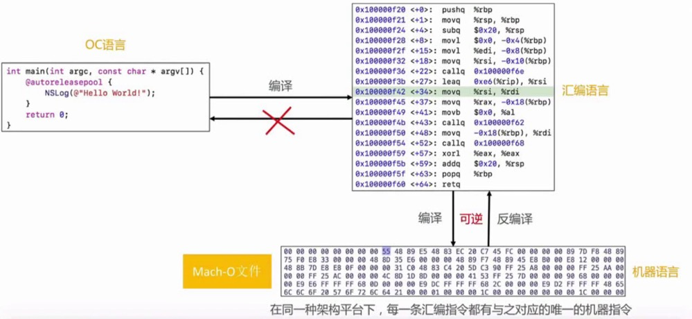

# 逆向思路
逆向App的思路可以分为四步,分析界面、分析代码、动态调试、代码编写。
```markdown
界面分析: 使用`Cycript`、`Reveal`
代码分析: 对Mach-O文件的静态分析,使用`MachOView`、`class-dump`、`Hopper`、`Disassembler`、`ida`等
动态调试: 对运行中的APP进行代码调试，`debugserver/LLDB`
代码编写: 通过`theos`注入代码到APP中，必要时还可能需要重新签名，打包ipa
```
在这之前我们已经搞定了如何分析APP的界面，下面再来讲一下如何分析APP的代码。首先我们要确定我们写的代码在什么地方？

我们的代码和图片经过编译、链接、签名生成`xxx.app`文件,文件内部包含图片资源、xib资源、签名信息和`Mach-O可执行文件`,将xxx.app文件进行压缩之后生成IPA文件,然后通过App Store、iFunbox、Xcode进行安装。如下图:


也就是说，代码进行编译、链接之后变成了Mach-O可执行文件,如果我们想分析代码，只需要对Mach-O文件分析就可以了。首先介绍一个利器`class-dump`，它可以从Mach-O文件中导出.h头文件的信息。

## class-dump
class-dump的作用就是把 Mach-O文件 的class信息给导出来，生成对应的.h头文件。
* [官方地址](http://stevenygard.com/projects/class-dump/)
* [GitHub下载地址](https://github.com/nygard/class-dump)。

安装步骤:
```markdown
1. 下载工具包后将class-dump文件复制到电脑`usr/local/bin`路径下,这样可以直接在终端使用`class-dump`命令
2. 如果添加到bin目录下仍然不能使用时，使用`sudo chmod 777 /usr/local/bin/class-dump`设置权限
3. 使用方式`class-dump -H Mach-O文件路径 -o 头文件存放目录`，例如 `class-dump -H ~/Desktop/ipas/Payload/test.app -o ~/Desktop/Payload`
```
如果是苹果商店下载的应用，需要先砸壳，再使用class-dump导出头文件。

## Hopper Disassmbler
在了解 Hopper Disassmbler 之前我们先介绍一下代码的编译过程。我们写的代码经过编译之后会生成汇编代码，汇编代码进行编译之后生成对应的`Mach-O`文件，同一个架构下每一句汇编代码都有对应的机器指令，也就是说机器指令反编译成汇编代码这部分是可逆的。而汇编语言不能完全的反编译成OC语言，但是可以生成一个大概的伪代码。过程如下图:



Hopper Disassmbler 能够将Mach-O文件的机器语言代码反编译成汇编语言、OC伪代码或者Swift伪代码。[官方网站](https://www.hopperapp.com/index.html),常用快捷键`shift + option +x` 找到哪里引用了这个方法。或者右击方法在全局搜索有哪里使用了当前方法。

## 动态库共享缓存(dyld shared cache)
从iOS3.1开始，为了提高性能，绝大部分的动态库文件都打包放到一个缓存文件中(dyld shared cache),手机中的文件缓存路径是`/System/Library/Cache/com.apple.dyld/dyld_shared_cache_armXXX`。动态库共享缓存非常明显的好处是节省内存。如果我们导出对应的UIKit库的方式是:
```markdown
1. 在`Mac/iOS`中，使用了`/usr/lib/dyld`程序加载动态库，[点击下载dyld源码](https://opensource.apple.com/tarballs/dyld)。
2. 如果需要导出UIKit动态库，在源码中找到`dsc_extractor.cpp`文件,删除`#if 0`之前的代码,并且将`0`修改成`1`。
3. 使用`clang++ -o dsc_extractor dsc_extractor.cpp`命令编译`dsc_extractor.cpp`文件，会生成`dsc_extractor`可执行文件
4. 从手机中导出`dyld_shared_cache_armXXX`动态库，使用`./dsc_extractor /Users/mlive/Desktop/dyld_shared_cache_arm64  dyld`命令从动态库里导出不同的框架动态库到dyld文件。
```

### dyld 和 Mach-O文件的关系
dyld用于加载`MH-EXECUTE`/`MH-DYLIB`/`MH-BUNDLE`这三种类型的Mach-O文件,APP的可执行文件、动态库都是由dyld负责加载的。dyld存放在手机中的文件路径是`/usr/lib/dyld`。可以在源码中看到加载可执行文件相关的代码:
```c
// only MH_BUNDLE, MH_DYLIB, and some MH_EXECUTE can be dynamically loaded
const mach_header* mh = (mach_header*)firstPages;
switch ( mh->filetype ) {
  case MH_EXECUTE:
  case MH_DYLIB:
  case MH_BUNDLE:
    break;
  default:
    throw "mach-o, but wrong filetype";
}
```


