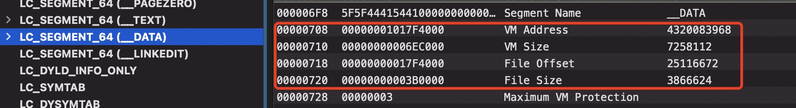
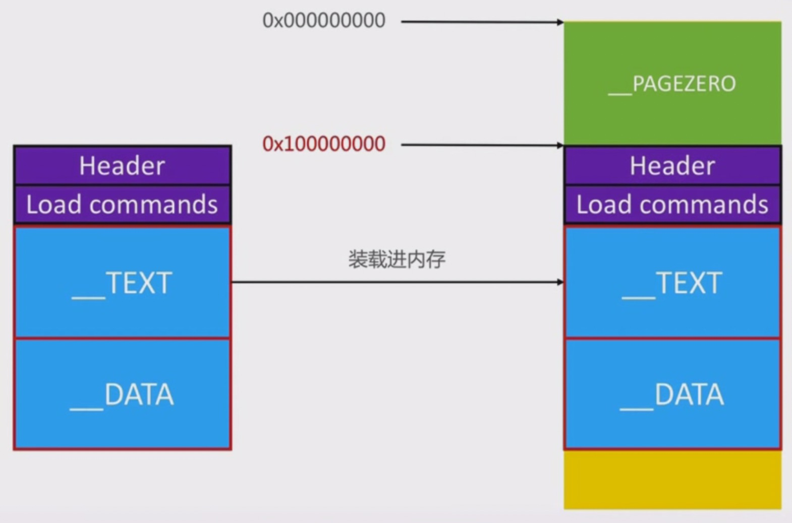
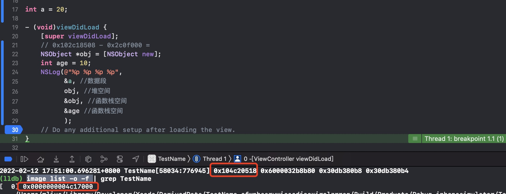

# ASLR
ASLR `Address Space Layout Randomization` 地址空间布局随机化。是一种针对缓冲区溢出的安全保护技术，通过对堆、栈共享库映射等线性布局的随机化，通过增加攻击者预测目的地的难度，防止攻击者直接定位攻击代码位置，达到阻止溢出攻击目的的一种技术。

简单点说就是在程序加载到内存时，在头部随机一部分空间，让你不能通过对Mach-O文件的静态分析准确找到内存中函数的位置。苹果从iOS4.3开始引入的ASLR技术。

了解 ASLR 之后，我们在进行动态调试时可以准确找到函数的位置，不至于断点下错位置。

## Mach-O文件格式
在了解ASLR之前先看下Mach-O的文件格式，Mach-O文件由三部分组成，如下图:


```markdown
* Header: 文件类型、目标架构类型等
* Load commands: 描述文件在虚拟内存中的逻辑结构、布局，都有哪些段,可以将它看做指针，指向数据区域
* Raw segment data: 在Load commands中定义的Segment的原始数据,具体数据部分
```

## 未使用ASLR
在`Load commands`中，我们需要知道这几个概念，虚拟内存地址(VM Address)、虚拟内存大小(VM Size)、在Mach-O文件中的位置（File Offset）、在Mach-O文件中的大小（File Size）。我们可以分别看下每个段的这几个值。

* `__PAGEZERO 段`的虚拟内存地址和物理内存地址

* `__TEXT 段`的虚拟内存地址和物理内存地址

* `__DATA 段`的虚拟内存地址和物理内存地址

* `__LINKEDIT段`的虚拟内存地址和物理内存地址


根据上图可以看出`__PAGEZERO 段`在虚拟内存时是有位置和大小的，而在Mach-O文件中是没有这个段的。在未使用ASLR技术的时候,Mach-O文件加载到内存中会增加`__PAGEZERO 段`。**它的作用就是在`obj = NULL`时NULL指针，就是指向`_PAGEZERO`安全区域。**

在arm64架构下，`__PAGEZERO 段`的大小是`0x100000000`,在`armv7`架构下大小是`0X4000`。我们也可以通过`size -l -m -x mach-o文件`查看nach-o文件的内存分布。

在未使用ASLR技术时Mach-O文件加载到内存中如下图：



## 使用ASLR
在编译完成之后，我们编写的函数在内存中的位置就是固定的，这也给安全带来了隐患，别人拿到我们的Mach-O文件，很容易知道我们函数的位置。

苹果从iOS4.3开始引入的ASLR技术。使用ASLR技术之后，在程序加载到内存的时候，会随机生成偏移内存，这样函数的的位置每次就是不固定的。如下图：


知道了这些之后，我们通过`偏移地址 + __PAGEZERO段虚拟大小 + Hopper中查到的函数地址`就是在内存中真正的函数地址。在动态调试中可以通过`image list -o -f `指令查看ASLR偏移了多少。

通过一个简单的例子进行验证一下,创建一个新的iOS项目，创建一个全局变量,在断点处通过`image list -o -f `指令查看ASLR偏移了多少。如下图：

全局变量是在数据区，我们通过全局变量的地址减去ASLR偏移地址减去`__PAGEZERO段`虚拟中的内存地址就是它的地址。
```shell
0x104c20518 - 0x4c17000 - 0x100000000 = 0x9518
```
通过`Xcode -> Product -> Show Build Floder in Finder`找到可执行文件,在MacOView上进行查看局部变量a的地址确实是`0x9518`.如下图:


>我们在动态调试时，通过`Hopeer`找到函数地址之后，需要加上ALSR偏移地址和`_PAGEZERO`段的大小。

## 推荐阅读
* [你真的了解虚拟内存和物理内存吗](https://juejin.cn/post/6844903970981281800)