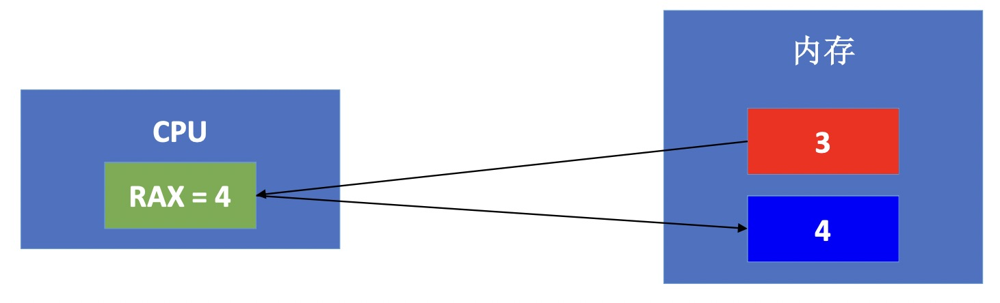

# 汇编
通常，CPU会先将内存中的数据存储到寄存器中，然后再对寄存器中的数据进行运算。假设内存中有块红色内存空间的值是3，现在想把它的值加1，并将结果存储到蓝色内存空间
```markdown
1. CPU首先会将红色内存空间的值放到rax寄存器中：movq 红色内存空间, `%rax`
2. 然后让rax寄存器与1相加：`addq $0x1, %rax`
3. 最后将值赋值给内存空间：`movq %rax`, 蓝色内存空间.如下图
```


编程语言的发展从机器语言到汇编语言到高级语言,如下图:

```markdown
1. 汇编语言与机器语言一一对应，每一条机器指令都有与之对应的汇编指令
2. 汇编语言可以通过编译得到机器语言，机器语言可以通过反汇编得到汇编语言
3. 高级语言可以通过编译得到汇编语言\机器语言，但汇编语言\机器语言几乎不可能还原成高级语言
```

## 编程语言分类
汇编语言的种类有 `8086汇编(16bit)`、`x86汇编(32bit)`、`x64汇编(64bit)`、`ARM汇编(嵌入式、移动设备)`...等等

x86、x64汇编根据编译器的不同，有2种书写格式 `Intel：Windows派系`、`AT&T ：Unix派系`。iOS开发中最主要的汇编语言是:`AT&T汇编 -> iOS模拟器`、`ARM汇编 -> iOS真机设备`。

## 常见汇编指令

## 寄存器
