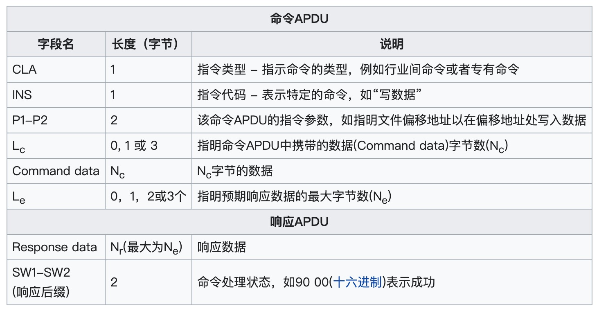

# NFC 功能开发
NFC，如同过去的电子票券智能卡一般，将允许移动支付取代或支持这类系统。可应用于社交网络，分享联系方式、照片、视频或文件。具备 NFC 功能的设备可以充当电子身份证和钥匙卡

苹果在 iOS11 推出了NFC的功能，iOS11 时的手机只支持读的功能，即可以通过手机的NFC功能读标签。并且只能读取NDEF格式的数据，在iOS 13系统上NFC的技术支持更加强大:
* iOS13系统基本支持目前已经部署的NFC协议的读写操作。
* 开发者可以通过`CoreNFC Framework`提供的native protocols与 tags 直接通信

## iOS NFC 开发流程
苹果在 iOS11 中提供`NFCNDEFReaderSession`类，仅支持NDEF格式的数据。在 iOS13 中对 `CoreNFC 框架`进行扩展, 提供`NFCTagReaderSession`API，支持`ISO7816Tag`、`ISO15693Tag`、`MiFareTag`、`FeliCaTag`类型的数据格式，并且允许使用 APDU 的方式对其进行通信。

> 添加 NFC 权限

在Xcode中向添加 `Near Field Communication Tag Reading`,生成对应的权限文件，如果证书不是自动签名需要先到苹果开发者后台进行添加
```xml
<key>com.apple.developer.nfc.readersession.formats</key>
<array>
    <string>NDEF</string>
    <string>TAG</string>
</array>
```

在info.plist 中添加`Privacy - NFC Scan Usage Description`请求权限，允许用户访问 NFC 功能

如果需要跟 `ISO7816`、 `ISO15693` 、`FeliCa`、 `MIFARE tags` 类型的 IC 卡进行交互, 则需要在info.plist 添加对应的AID,例如城市一卡通的AID：A00000000386980701, **注意：苹果的 NFC 功能不支持支付类型的AID**
```xml
<key>com.apple.developer.nfc.readersession.felica.systemcodes</key>
<array>
    <string>12FC</string>
</array>
<key>com.apple.developer.nfc.readersession.iso7816.select-identifiers</key>
<array>
    <string>A00000000386980701</string>
</array>
```

> 与 NFC 相关的API

1. 创建会话标签,一次只能选择一种`NFCNDEFReaderSession` 或者是 `NFCTagReaderSession`

```objc
self.session = [[NFCNDEFReaderSession alloc] initWithDelegate:self queue:nil invalidateAfterFirstRead:NO];
[self.session beginSession];
```

2. 遵守对应的协议 `NFCNDEFReaderSession`这个类要遵守2个协议`NFCReaderSessionDelegate`、`NFCNDEFReaderSessionDelegate`。它对于的协议方法有：

```objc
//开始链接上nfc的回调
- (void)readerSessionDidBecomeActive:(NFCReaderSession *)session
//链接报错了的回调
- (void)readerSession:(NFCReaderSession *)session didInvalidateWithError:(NSError *)error
//读取到NFC数据的回调（ios11以上支持）
- (void)readerSession:(NFCNDEFReaderSession *)session didDetectNDEFs:(NSArray<NFCNDEFMessage *> *)messages
//读取到NFC数据的回调（ios13以上支持）
- (void)readerSession:(NFCReaderSession *)session didDetectTags:(NSArray<__kindof id<NFCTag>> *)tags
```

3. 读取对应数据

```objc
- (void)readerSession:(NFCNDEFReaderSession *)session didDetectNDEFs:(NSArray<NFCNDEFMessage *> *)messages{
    for (NFCNDEFMessage *message in messages) {
        for (NFCNDEFPayload *record in message.records) {
            NSString *dataStr = [[NSString alloc] initWithData:record.payload         encoding:NSUTF8StringEncoding];
            NSLog(@"扫描结果：%@",dataStr);
        }
    }
}
```

### 完整代码，仅展示 NFCNDEFReaderSession 
身份证、银行卡信息、小区门禁卡不能被读取到数据信息, 可以在苹果的 快捷指令 -> 自动化 -> 创建个人自动化 -> NFC -> NFC标签, 扫描对应的 卡片 ,可以添加一些动作。比如扫描到对应的NFC就快速拨打某个电话。

* `NFCManager.h`文件内容

```objc
#import <Foundation/Foundation.h>
#import <CoreNFC/CoreNFC.h>

NS_ASSUME_NONNULL_BEGIN

typedef NS_ENUM(NSInteger, NFCSupportsStatus) {
    NFCSupportStatusYes,//支持
    NFCSupportStatusDeviceNo,//硬件不支持
    NFCSupportStatusnSystemNo,//系统不支持
};

API_AVAILABLE(ios(11.0))
typedef void(^NFCScanSuccessBlock)(NFCNDEFMessage *message);
typedef void(^NFCScanErrorBlock)(NSError *error);
typedef void(^NFCWriteSuccessBlock)(void);
typedef void(^NFCWritErrorBlock)(NSError *error);

API_AVAILABLE(ios(11.0))
@interface NFCManager : NSObject
@property(nonatomic,copy)NFCScanSuccessBlock scanSuccessBlock;
@property(nonatomic,copy)NFCScanErrorBlock scanErrorBlock;
@property(nonatomic,copy)NFCWriteSuccessBlock writeSuccessBlock;
@property(nonatomic,copy)NFCWritErrorBlock writErrorBlock;
@property(nonatomic,assign) BOOL moreTag;//多标签识别

+(NFCManager *)sharedInstance;
-(void)scanTagWithSuccessBlock:(NFCScanSuccessBlock)scanSuccessBlock andErrorBlock:(NFCScanErrorBlock)scanErrorBlock;
-(void)writeMessage:(NFCNDEFMessage *)message ToTagWithSuccessBlock:(NFCWriteSuccessBlock)writeSuccessBlock andErrorBlock:(NFCWritErrorBlock)writErrorBlock;
//判断是否支持读写功能
+(NFCSupportsStatus)isSupportsNFCReading;
+(NFCSupportsStatus)isSupportsNFCWrite;
//获取类型名数组
+(NSArray*)getNameFormatArray;
//获取类型名字
+(NSString*)getNameFormat:(NFCTypeNameFormat)typeName;
//获取类型结构体
+(NFCTypeNameFormat)getNFCTypeNameFormat:(NSString*)typeName;
@end

NS_ASSUME_NONNULL_END
```

* `NFCManager.m`文件内容

```objc
#import "NFCManager.h"

API_AVAILABLE(ios(11.0))
@interface NFCManager ()<NFCNDEFReaderSessionDelegate>{
    BOOL isReading;
}
@property (strong, nonatomic) NFCNDEFReaderSession *session;
@property (strong, nonatomic) NFCNDEFMessage *message;
@end


@implementation NFCManager

#pragma mark - 单例方法
+(NFCManager *)sharedInstance{
    static dispatch_once_t onceToken;
    static NFCManager * sSharedInstance;
    dispatch_once(&onceToken, ^{
        sSharedInstance = [[NFCManager alloc] init];
    });
    return sSharedInstance;
}
-(void)scanTagWithSuccessBlock:(NFCScanSuccessBlock)scanSuccessBlock andErrorBlock:(NFCScanErrorBlock)scanErrorBlock{
    self.scanSuccessBlock=scanSuccessBlock;
    self.scanErrorBlock=scanErrorBlock;
    isReading=YES;
    [self beginScan];
}
-(void)writeMessage:(NFCNDEFMessage *)message ToTagWithSuccessBlock:(NFCWriteSuccessBlock)writeSuccessBlock andErrorBlock:(NFCWritErrorBlock)writErrorBlock{
    self.message=message;
    self.writeSuccessBlock=writeSuccessBlock;
    self.writErrorBlock=writErrorBlock;
    isReading=NO;
    [self beginScan];
}
+(NFCSupportsStatus)isSupportsNFCReading{
    if (@available(iOS 11.0,*)) {
        if (NFCNDEFReaderSession.readingAvailable == YES) {
            return NFCSupportStatusYes;
        }else{
            NSLog(@"%@",@"该机型不支持NFC功能!");
            return NFCSupportStatusDeviceNo;
        }
    } else {
        NSLog(@"%@",@"当前系统不支持NFC功能!");
        return NFCSupportStatusnSystemNo;
    }
}
+(NFCSupportsStatus)isSupportsNFCWrite{
    if (@available(iOS 13.0,*)) {
        if (NFCNDEFReaderSession.readingAvailable == YES) {
            return NFCSupportStatusYes;
        }else{
            NSLog(@"%@",@"该机型不支持NFC功能!");
            return NFCSupportStatusDeviceNo;
        }
    }else {
        NSLog(@"%@",@"当前系统不支持NFC功能!");
        return NFCSupportStatusnSystemNo;
    }
}
-(void)beginScan{
    if (@available(iOS 11.0, *)) {
        self.session = [[NFCNDEFReaderSession alloc]initWithDelegate:self queue:nil invalidateAfterFirstRead:NO];
        self.session.alertMessage = @"准备扫描，请将卡片贴近手机";
        [self.session beginSession];
    }
}
//获取类型名数组
+(NSArray*)getNameFormatArray{
    return @[@"Empty",@"NFCWellKnown",@"Media",@"AbsoluteURI",@"NFCExternal",@"Unknown",@"Unchanged"];
}
//获取类型名字
+(NSString*)getNameFormat:(NFCTypeNameFormat)typeName{
    if (typeName==NFCTypeNameFormatEmpty) {
        return @"Empty";
    }else if (typeName==NFCTypeNameFormatNFCWellKnown){
        return @"NFCWellKnown";
    }else if (typeName==NFCTypeNameFormatMedia){
        return @"Media";
    }else if (typeName==NFCTypeNameFormatAbsoluteURI){
        return @"AbsoluteURI";
    } else if (typeName==NFCTypeNameFormatNFCExternal){
        return @"NFCExternal";
    }else if (typeName==NFCTypeNameFormatUnknown){
        return @"Unknown";
    }else if (typeName==NFCTypeNameFormatUnchanged){
        return @"Unchanged";
    }
    return @"";
}
//获取类型结构体
+(NFCTypeNameFormat)getNFCTypeNameFormat:(NSString*)typeName{
    if ([typeName isEqualToString:@"Empty"]) {
        return NFCTypeNameFormatEmpty;
    }else if ([typeName isEqualToString:@"NFCWellKnown"]){
        return NFCTypeNameFormatNFCWellKnown;
    }else if ([typeName isEqualToString:@"Media"]){
        return NFCTypeNameFormatMedia;
    }else if ([typeName isEqualToString:@"AbsoluteURI"]){
        return NFCTypeNameFormatAbsoluteURI;
    }else if ([typeName isEqualToString:@"NFCExternal"]){
        return NFCTypeNameFormatNFCExternal;
    }else if ([typeName isEqualToString:@"Unknown"]){
        return NFCTypeNameFormatUnknown;
    }else if ([typeName isEqualToString:@"Unchanged"]){
        return NFCTypeNameFormatUnchanged;
    }
    return NFCTypeNameFormatEmpty;
}
-(NFCNDEFMessage*)createAMessage{
    NSString* type = @"U";
    NSData* typeData = [type dataUsingEncoding:NSUTF8StringEncoding];
    NSString* identifier = @"12345678";
    NSData* identifierData = [identifier dataUsingEncoding:NSUTF8StringEncoding];
    NSString* payload1 = @"ahttps://www.baidu.com";
    NSData* payloadData1 = [payload1 dataUsingEncoding:NSUTF8StringEncoding];
    if (@available(iOS 13.0, *)) {
        NFCNDEFPayload *NDEFPayload1=[[NFCNDEFPayload alloc]initWithFormat:NFCTypeNameFormatNFCWellKnown type:typeData identifier:identifierData payload:payloadData1];
        NFCNDEFMessage* message = [[NFCNDEFMessage alloc]initWithNDEFRecords:@[NDEFPayload1]];
        return message;
    } else {
        return nil;
    }
}
//停止扫描
-(void)invalidateSession{
    if (!self.moreTag) {
        [self.session invalidateSession];
    }
}
#pragma mark - NFCNDEFReaderSessionDelegate
//读取失败回调-读取成功后还是会回调这个方法
- (void)readerSession:(NFCNDEFReaderSession *)session didInvalidateWithError:(NSError *)error API_AVAILABLE(ios(11.0)){
    NSLog(@"%@",error);
    if (error.code == 201) {
        NSLog(@"扫描超时");
    }
    if (error.code == 200) {
        NSLog(@"取消扫描");
    }
}
//读取成功回调iOS11-iOS12
- (void)readerSession:(NFCNDEFReaderSession *)session didDetectNDEFs:(NSArray*)messages
API_AVAILABLE(ios(11.0)){
    dispatch_async(dispatch_get_main_queue(), ^{
        if (self->isReading) {
            if (@available(iOS 11.0, *)) {
                for (NFCNDEFMessage *message in messages) {
                    session.alertMessage = @"读取成功";
                    [self invalidateSession];
                    if (self.scanSuccessBlock) {
                        self.scanSuccessBlock(message);
                    }
                }
            }
        } else{
            //ios11-ios12下没有写入功能返回失败
            session.alertMessage = @"写入失败";
            [self invalidateSession];
        }
        
    });
}
//读取成功回调iOS13
- (void)readerSession:(NFCNDEFReaderSession *)session didDetectTags:(NSArray<__kindof id<NFCNDEFTag>> *)tags API_AVAILABLE(ios(13.0)) API_UNAVAILABLE(watchos, macos, tvos){
    dispatch_async(dispatch_get_main_queue(), ^{
        if (tags.count>1) {
            session.alertMessage=@"存在多个标签";
            [session restartPolling];
            return;
        }
        id  tag=tags.firstObject;
        [session connectToTag:tag completionHandler:^(NSError * _Nullable error) {
            if (error) {
                session.alertMessage = @"连接NFC标签失败";
                [self invalidateSession];
                return;
            }
            [tag queryNDEFStatusWithCompletionHandler:^(NFCNDEFStatus status, NSUInteger capacity, NSError * _Nullable error) {
                if (error) {
                    session.alertMessage = @"查询NFC标签状态失败";
                    [self invalidateSession];
                    return;
                }
                if (status == NFCNDEFStatusNotSupported) {
                    session.alertMessage = @"标签不是NDEF格式";
                    [self invalidateSession];
                    return;
                }
                if (self->isReading) {
                    //读
                    [tag readNDEFWithCompletionHandler:^(NFCNDEFMessage * _Nullable message, NSError * _Nullable error) {
                        if (error) {
                            session.alertMessage = @"读取NFC标签失败";
                            [self invalidateSession];
                        }else if (message==nil) {
                            session.alertMessage = @"NFC标签为空";
                            [self invalidateSession];
                            return;
                        } else {
                            session.alertMessage = @"读取成功";
                            [self invalidateSession];
                            if (self.scanSuccessBlock) {
                                self.scanSuccessBlock(message);
                            }
                        }
                    }];
                }
                else{
                    //写数据
                    [tag writeNDEF:self.message completionHandler:^(NSError * _Nullable error) {
                        if (error) {
                            session.alertMessage = @"写入失败";
                            if (self.writErrorBlock) {
                                self.writErrorBlock(error);
                            }
                        }else {
                            session.alertMessage = @"写入成功";
                            if (self.writeSuccessBlock) {
                                self.writeSuccessBlock();
                            }
                        }
                        [self invalidateSession];
                    }];
                }
            }];
        }];
    });
}
//
- (void)readerSessionDidBecomeActive:(NFCNDEFReaderSession *)session API_AVAILABLE(ios(13.0)) API_UNAVAILABLE(watchos, macos, tvos){
    
}
@end
```

## iOS 与 CPU 卡之间的交互
CPU 卡又叫智能卡，卡内具有中央处理器（CPU）、随机存储器（RAM）、程序存储器（ROM）、数据存储器（EEPROM）以及片内操作系统（COS）,CPU 卡对应的标准：
```
ISO 10536：识别卡－非接触式的集成电路卡
ISO 7816：识别卡－带触点的集成电路卡
ISO7816-1：规定卡的物理特性。卡的物理特性中描述了卡应达到的防护紫外线的能力、X光照射的剂量、卡和触点的机械强度、抗电磁干扰能力等等。
ISO7816-2：规定卡的尺寸和位置。
ISO7816-3：规定卡的电信号和传输协议。传输协议包括两种：同步传输协议和异步传输协议
ISO7816-4：规定卡的行业间交换用命令。包括：在卡与读写间传送的命令和应答信息内容；在卡中的文件、数据结构及访问方法；定义在卡中的文件和数据访问权限及安全结构。
```
有关金融领域CPU卡应用的标准有:
```
ISO 9992：金融交易卡－集成电路卡与受卡接受设备之间的信息
ISO 14443：识别卡－非接触卡规范（距离10cm）
ISO 10202：金融交易卡－使用集成电路卡的金融交易系统的安全结构
EMV：支付系统的集成电路卡规范和支付系统的集成电路卡终端规范。中国金融集成电路(IC)卡规范：1998年3月中国人民银行等近十家金融单位在采用国际标准和国外先进技术的原则下，以ISO标准和Europay、Mastercard、Visa三大组织研制的EMV96为基础，结合国内CPU卡的应用实际需要，对我国金融CPU卡的基本应用作出了具体规定。
```

比如城市一卡通IC卡,如果需要读取公交卡的信息，需要使用发送 APDU 命令的方式跟其进行交互,比如下面的代码:
```objc
- (void)tagReaderSession:(NFCTagReaderSession *)session didDetectTags:(NSArray<__kindof id<NFCTag>> *)tags{
    id<NFCTag> nfcTag = [tags lastObject];
    id<NFCISO7816Tag> tag = [nfcTag asNFCISO7816Tag];

    // 建立连接
    [session connectToTag:tag completionHandler:^(NSError * _Nullable error) {
        if (error) {
            session.alertMessage = @"连接NFC标签失败";
            [self invalidateSession];
            return;
        }
        
        [self oneRead:tag];
    }];

}

/* 公交IC卡的几个APDU指令
 "0x00 A4 04 00 09 A00000000386980701", // 选择对应的 AID 文件
 "0x00 B0 95 00 00 ", // 读取卡的数据
 "0x00 B2 01 C5 00 ", // 读取卡的交易数据,长度是1000
 "0x80 50 00 02 0B 010000000069de67d5502510", // 初始化交易
*/
// 发送指令
- (void)oneRead:(id<NFCISO7816Tag>)tag{
    NSData *data = [self hexToBytes:@"A00000000386980701"];
    NFCISO7816APDU *apdu = [[NFCISO7816APDU alloc] initWithInstructionClass:0x00 instructionCode:0xA4 p1Parameter:0x04 p2Parameter:0x00 data:data expectedResponseLength:0x0E];
    [tag sendCommandAPDU:apdu completionHandler:^(NSData * _Nonnull responseData, uint8_t sw1, uint8_t sw2, NSError * _Nullable error) {
        if (error || (sw1 != 0x90 && sw2 != 0) ) {
            NSLog(@"第一条指令 读取数据出现错误 >>>> %@ ",error);
            [self invalidateSession];
            return;
        }
        // 打印字节数
        NSLog(@"APDU 读取命令成功，第一条指令 >>>> %@",responseData);
    }];
}

// 制度串转成二进制数据
- (NSData *)hexToBytes:(NSString *)str{
    NSMutableData* data = [NSMutableData data];
    int idx;
    for (idx = 0; idx+2 <= str.length; idx+=2) {
        NSRange range = NSMakeRange(idx, 2);
        NSString* hexStr = [str substringWithRange:range];
        NSScanner* scanner = [NSScanner scannerWithString:hexStr];
        unsigned int intValue;
        [scanner scanHexInt:&intValue];
        [data appendBytes:&intValue length:1];
    }
    return data;
}
```

## 推荐网址
* [我们如何从iPhone将银行卡加载到钥匙串中](https://tech-zh.netlify.app/articles/zh-cn515602/ )  五星 
* [iOS NFC读取上海公交卡](https://juejin.cn/post/6844904177684971527) 五星
* [iOS NFC开发(读标签与写标签)](https://www.jianshu.com/p/7822103337ae) 五星
* [NFC的使用](http://events.jianshu.io/p/03aa0de70682) 五星
* [苹果官方文档](https://developer.apple.com/documentation/corenfc?language=objc)
* [苹果社区的回答](https://developer.apple.com/forums/thread/119524)

> NFC 读取公交卡相关网址
* [智能卡手册](https://wiki.nfc.im/books/%E6%99%BA%E8%83%BD%E5%8D%A1%E6%89%8B%E5%86%8C)
* [一卡通CPU指令解析](https://www.cxymm.net/article/qq_20069435/75097810)
* [NFC读取公交卡](https://www.shangmayuan.com/a/9b129aaa94f54cf3b18b5e8d.html) 三星
* [CPU卡校验MAC1、计算MAC2、校验TAC的方式及流程](https://daimajiaoliu.com/daima/47966f360900400)
* [NFC手机模拟加密门禁卡](https://hceng.cn/2019/07/12/NFC%E6%89%8B%E6%9C%BA%E6%A8%A1%E6%8B%9F%E5%8A%A0%E5%AF%86%E9%97%A8%E7%A6%81%E5%8D%A1/)


## 什么是AID
AID-即唯一标识一个应用，分为两部分，RID(5字节) + PIX（最多11字节）
* RID:注册标识符，由ISO组织来分配，标识一个全球唯一的应用提供商，一般是分配给卡组织。比如分配给银联，我们遵循的是PBOC规范，分配到的RID=A000000333 
* PIX:扩展应用标识符，一般是由应用提供商自己定义。比如银联定义的借记应用的PIX=010101，贷记应用的PIX=010102,准贷记应用的PIX=010103,纯电子现金应用的PIX=010106

RID | PIX | 应用
------- | ------- | -------
A0 00 00 03 33 | 01 01 01  |  PBOC借记应用
A0 00 00 03 33 | 01 01 02  |  PBOC贷记应用
A0 00 00 03 33 | 01 01 03  |  PBOC准贷记应用
A0 00 00 03 33 | 01 01 06  |  PBOC纯电子现金应用

* [AID相关 索引](https://wiki.nfc.im/books/%E6%99%BA%E8%83%BD%E5%8D%A1%E6%89%8B%E5%86%8C/page/aid-%E7%B4%A2%E5%BC%95)
* [银行卡对应的AID索引](https://blog.csdn.net/yxtxiaotian/article/details/88013182)


## 什么是 APDU
有两种类别的APDU：命令APDU和响应APDU。命令APDU由读卡器发送到智能卡-它包含了一个**必选的4字节的头部（CLA，INS，P1，P2）和0到255字节的数据**。响应APDU由智能卡发送到读卡器-它包含了必选的**2字节的状态字和0到256字节的数**据。


### APDU 指令集

指令 | 指令类别 | 指令码 | 功能描述
------- | ------- | ------- | -------
APPLICATION UNBLOCK | 84 | 18 | 应用解锁
APPLICATION BLOCK | 84 | 1E | 应用锁定
CARD BLOCK | 84 | 16 | 卡片锁定
PIN UNBLOCK | 84 | 24 | 个人密码解锁
EXTERNAL AUTHENTICATE | 00 | 82 | 外部认证
GET CHALLENGE | 00 | 84 | 取随机数
INTERNAL AUTHENTICATE | 00 | 88 | 内部认证
READ BINARY | 00 | B0 | 读二进制文件内容
READ RECORD | 00 | B2 | 读记录文件指定内容
SELECT | 00 | A4 | 选择文件
UPDATE BINARY | 00/04 | D6 | 写二进制文件
UPDATE RECORD | 00/04 | DC | 写记录文件
VERIFY | 00 | 20 | 验证口令
CHANGE/PIN RELOAD | 80 | 5E | 重装/修改个人密码
CREDIT FOR LOAD | 80 | 52 | 圈存
DEBIT FOR PURCHASE/CASE WITHDRAW/UNLOAD | 80 | 54 | 消费/取现/圈提
GET BALANCE | 80 | 5C | 读余额
GET TRANSCATION PROVE | 80 | 5A | 取交易认证
INITIALIZE FOR XXX | 80 | 50 | 初始化XXX交易
UNBLOCK | 80 | 2C | 解锁被锁住的口令
UPDATE OVERDRAW LIMIT | 80 | 58 | 修改透支限额

### APDU 错误码

状态码 | 性质 | 错误解释
------- | ------- | -------
9000 | 正常 | 成功执行
6200 | 警告 | 信息未提供
6281 | 警告 | 回送数据可能出错
6282 | 警告 | 文件长度小于Le
6283 | 警告 | 选中的文件无效
6284 | 警告 | FCI格式与P2指定的不符
6300 | 警告 | 鉴别失败
63Cx | 警告 | 校验失败（x－允许重试次数）
6400 | 出错 | 状态标志位没有变
6581 | 出错 | 内存失败
6700 | 出错 | 长度错误
6882 | 出错 | 不支持安全报文
6981 | 出错 | 命令与文件结构不相容，当前文件非所需文件
6982 | 出错 | 操作条件（AC）不满足，没有校验PIN
6983 | 出错 | 认证方法锁定，PIN被锁定
6984 | 出错 | 随机数无效，引用的数据无效
6985 | 出错 | 使用条件不满足
6986 | 出错 | 不满足命令执行条件（不允许的命令，INS有错）
6987 | 出错 | MAC丢失
6988 | 出错 | MAC不正确
698D | 保留 | 　
6A80 | 出错 | 数据域参数不正确
6A81 | 出错 | 功能不支持；创建不允许；目录无效；应用锁定
6A82 | 出错 | 该文件未找到
6A83 | 出错 | 该记录未找到
6A84 | 出错 | 文件预留空间不足
6A86 | 出错 | P1或P2不正确
6A88 | 出错 | 引用数据未找到
6B00 | 出错 | 参数错误
6Cxx | 出错 | Le长度错误，实际长度是xx
6E00 | 出错 | 不支持的类：CLA有错
6F00 | 出错 | 数据无效
6D00 | 出错 | 不支持的指令代码
9301 | 出错 | 资金不足
9302 | 出错 | MAC无效
9303 | 出错 | 应用被永久锁定
9401 | 出错 | 交易金额不足
9402 | 出错 | 交易计数器达到最大值
9403 | 出错 | 密钥索引不支持
9406 | 出错 | 所需MAC不可用
6900 | 出错 | 不能处理
6901 | 出错 | 命令不接受（无效状态）
61xx | 正常 | 需发GET RESPONSE命令
6600 | 出错 | 接收通讯超时
6601 | 出错 | 接收字符奇偶错
6602 | 出错 | 校验和不对
6603 | 警告 | 当前DF文件无FCI
6604 | 警告 | 当前DF下无SF或KF
