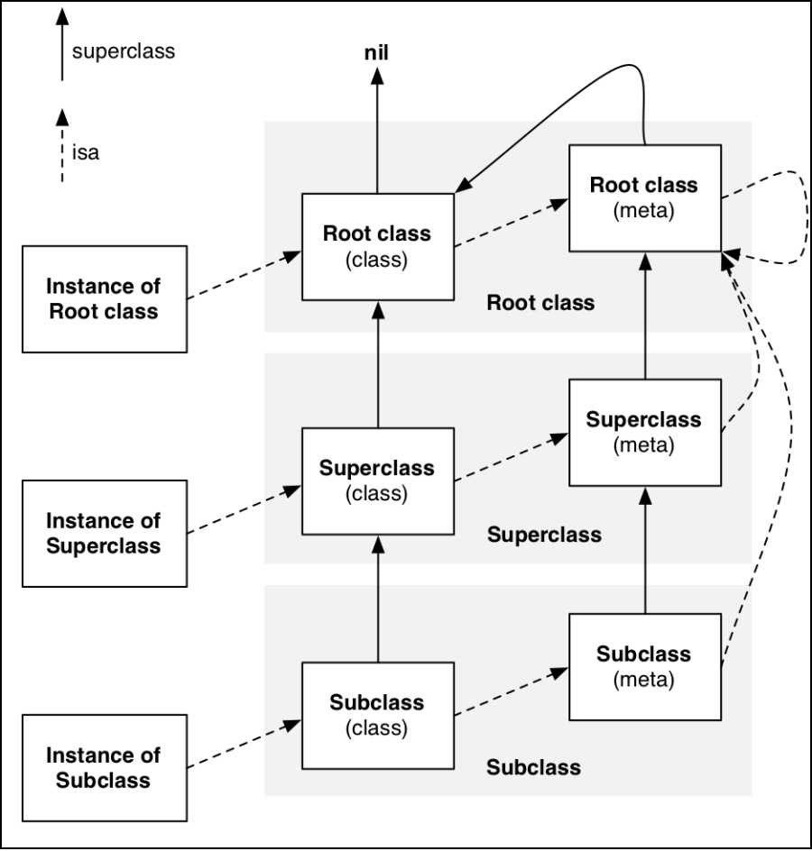

# isa和superclass

## oc对象的分类
oc对象可以分为三种，`instance对象 （实例对象）`、 `class 对象 （类对象）` 和 `meta-class 对象(元类对象)`

我们都知道实例对象在内存中保存着自己成员变量的具体值，每一个通过`[[NSObject alloc] init]`返回的实例对象的地址都不一样。但是他们内部都有一个共同的 isa 指针，这个isa指针是保存在哪里呢？另外我们平时用到协议又是保存到什么地方呢？答案就在类对象中。

### 类对象 class
通过下面的代码获取到class对象,通过打印地址，我们发现它们指向的是同一个地址。**也就是说每个类在内存中只有一个class对象**。

**class 对象在内存中存储的信息主要包括 isa指针、superclass指针、类的属性信息(@property)、类的对象方法信息(instance method)、类的协议信息(@protocol)、类的成员变量信息(ivar) ...等等**,这里的成员变量信息主要指成员变量的类型和名字，不是它的具体值。

```objc
#import <objc/runtime.h>

NSObject *obj = [[NSObject alloc] init];

Class class1 = [obj class];
Class class2 = [NSObject class];
Class class3 = object_getClass(obj);

NSLog(@"%p %p %p",class1,class2,class3);
```

### 元类对象 meta-class
通过`object_getClass()`方法，将类对象作为参数传递进去，会返回元类对象。你会发现`元类对象`和`类对象`一样，返回的都是class类型，说明他们的结构是一样的，但是里面保存的值是不一样的。

**每个元类对象在内存中只有一份，主要保存isa指针、superclass指针、类的类方法信息、类的属性信息(值为null)、类的协议信息(null) ...等等**，虽然它的结构跟类对象是一样的，但是主要保存的还是isa、superclass和类的类方法，其他信息都是null。

```objc
// 将类对象作为参数传进去，获取的是元类对象
class metaClass = object_getClass([NSObject class]);
// 判断是否是元类
Bool isMetaClass = class_isMetaClass(metaClass);

```

## 初始 isa 和 superclass
根据我们上面的讲解，方法是保存在类对象和元类对象中的，那么当我们通过实例对象调用一个方法时，它是怎么找到这些方法并运行的呢？答案就是通过isa和supperclass。

isa是怎么找到方法的，可以根据下面的图来认识一下。**当实例对象要调用方法时，会通过实例对象的isa指针找到自己的类对象，类对象存储着对象方法信息。如果是要调用类方法，会通过 类对象的isa指针 找到自己的 元类对象进行调用。**(一个是类对象class,一个是元类对象meta-class，🙅不要搞混哈！！)


如果子类调用父类的方法，又是如何找到的呢？这个时候就用到了我们的 superclass指针 。因为类对象的 superclass指针 和元类对象的 superclass指针 指向的类不同，所以这里先讲一下类对象的 superclass指针。

> 类对象 的superclass指针

假设我们有一个 Person类 继承自 NSObject , 一个Student类继承自Person类。superclass指针的指向如图所示。**类对象的 superclass指针 指向的是 父类的类对象，当Student的实例对象调用父类的方法时，会先通过isa指针找到自己的类对象，然后通过类对象的superclass指针 找到Person的类对象，然后找到对应的方法进行调用。**


> 元类对象 的superclass指针

同上所述，**元类对象的superlcass指针 指向的是自己父类的元类对象。**当Student调用Person类的类方法时，会先通过类对象的isa指针找到自己的元类对象，然后通过元类对象的 superclass指针 找到Person的元类对象进行调用。


## 通过一张图来再次认识isa和superclass
图中有三个类，子类、父类、基类，通过superclass连接在一起。还有三种对象类型，实例对象、类对象、元类对象，通过isa连接在一起。我们可以把它们看成我们刚才讲的Student类、Person类、NSObject类。虚线是isa，实线是superclass。



通过这张图我们可以做一个总结：
1. instance的isa指向class, class的isa指向meta-calss, meta-calss的isa指向基类的meta-calss

2. class的 superclass指针 指向父类的class，如果没有父类，指向nil
3. meta-calss的 superclass指针 指向父类的meta-calss，**基类的meta-calss的 superclass指针 指向 基类的class**

实例对象调用方法的轨迹：instance通过isa找到class,如果方法不存在，通过superclass找到父类

class调用类方法的轨迹：class通过isa找到meta-class,如果方法不存在，通过superclass找到父类，如果

>基类的元类对象的superlcass指向基类的类对象。
这里我们肯定会有一个疑问，这是真的吗？我们将通过下面的代码进行证实。

```objc
// Person 继承自 NSObject,同时添加了 metaTest类方法 ,但并没有对它实现。通过添加NSObject分类实现了- (void)metaTest{}方法。直接调用[Person metaTest]发现可以发现metaTest方法。
@interface Person : NSObject
+ (void)metaTest;
@end

@implementation Person

@end

@interface NSObject (Test)
+ (void)metaTest;
@end

@implementation NSObject (Test)
// 实例方法
- (void)metaTest{
    NSLog(@"[NSObject test] -- %p",self);
}
@end

int main(int argc, const char * argv[]) {
    @autoreleasepool {
        NSLog(@"Person :%p -- NSObject :%p",[Person class],[NSObject class]);
        [Person metaTest];
        [NSObject metaTest];
    }
    return 0;
}
```
运行之后，我们发现Person类真的可以掉用`metaTest`方法，按照我们刚才所学，它的调用顺序应该如下图所示


## isa的验证过程
我们刚才所说，isa指针指向的就是类对象，我们通过直接打印地址的方式进行验证。


## 扩展
面试题: 对象的isa指向哪里

当一个实例对象调用方法时，本质是通过runtime方法给类发送消息，实例对象本身没有方法，通过自身isa指针找到类对象，调用类对象中保存的方法。


object_getClass(id obj)
objc_getClass(const char *aClassName)
的区别
```cpp
// objc-class.mm
Class object_getClass(id obj)
{
    // 如果是instance对象，返回的是class对象
    // 如果是class对象，返回的是meta-class对象
    // 如果是meta-class对象，返回的是NSOject(基类)的meta-class对象
    if (obj) return obj->getIsa();
    else return Nil;
}

/***********************************************************************
* objc_getClass.  Return the id of the named class.  If the class does
* not exist, call _objc_classLoader and then objc_classHandler, either of 
* which may create a new class.
* Warning: doesn't work if aClassName is the name of a posed-for class's isa!
**********************************************************************/
Class objc_getClass(const char *aClassName)
{
    if (!aClassName) return Nil;

    // NO unconnected, YES class handler
    return look_up_class(aClassName, NO, YES);
}

+ (Class)class
- (Class)class
返回的一直都是类对象。
```