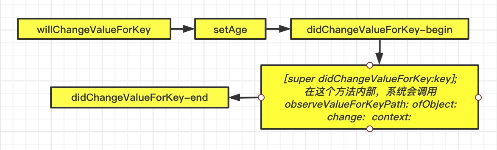

# KVO的本质
KVO的全称是`Key-Value Observing`，俗称“键值监听”，可以用于监听某个对象属性值的改变

## KVO的基础使用
我们先简单使用一下KVO，我们定义了两个实例对象p1和p2，只对p1做监听，当我们点击屏幕时，改变p1和p2 age 属性的值。
```objc
#import "ViewController.h"
#import "Person.h"

@interface ViewController()
@property (nonatomic,strong)Person *p1;
@property (nonatomic,strong)Person *p2;
@end

@implementation ViewController
- (void)viewDidLoad {
    [super viewDidLoad];

    self.p1 = [[Person alloc] init];
    self.p2 = [[Person alloc] init];

    [self.p1 addObserver:self forKeyPath:@"age" options:NSKeyValueObservingOptionNew | NSKeyValueObservingOptionOld context:@"123"];
}

- (void)observeValueForKeyPath:(NSString *)keyPath ofObject:(id)object change:(NSDictionary<NSKeyValueChangeKey,id> *)change context:(void *)context{
    NSLog(@"%@ - %@ - %@ - %@",object,keyPath,change,context);
}

- (void)touchesBegan:(NSSet<UITouch *> *)touches withEvent:(UIEvent *)event{
    self.p1.age = 2;
    self.p2.age = 12;
}

- (void)dealloc{
    [self.p1 removeObserver:self forKeyPath:@"age"];
}
@end
```
这里我们会不会有一个疑问，同样是更改 age 属性，它是怎么做到只监听p1更改属性的值而不监听p2更改属性的值呢？

我们都知道`self.p1.age = 2`相当于调用`[self.p1 setAge:2]`方法,我们在Person内重写`setAge:`方法，发现p1和p2更改age的值时都会调用，这证明对age的监听不是在这个方法里面做的，那会不会是实例对象的问题呢？

通过上节学习 isa和superclass 我们都知道，一个实例对象如果想要调用方法需要先通过isa指针找到它的类对象。我们在p1使用KVO监听前和监听后分别对它的isa指针进行打印，看一下发生了什么改变，因为isa指针不能直接打印，我们通过定义一个结构体的形式对它进行强转。
```objc
#import <objc/runtime.h>

NSLog(@"kvo监听前的isa指针: %@",object_getClass(self.p1));

[self.p1 addObserver:self forKeyPath:@"age" options:NSKeyValueObservingOptionNew | NSKeyValueObservingOptionOld context:@"123"];

NSLog(@"kvo监听后的isa指针: %@ ",object_getClass(self.p1));

打印结果：
kvo监听前的isa指针: Person
kvo监听后的isa指针: NSKVONotifying_Person 
```
打印之后，我们发现p1进行kvo监听之后，它的isa指向了一个新的类 `NSKVONotifying_Person`,这个类的内部又做了什么处理呢？

## NSKVONotifying_XXX 类
系统对 p1 的 age 属性进行监听时,通过 Runtime 动态创建`NSKVONotifying_Person`这样一个类,它是 Person 的子类，`NSKVONotifying_Person`的 superclass指针指向 Person。在 p1 通过`setAge:`方法进行赋值时，会调用一个`_NSSetIntValueAndNotify()`这样的函数，大致的伪代码如下，注意是伪代码：

```objc
@implementation NSKVONotifying_Person

-(void)setAge:(int)age{
    _NSSetIntValueAndNotify();
}

void _NSSetIntValueAndNotify()
{
    [self willChangeValueForKey:@"age"];
    [super setAge:age];
    [self didChangeValueForKey:@"age"];
}

- (void)didChangeValueForKey:(NSString *)key{
    [super didChangeValueForKey:key];
    [oberser observeValueForKeyPath:key ofObject:self change:nil context:nil];
}
@end
```

我们如何证实调用 setAge: 方法时会有`_NSSetIntValueAndNotify()`这个函数呢？我们通过`methodForSelector()`看一下监听前后 setAge: 方法实现的内存地址，并且在实现监听之后打一个断点，通过 lldb 直接打印方法地址, 将获取到函数方法名来对比一下。发现确实对age属性做KVO监听之后，它的 setAge: 方法的实现也发生了变化。
```objc
NSLog(@"kvo监听前的setAge:方法的地址: %p",[self.p1 methodForSelector:@selector(setAge:)]);

[self.p1 addObserver:self forKeyPath:@"age" options:NSKeyValueObservingOptionNew | NSKeyValueObservingOptionOld context:@"123"];

NSLog(@"kvo监听后的setAge:方法的地址: %p",[self.p1 methodForSelector:@selector(setAge:)]);

// 打印结果
2020-12-15 13:49:13.169932+0800 Demo[7473:174037] kvo监听前的setAge:方法的地址: 0x10df9ff00
2020-12-15 13:49:13.170427+0800 Demo[7473:174037] kvo监听后的setAge:方法的地址: 0x7fff207d2ce3
(lldb) p (IMP)0x10df9ff00
(IMP) $0 = 0x000000010df9ff00 (Demo`-[Person setAge:] at Person.m:11)
(lldb) p (IMP)0x7fff207d2ce3
(IMP) $1 = 0x00007fff207d2ce3 (Foundation`_NSSetIntValueAndNotify)
(lldb) 
```
通过打印方法地址我们发现对age实行KVO监听之后，setAge:方法的实现地址变成了`_NSSetIntValueAndNotify`函数，这是`Foundation`框架中的实现函数，如果要查看具体实现，需要越狱的手机，获取到系统文件，并对它进行反汇编操作。

> 使用runtime 查看 NSKVONotifying_XXX 内部实现的方法

```objc
// object_getClass(self.p1) 获取 NSKVONotifying_Person 类
[self printMethodNameOfClass:object_getClass(self.p1)];

// 查看一个类内部的方法
- (void)printMethodNameOfClass:(Class)cls{
    
    unsigned int count;
    // 获取方法数组
    Method *methodlist = class_copyMethodList(cls, &count);
    
    // 存储方法名
    NSMutableString *methodNames = [NSMutableString string];
    
    // 遍历所有方法
    for(int i = 0; i < count; i++){
        // 获得方法
        Method method = methodlist[i];
        // 获取方法名
        NSString *methodName = NSStringFromSelector(method_getName(method));
        // 拼接方法名
        [methodNames appendString:methodName];
        [methodNames appendString:@" ,"];
    }
    // 释放
    free(methodlist);
    
    // 打印方法名
    NSLog(@"%@ %@",cls,methodNames);
}
```

## 调用顺序问题
知道KVO的实现原理之后，我们获取一下它的打印顺序，在 Person类内部重写方法。
```
@implementation Person
-(void)setAge:(int)age{
    _age = age;
    NSLog(@"setAge");
}

- (void)willChangeValueForKey:(NSString *)key{
    [super willChangeValueForKey:key];
    
    NSLog(@"willChangeValueForKey");
}
-(void)didChangeValueForKey:(NSString *)key{
    NSLog(@"didChangeValueForKey --begin");

    [super didChangeValueForKey:key];
    
    NSLog(@"didChangeValueForKey --end");

}
@end
```
它的调用顺序如下图


## 面试题
**面试题1: iOS用什么方式实现对一个对象的KVO？(KVO的本质是什么？)**
1. 系统利用RuntimeAPI动态生成一个子类，并且让instance对象的isa指向这个全新的子类
2. 当instance对象的修改属性的值触发`setXxx:`方法时，会调用Foundation的`_NSSetXXXValueAndNotify`函数
3. _NSSetXXXValueAndNotify内部调用了    
    * willChangeValueForKey:
    * 父类原来的setter
    * didChangeValueForKey:
        * `didChangeValueForKey`内部会触发监听器（Oberser）的监听方法`( observeValueForKeyPath:ofObject:change:context:）`

**面试题2: 如何手动触发KVO？**

手动调用`willChangeValueForKey:`和`didChangeValueForKey:`

**面试题3: 直接修改成员变量的值会出发KVO吗？**

不会触发，因为直接通过指针修改成员变量的值不会调用`willChangeValueForKey:`和`didChangeValueForKey:`方法