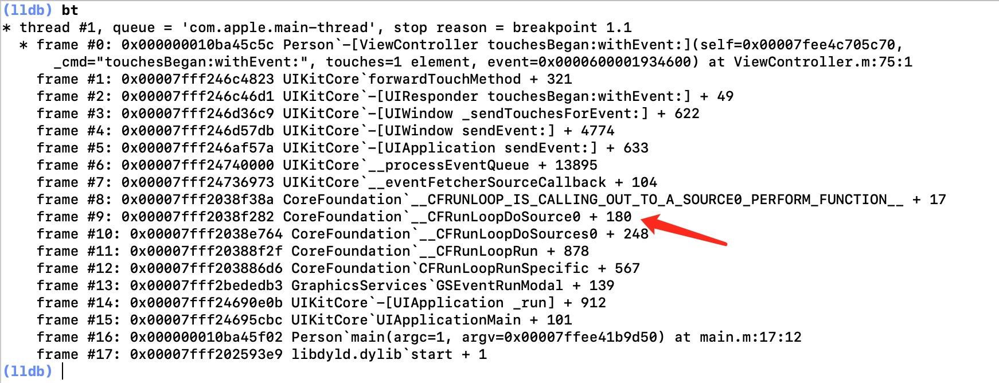

# Runloop
Runloop能够保证我们程序一直运行，类似于一个循环，在程序运行过程中循环做一些事情。这也是为什么我们的应用能够一直监听到屏幕滑动和点击事件的原因。Runloop是开源项目，[点此进入苹果官网获取源码](https://opensource.apple.com/tarballs/CF/)。我们将从下面几个方向学习runloop:
1. 认识什么是Runloop 
2. 认识Runloop和线程之间的关系
3. 了解Runloop的内部结构以及它们的作用
4. Runloop在项目中的应用。

## 认识Runloop
Runloop 顾名思义,是在程序运行过程中循环做一些事情，定时器、PerformSelector、事件相应、手势识别、UI刷新等技术都是通过Runloop进行实现的。

iOS中有2套API来访问和使用 RunLoop ,Foundation框架中的`NSRunLoop`,Core Foundation 框架中的`CFRunLoopRef`,它们都代表着RunLoop对象。NSRunLoop 是基于 CFRunLoopRef的一层OC包装。

**获取Runloop的两种方式:**
```objc
// Foundation框架
[NSRunLoop currentRunLoop]; // 获取当前Runloop
[NSRunLoop mainRunLoop]; // 获取当前Runloop

// Core Foundation 框架
CFRunLoopGetCurrent(); // 获取当前Runloop
CFRunLoopGetMain(); // 获取当前Runloop

// 打印当前Runloop的地址不一样，并不是有两个Runloop，查看 [NSRunLoop currentRunLoop] 的详情，会看到Runloop的地址实际上指向的是CFRunLoopGetCurrent()的地址，这也证明了NSRunLoop 其实就是对 CFRunLoopRef的一层包装。
NSLog(@"%p  %p -- %@",[NSRunLoop currentRunLoop],CFRunLoopGetCurrent(),[NSRunLoop currentRunLoop]);
```

## Runloop和线程之间的关系
1. 每条线程都有唯一的一个与之对应的RunLoop对象
2. RunLoop保存在一个全局的Dictionary里，线程作为key，RunLoop作为value
3. 线程刚创建时并没有RunLoop对象，RunLoop会在第一次获取它时创建
4. RunLoop会在线程结束时销毁
5. 主线程的RunLoop已经自动获取（创建），子线程默认没有开启RunLoop

知道了Runloop和线程之间的关系，我们再通过源码确认一下上面的说法是否正确，从获取当前Runloop的`CFRunLoopGetCurrent`方法入手。代码片段来自`CF-1153.18`
```c
CFRunLoopRef CFRunLoopGetCurrent(void) {
    ...
    return _CFRunLoopGet0(pthread_self());
}

CF_EXPORT CFRunLoopRef _CFRunLoopGet0(pthread_t t) {
    ...
    // 从字典中获取runloop
    CFRunLoopRef loop = (CFRunLoopRef)CFDictionaryGetValue(__CFRunLoops, pthreadPointer(t));
    __CFUnlock(&loopsLock);
    if (!loop) {
    // 如果Runloop对象不存在，创建新的Runloop对象
	CFRunLoopRef newLoop = __CFRunLoopCreate(t);
    ...
    // 将runloop存储在字典中
    CFDictionarySetValue(__CFRunLoops, pthreadPointer(t), newLoop);
    loop = newLoop;
    ...
	CFRelease(newLoop);
    }
    ...
    return loop;
}
```
通过源码我们可以确认，Runloop在全局中以键值对的形式保存着，线程做为key，Runloop对象做为value。因为是字典，所以线程和 RunLoop 对象是1对1的关系。在代码中我们也看到如果当前RunLoop对象不存在时，通过`__CFRunLoopCreate()`函数创建新的Runloop对象。这也证明了RunLoop会在第一次获取它时创建。

## Runloop的内部结构
Core Foundation 框架中跟RunLoop有关的5个类， `CFRunLoopRef`、`CFRunLoopModeRef`、`CFRunLoopSourceRef`、`CFRunLoopTimerRef`、`CFRunLoopObserverRef`。

> CFRunLoopRef 和 CFRunLoopModeRef 的关系
* `CFRunLoopRef`代表 Runloop对象
* `CFRunLoopModeRef`代表 RunLoop的运行模式

一个 RunLoop 包含若干个Mode，每个Mode又包含若干个 Source0/Source1/Timer/Observer 。如果需要切换Mode，只能退出当前Loop，再重新选择一个Mode进入。这样做的好处是不同组的 Source0/Source1/Timer/Observer 能分隔开来，互不影响。如果Mode里没有任何 Source0/Source1/Timer/Observer ，RunLoop会立马退出。
它们之间的关系如下图:


我们再通过`CFRunLoopRef`和`CFRunLoopModeRef`结构体来认识他们的关系，代码片段来自`CF-1153.18`,经过删减：
```
typedef struct __CFRunLoop * CFRunLoopRef;
struct __CFRunLoop {
    pthread_t _pthread;
    CFMutableSetRef _commonModes;
    CFMutableSetRef _commonModeItems;
    CFRunLoopModeRef _currentMode; //当前Mode
    CFMutableSetRef _modes;  //Mode的合集
    struct _block_item *_blocks_head; //调用CFRunLoopPerformBlock 函数时，blocks_heads 会被赋值。双向链表结构，在进入runloop 休眠之前就执行了。不影响runloop 的执行顺序。
    struct _block_item *_blocks_tail; //执行的block的链表的尾部
};

typedef struct __CFRunLoopMode *CFRunLoopModeRef;
struct __CFRunLoopMode {
    CFStringRef _name;
    CFMutableSetRef _sources0;
    CFMutableSetRef _sources1;
    CFMutableArrayRef _observers;
    CFMutableArrayRef _timers;
};
```

## CFRunLoopModeRef
**CFRunLoopModeRef代表RunLoop的运行模式。**一个RunLoop包含若干个Mode，RunLoop启动时只能选择其中一个作为currentMode。切换Mode时，只能先退出当前Loop，再重新选择一个Mode进入。如果Mode里没有任何Source0/Source1/Timer/Observer，RunLoop会立马退出。

**CFRunLoopModeRef 的类型**
* `kCFRunLoopDefaultMode（NSDefaultRunLoopMode）`：App的默认Mode，通常主线程是在这个Mode下运行
* `UITrackingRunLoopMode`：界面跟踪 Mode，用于 ScrollView 追踪触摸滑动，保证界面滑动时不受其他 Mode 影响
* `GSEventReceiveRunLoopMode`: 接受系统事件的内部Mode
* `UIInitializationRunLoopMode`：刚启动App时进入的第一个Mode
* `kCFRunLoopCommonModes`: 是苹果用来占位用的Mode,并不是一个真正的Mode，kCFRunLoopCommonModes包含`kCFRunLoopDefaultMode`和`UITrackingRunLoopMode`两种Mode。

最常用的两种Mode，`kCFRunLoopDefaultMode`和`UITrackingRunLoopMode`。

## Source0、Source1、Timers、Observers
Source1用来捕捉系统事件，包装成Source0进行处理，Timers主要处理跟定时器相关的功能，Observers监听Runloop的状态，在Runloop进入休眠之前进行界面刷新

类型 | 处理事件
------- | -------
`Source0` | 1. 触摸事件处理<br> 2. `performSelector:onThread:`
`Source1` | 1. 基于Port的线程间通信 <br> 2. 系统事件捕捉(系统通过Source1捕捉事件，包装成Source0进行处理)
`Timers` | 1. `NSTimer` <br> 2. `performSelector:withObject:afterDelay:`
`Observers` | 1. 用于监听RunLoop的状态<br> 2. UI刷新（BeforeWaiting）<br> 3. Autorelease pool（BeforeWaiting）

> Source0

通过打印堆栈的形式查看点击事件到底是不是通过Source0进行处理。我们在 View 的点击事件内打断点，通过`bt`命令打印堆栈信息。我们看到有调用`__CFRunLoopDoSource0`函数，这也证明了我们的说法是正确的。


> Runloop的状态
```c
typedef CF_OPTIONS(CFOptionFlags, CFRunLoopActivity) {
    kCFRunLoopEntry = (1UL << 0),  // 即将进入Runloop
    kCFRunLoopBeforeTimers = (1UL << 1),  // 即将处理Timer
    kCFRunLoopBeforeSources = (1UL << 2),  // 即将处理Sources
    kCFRunLoopBeforeWaiting = (1UL << 5),  // 即将进入休眠
    kCFRunLoopAfterWaiting = (1UL << 6),  // 刚从休眠中唤醒
    kCFRunLoopExit = (1UL << 7),  // 即将退出Loop
    kCFRunLoopAllActivities = 0x0FFFFFFFU  // 所有状态
};
```

> 通过 CFRunLoopObserverRef 监听一下Runloop的状态变化：
```c
void observeRunloopActivities(CFRunLoopObserverRef observer, CFRunLoopActivity activity, void *info){
    switch (activity) {
        case kCFRunLoopEntry:
            NSLog(@"进入RunLoop   kCFRunLoopEntry");
            break;
        case kCFRunLoopBeforeTimers:
            NSLog(@"即将处理Timer   kCFRunLoopBeforeTimers");
            break;
        case kCFRunLoopBeforeSources:
            NSLog(@"即将处理Source  kCFRunLoopBeforeSources");
            break;
        case kCFRunLoopBeforeWaiting:
            NSLog(@"即将进入休眠  kCFRunLoopBeforeWaiting");
            break;
        case kCFRunLoopAfterWaiting:
            NSLog(@"刚从休眠中唤醒 kCFRunLoopAfterWaiting");
            break;
        case kCFRunLoopExit:
            NSLog(@"退出RunLoop   kCFRunLoopExit");
            break;
            
        default:
            break;
    }
}

- (void)viewDidLoad {
    [super viewDidLoad];
    // 创建observer
     CFRunLoopObserverRef ref =  CFRunLoopObserverCreate(kCFAllocatorDefault, kCFRunLoopAllActivities, YES, 0, observeRunloopActivities, NULL);
    // 添加Runloop到observe中，kCFRunLoopCommonModes表示监听kCFRunLoopDefaultMode和UITrackingRunLoopMode
    CFRunLoopAddObserver(CFRunLoopGetCurrent(), ref, kCFRunLoopCommonModes);
    // 释放
    CFRelease(ref);
}
```

**`CFRunLoopObserverCreate(CFAllocatorRef allocator, CFOptionFlags activities, Boolean repeats, CFIndex order, CFRunLoopObserverCallBack callout, CFRunLoopObserverContext *context)`函数**参数说明：
* CFAllocatorRef：表示内存申请和释放的方式。(一般使用kCFAllocatorDefault，表示使用当前线程中默认的 CFAllocatorRef 变量进行内存管理)
* CFOptionFlags： 监听RunLoop的变化的状态(如果要监听所有状态使用kCFRunLoopAllActivities)
* Boolean：是否重复监听
* CFIndex：是否按照顺序监听
* CFRunLoopObserverCallBack： 监听的回调方法(C语言的方法)
* CFRunLoopObserverContext： 表示上下文环境,用于和回调函数传值

> 监听Runloop切换Mode

我们常用的Mode有两种，`kCFRunLoopDefaultMode`和`UITrackingRunLoopMode`，我们使用`CFRunLoopObserverRef`来监听Runloop切换mode模式。

在屏幕中添加`UITextView`视图，当我们滚动`UITextView`时，Runloop会切换到`UITrackingRunLoopMode`模式，当我们停止滚动时，Runloop会切换到`kCFRunLoopDefaultMode`模式。
```objc
- (void)viewDidLoad {
    [super viewDidLoad];
   
    // 创建Observer
    CFRunLoopObserverRef ref =  CFRunLoopObserverCreateWithHandler(kCFAllocatorDefault, kCFRunLoopAllActivities, YES, 0, ^(CFRunLoopObserverRef observer, CFRunLoopActivity activity) {
        switch (activity) {
            case kCFRunLoopEntry:
            {
                CFRunLoopMode mode = CFRunLoopCopyCurrentMode(CFRunLoopGetCurrent());
                NSLog(@"进入RunLoop  kCFRunLoopEntry -%@",mode);
                CFRelease(mode);
            }
                break;
            case kCFRunLoopExit:
            {
                CFRunLoopMode mode = CFRunLoopCopyCurrentMode(CFRunLoopGetCurrent());
                NSLog(@"退出RunLoop   kCFRunLoopExit -%@",mode);
                CFRelease(mode);
            }
                break;
                
            default:
                break;
        }
    });
    // 将Observer添加Runloop
    CFRunLoopAddObserver(CFRunLoopGetCurrent(), ref, kCFRunLoopCommonModes);
    // 删除
    CFRelease(ref);
}

// 打印结果：
退出RunLoop   kCFRunLoopExit -kCFRunLoopDefaultMode
进入RunLoop  kCFRunLoopEntry -UITrackingRunLoopMode

退出RunLoop   kCFRunLoopExit -UITrackingRunLoopMode
进入RunLoop  kCFRunLoopEntry -kCFRunLoopDefaultMode
```