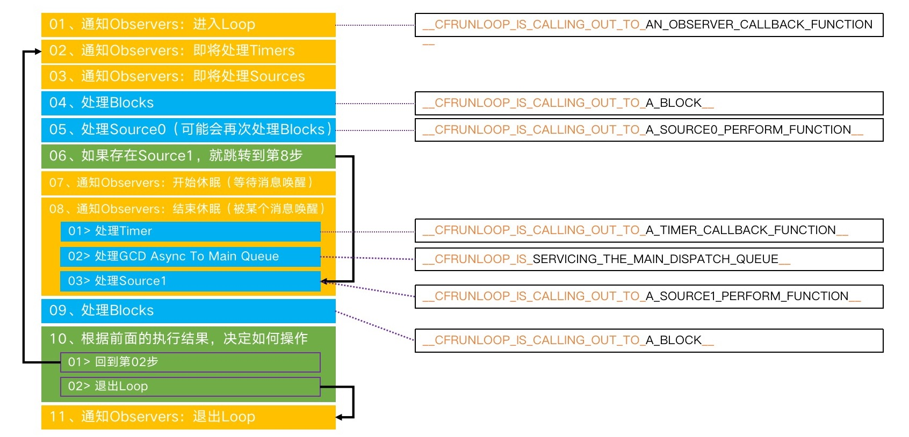

# Runloop
知道了什么是Runloop、Runloop的内部结构和Mode的切换。现在我们来学习Runloop的调用流程以及从源码上分析Runloop的调用流程，最后讲Runloop在程序内的应用。

## Runloop的调用流程
01. 通知Observers：进入Loop
02. 通知Observers：即将处理Timers
03. 通知Observers：即将处理Sources
04. 处理Blocks
05. 处理Source0（可能会再次处理Blocks）
06. 如果存在Source1，就跳转到第8步
07. 通知Observers：开始休眠（等待消息唤醒）
08. 通知Observers：结束休眠（被某个消息唤醒）
    1. 处理Timer
    2. 处理GCD Async To Main Queue
    3. 处理Source1
09. 处理Blocks
10. 根据前面的执行结果，决定如何操作
    01.  回到第02步
    02.  退出Loop
11. 通知Observers：退出Loop

使用图片展示Runloop的调用流程，图片来源于小码哥的MJ老师，点击进入[小码哥官网](http://www.520it.com/)


## 通过源码分析Runloop
该怎么找Runloop的入口呢？在上一章中，我们通过打印堆栈信息查看是否是 Source0 处理点击事件，在堆栈事件中，我们看到`__CFRunLoopRun`函数，在`CFRunLoopRunSpecific`函数中使Runloop运行，可以确定`CFRunLoopRunSpecific`函数是Runloop的入口，通过源码进行分析Runloop的具体实现，代码片段来自`CF-1153.18`，应为源代码太多，做一些删减，只显示主逻辑：
```c
SInt32 CFRunLoopRunSpecific(CFRunLoopRef rl, CFStringRef modeName, CFTimeInterval seconds, Boolean returnAfterSourceHandled) {   
    // 通知Observers: 进入Runloop
    __CFRunLoopDoObservers(rl, currentMode, kCFRunLoopEntry);
    
    // Runloop中具体要做的事情
    __CFRunLoopRun(rl, currentMode, seconds, returnAfterSourceHandled, previousMode);
	
    // 通知Observers: 退出Runloop
    __CFRunLoopDoObservers(rl, currentMode, kCFRunLoopExit);

    return result;
}
```
通过代码我们看到`__CFRunLoopRun()`函数中时Runloop的具体实现，下面来分析一下`__CFRunLoopRun()`函数
```c
```
## Runloop在程序中的应用

