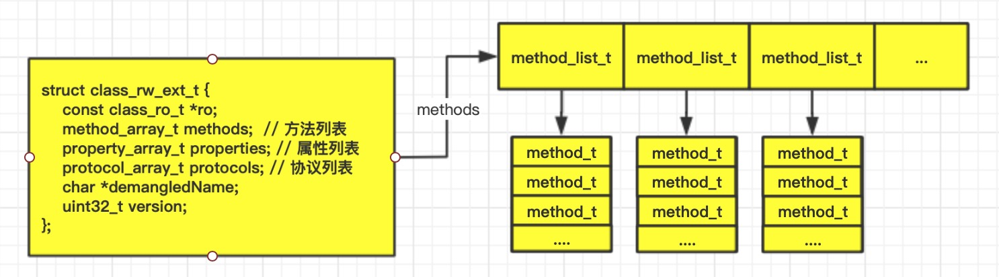

# 学习Runtime的准备工作
要想学习Runtime，首先要了解它底层的一些常用数据结构，比如 isa 指针，在arm64架构之前，isa 就是一个普通的指针，存储着`Class、Meta-Class`对象的内存地址。从arm64架构开始，对 isa 进行了优化，变成了一个共用体（union）结构，并且使用位域来存储更多的信息

## isa的位域
通过之前位域的学习我们知道，通过对二进制位的使用可以使我们保存更多的数据，在arm64架构下，isa的共同体是这个样子。
```c
union isa_t
{
    Class cls;
    uintptr_t bits;
    struct{
        uintptr_t nonpointer        : 1;
        uintptr_t has_assoc         : 1;
        uintptr_t has_cxx_dtor      : 1;
        uintptr_t shiftcls          : 33; /*MACH_VM_MAX_ADDRESS 0x1000000000*/
        uintptr_t magic             : 6;
        uintptr_t weakly_referenced : 1;
        uintptr_t deallocating      : 1;
        uintptr_t has_sidetable_rc  : 1;
        uintptr_t extra_rc          : 19
    }
}
```

符号 | 含义
------- | -------
nonpointer | 0：代表普通的指针，存储着Class、Meta-Class对象的内存地址 <br> 1：代表优化过，使用位域存储更多的信息
has_assoc | 是否有设置过关联对象，如果没有，释放时会更快
has_cxx_dtor | 是否有C++的析构函数（.cxx_destruct），如果没有，释放时会更快
shiftcls | 存储着Class、Meta-Class对象的内存地址信息
magic | 用于在调试时分辨对象是否未完成初始化
weakly_referenced | 是否有被弱引用指向过，如果没有，释放时会更快
deallocating | 对象是否正在释放
extra_rc | 里面存储的值是引用计数器减1
has_sidetable_rc | 引用计数器是否过大无法存储在isa中。如果为1，那么引用计数会存储在一个叫SideTable的类的属性中

## 认识Class的结构
在[isa和supperclass](ios/principle/isa和superclass.md)这篇文章中，我们粗略的讲过 Class 的结构，通过下面这张图重温一下 Class 的结构

>`class_rw_ext_t`结构体中的`methods、properties、protocols`是二维数组，是可读可写的，包含了类的初始内容、分类的内容。结构体如下图：


数组中包含着类的初始内容和分类中的内容，通过阅读源码我们可以看到，在初始化`class_rw_ext_t`之后，类中的方法、属性、协议，会被添加到rwe对应的数组中。源码来自于`objc-874`
```c
class_rw_ext_t *
class_rw_t::extAlloc(const class_ro_t *ro, bool deepCopy)
{
    runtimeLock.assertLocked();

    // 初始化class_rw_ext_t结构体
    auto rwe = objc::zalloc<class_rw_ext_t>();

    rwe->version = (ro->flags & RO_META) ? 7 : 0;

    // 将class_ro_t里的方法添加到rwt的数组中
    method_list_t *list = ro->baseMethods();
    if (list) {
        if (deepCopy) list = list->duplicate();
        rwe->methods.attachLists(&list, 1);
    }
    // 将class_ro_t里的属性添加到rwt的数组中
    property_list_t *proplist = ro->baseProperties;
    if (proplist) {
        rwe->properties.attachLists(&proplist, 1);
    }
    // 将class_ro_t里的协议添加到rwt的数组中
    protocol_list_t *protolist = ro->baseProtocols;
    if (protolist) {
        rwe->protocols.attachLists(&protolist, 1);
    }

    set_ro_or_rwe(rwe, ro);
    return rwe;
}
```
>`class_ro_t`里面的baseMethodList、baseProtocols、ivars、baseProperties是一维数组，是只读的，包含了类的初始内容。
```c
// class_ro_t是类的初始内容
struct class_ro_t {  
    uint32_t instanceSize;  //instance对象占用的内存空间    
    const char * name; // 类名
    method_list_t * baseMethodList; //方法列表
    protocol_list_t * baseProtocols; //协议
    const ivar_list_t * ivars; // 成员变量列表
    const uint8_t * weakIvarLayout;
    property_list_t *baseProperties; //属性列表
};
```

## 认识 method_t
method_t是一个结构体，里面保存着函数名、函数编码和函数地址。结构体如下：
```c
struct method_t {
    SEL name; // 函数名
    const char *types; //编码 （返回值类型 参数类型）
    IMP imp; // 指向函数的指针 （函数地址）
} 
```

>IMP -> 指向方法实现功能的指针

`typedef id _Nullable (*IMP)(id _Nonnull, SEL _Nonnull, ...); `

>SEL -> 函数名

SEL的定义`typedef struct objc_selector *SEL;`, SEL 代表方法\函数名，一般叫做选择器，底层结构跟`char *`类似，可以通过`@selector()`和`sel_registerName()`获得 SEL。也可以通过`sel_getName()`和`NSStringFromSelector()`将 SEL 转成字符串。注意：**不同类中相同名字的方法，所对应的方法选择器是相同的**
```c
// 获取SEL
SEL sel1 = @selector(test);
SEL sel2 = sel_registerName("test");

// SEL转字符串
NSString *sel1 = NSStringFromSelector(@selector(test));
const char * sel2 = sel_getName(sel_registerName("test"));

// 通过打印多个地址我们得出 @selector(test)不管写多少遍都是相同的
NSLog(@"%p --- %p  ---- %p",@selector(test),sel_registerName("test"),@selector(test));
//打印结果： 0x7fff7317693f --- 0x7fff7317693f  ---- 0x7fff7317693f
```

>types -> 函数返回值、参数编码的字符串

我们有了函数名，有了指向函数地址的指针，我们还缺少什么呢？怎么知道这个函数有没有返回值，有几个参数，都是什么类型？这就需要用到types。

iOS中提供了一个叫做`@encode`的指令，可以将具体的类型表示成字符串编码,比如：`@encode(int)` 返回i


我们根据`@encode`分析一下下面的字符串是什么意思
```
定义一个没有返回值的` (void)test;方法，types是 v16@0:8 
在之前的文章中，我们说过，每个方法系统都会默认传两个参数，（id）self和(SEL)_cmd,我们分析一下这个方法的types
v -> 返回值是void
16 ->  一共16个字节，self占8个字节，SEL占8个字节
@ -> id
0 -> 表示从第0个字节开始
: -> SEL
8 -> 表示从第8个字节开始

如果有参数并且有返回值的函数是什么样子呢？
- (int)test:(int)age num:(float)num; // types是 i24@0:8i16f20
```

## 方法缓存 cache_t
通过之前的学习，我们知道方法是存储在类对象中，实例对象调用方法时，首先通过 isa 找到类对象，如果当前类对象没有，会通过类对象的 superclass 指针找到父类，如果父类中也没有，再通过父类的 superclass 往上找，直到找不到报经典错误`unrecognized selector sent to instance`为止。想一下，如果每次都这样调用方法，是不是有些浪费？ 这个时候就要用到缓存cache_t，了解cache_t之前我们先来了解一下散列表

> 散列表

散列表是用来提高查找速度的，使用空间换时间的方式。

散列表初始化时会默认分配内存，假设为4。在存储数据的时候，使用`key &（4-1）`,得出一个索引，（因为使用`&`的方式，所以索引不可能会越界）。如果对应的索引没有数据，将数据放到对应的索引上，如果存在数据，使用 `(索引 + 1) & (4-1)`的方式生成新的索引。

如果数据已经存到3个了，需要对散列表进行扩容，使用翻倍扩容的方式`4 * 2`,扩容前需要先清除散列表中的数据。

> cache_t

为了提高方法的查找速度，Class内部结构中有个方法缓存（cache_t），用**散列表（哈希表）**来缓存曾经调用过的方法。

* cache_t结构体
```c
struct cache_t {
    struct bucket_t *buckets();  // 散列表
    mask_t mask();   // 散列表的长度 -1
    mask_t occupied(); // 已经缓存的方法数量
    ...
}
```

* bucket_t 结构体
```c
struct bucket_t {
    explicit_atomic<uintptr_t> _imp; //  函数的内存地址
    explicit_atomic<SEL> _sel; // SEL 作为key

    // 获取方法签名修饰符
    uintptr_t modifierForSEL(SEL newSel, Class cls) const {
        // 将方法实现的地址、方法名地址和类地址进行位异或后返回
        return (uintptr_t)&_imp ^ (uintptr_t)newSel ^ (uintptr_t)cls;
    }
    // 对方法进行编码  （返回值类型 参数类型 占用多少字节）
    uintptr_t encodeImp(IMP newImp, SEL newSel, Class cls) const {
        if (!newImp) return 0;
        // 将方法实现地址与类对象地址进行位异或运算后返回
        return (uintptr_t)newImp ^ (uintptr_t)cls;
    }
}
```

通过源码查看cache_t的散列表是怎么做的，下面的代码片段来自于`obj4-781`，代码经过删减
```c
// 散列表插入数据
void cache_t::insert(Class cls, SEL sel, IMP imp, id receiver)
{
    mask_t newOccupied = occupied() + 1;
    unsigned oldCapacity = capacity(), capacity = oldCapacity;

    // 散列表为空时 
    if (slowpath(isConstantEmptyCache())) {
        if (!capacity) capacity = INIT_CACHE_SIZE;
        reallocate(oldCapacity, capacity, /* freeOld */false);
    }
    else if (fastpath(newOccupied + CACHE_END_MARKER <= capacity / 4 * 3)) {
        // Cache is less than 3/4 full. Use it as-is.
    }else {

        // 对散列表进行扩容
        capacity = capacity ? capacity * 2 : INIT_CACHE_SIZE;
        reallocate(oldCapacity, capacity, true);
    }

    // 获取到散列表和对应的索引
    bucket_t *b = buckets();
    mask_t m = capacity - 1;
    mask_t begin = cache_hash(sel, m);
    mask_t i = begin;

    // Scan for the first unused slot and insert there.
    // There is guaranteed to be an empty slot because the
    // minimum size is 4 and we resized at 3/4 full.
    do {
        if (b[i].sel() == 0) {
             _occupied++;
            b[i].set<Atomic, Encoded>(sel, imp, cls);
            return;
        }
        if (b[i].sel() == sel) {
            return;
        }
    } while ((i = cache_next(i, m) != begin));
    ...
}

// 初始化散列表
void cache_t::reallocate(mask_t oldCapacity, mask_t newCapacity, bool freeOld)
{
    bucket_t *oldBuckets = buckets();
    bucket_t *newBuckets = allocateBuckets(newCapacity);
    ...
    setBucketsAndMask(newBuckets, newCapacity - 1);

    // 释放之前的散列表数据
    if (freeOld) {
        cache_collect_free(oldBuckets, oldCapacity);
    }
}

// 生成索引
static inline mask_t cache_hash(SEL sel, mask_t mask) 
{
    return (mask_t)(uintptr_t)sel & mask;
}

// 取出下一个索引 不同平台索引方式不一样
#if __arm__  ||  __x86_64__  ||  __i386__
static inline mask_t cache_next(mask_t i, mask_t mask) {
    return (i+1) & mask;
}
#elif __arm64__
static inline mask_t cache_next(mask_t i, mask_t mask) {
    return i ? i-1 : mask;
}
#endif
```

