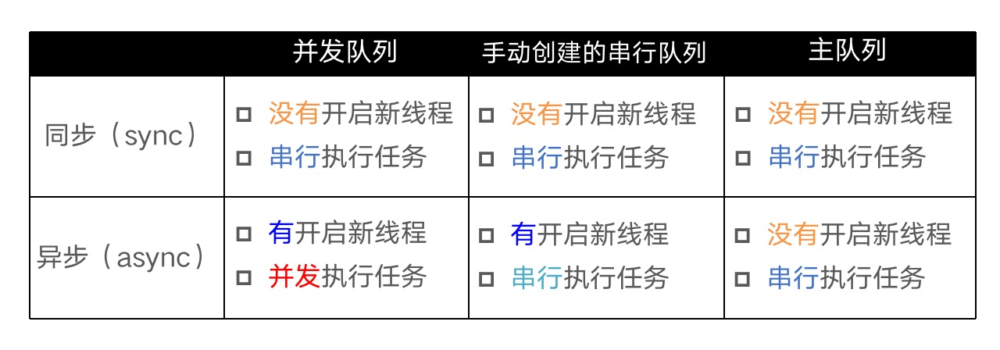

# 多线程
多线程在项目中经常使用，在我们进行耗时操作时，比如网络请求、下载图片、加载音视频等耗时操作，为了不卡住主线程，都需要在异步进行操作。

## 基本概念
多线程中容易被混淆的4个概念，同步、异步、串行、并发。

**技术方案** | **简介** | **语言** | **线程生命周期** | **使用频率**
------- | ------- | ------- | ------- | -------
pthread | 一套通用的多线程API 适用于Unix\Linux\Windows等系统 跨平台\可移植 使用难度大 | C | 程序员管理 | 几乎不用
NSThread | 使用更加面向对象 简单易用，可直接操作线程对象 | OC | 程序员管理 | 偶尔使用
GCD | 旨在替代NSThread等线程技术 充分利用设备的多核 | C | 自己管理 | 经常使用
NSOperation | 基于GCD（底层是GCD） 比GCD多了一些更简单实用的功能,使用更加面向对象 | OC | 自己管理 | 经常使用

有4个术语比较容易混淆：同步、异步、并发、串行
同步和异步主要影响：能不能开启新的线程
同步：在当前线程中执行任务，不具备开启新线程的能力
异步：在新的线程中执行任务，具备开启新线程的能力

并发和串行主要影响：任务的执行方式
并发：多个任务并发（同时）执行
串行：一个任务执行完毕后，再执行下一个任务

## 队列的执行效果

