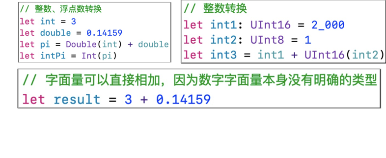
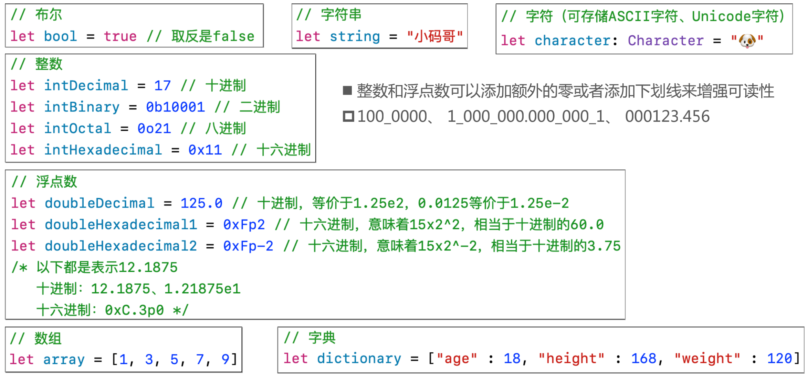

# 基础语法

```markdown
* `API（Application Programming Interface）：`应用程序编程接口。源代码和库之间的接口
* `ABI（Application Binary Interface）：`应用程序二进制接口。应用程序与操作系统之间的底层接口,涉及的内容有：目标文件格式、数据类型的大小\布局\对齐、函数调用约定等等
```
## swift编译流程
编译分为前端、中间代码、后端,我们之前使用c/oc编写代码是使用`Clang编译器`编译成前端代码，Swift则是使用`swiftc编译器`进行编译。如下图:

Swift代码编译时首先生成AST语法树，然后生成Swift特有的中间代码，然后对中间代码优化生成简洁的Swift中间代码，之后生成LLVM IR中间代码，然后是汇编代码，最后是可执行文件。过程如下图:


Swift使用`swiftc编译器`进行编译，它的位置存放在Xcode内部 `Contents/Developer/Toolchains/XcodeDefault.xctoolchain/usr/bin`文件中，对应的指令有:
```markdown
* 生成语法树: `swiftc -dump-ast main.swift` 
* 生成最简洁的SIL代码: `swiftc -emit-sil main.swift` 
* 生成LLVM IR代码: `swiftc -emit-ir main.swift -o main.ll` 
* 生成汇编代码: `swiftc -emit-assembly main.swift -o main.s`
```

## 关于Playground
Playground可以快速预览代码效果，在学习Swift语法时可是用它快速预览。在Xcode13中需要选择`File -> New ->Playground Page`创建一个新的Playground。如果是M1芯片需要Xcode不以`Rosetta`方式打开,关闭`Rosetta`的方式`打开访达->应用->Xcode->右键点击Xcode->显示简介->将勾选使用Rosetta打开去掉`。快捷键有:
```markdown
* `Command + Shift + Enter`：运行整个Playground
* `Shift + Enter`：运行截止到某一行代码
```

Playground下的`Soureces`文件放代码文件,`Resoureces`放资源文件。如果想直接看到界面效果，可以直接导入`import PlaygroundSupport`.比如下面的代码:
```swift
import UIKit
import PlaygroundSupport

let vc = UITableViewController()
vc.view.backgroundColor = .red
PlaygroundPage.current.liveView = vc
```

## 数据类型
Swift不用我们编写main函数，默认全局范围内的首句可执行代码作为程序入口。一句代码尾部可以省略分号`（;）`，如果是多句代码写到同一行时必须用分号`（;）`隔开。

Swift 用`var`定义变量，`let`定义常量，编译器能自动推断出变量\常量的类型。常量只能赋值1次，**但是它的值不要求在编译时期确定，但使用之前必须赋值1次。**比如下面的代码：
```swift
func getAge() -> Int{
    return 10;
}
let age = getAge()
```

Swift分为值类型和引用类型.值类型中又分为枚举和结构体。如下图:

```markdown
* 整数类型有：Int8、Int16、Int32、Int64、UInt8、UInt16、UInt32、UInt64
* 在32bit平台，Int等价于Int32，在64bit平台，Int等价于Int64
* 整数的最大值和最小值: `UInt8.max`/`UInt16.min`，一般情况下直接使用Int即可
```
浮点类型`Float`32位，精度只有6位。Doouble是64位，精度至少15位。如果是两个整数运行时想要获取到小数，首先需要将两个整数转变为Float类型。类型转换如下图:


布尔、字符串、数组、字典的一些写法如下，字符类型必须要在后面标上类型:`Character`。


关于元组的一些写法:
```swift
// 元组初始化,获取value时使用 HTTP404Error.0 / HTTP404Error.1
let HTTP404Error = (404,"Not Found")
// 使用元组接收时可以给名词,获取value时使用 code / msg,如果不想接收可以直接使用(code,_) =  HTTP404Error
let (code,msg) = HTTP404Error
// 初始化时给值一个名称,获取value时使用 HTTP200Status.code
let HTTP200Status = (code:200,msg:"success")
```

## 流程控制
