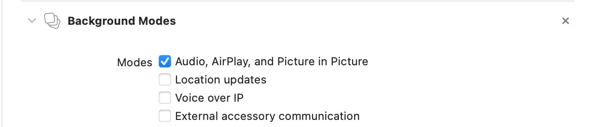

# 画中画
画中画是 iOS14 推出的功能，一种控制器，用于在浮动的可调整大小的窗口中响应用户启动的画中画视频播放。B栈的视频可以使用此功能。

>画中画是Apple希望始终在用户控制下的一项用户功能。仅在响应用户的明确请求时才调用PiP。如果某个应用以非用户直接指导的方式调用PiP，则App Store审核小组将拒绝它。

如果使用画中画需要Xcode设置打允许后台播放 `Audio, AirPlay, and Picture in Picture`


## 相关API
画中画功能需要使用到`AVPictureInPictureController`类，相关的API:

```objc
// 当前设备是否支持画中画
+ (BOOL)isPictureInPictureSupported;
// 创建画中画控制器
- (nullable instancetype)initWithPlayerLayer:(AVPlayerLayer *)playerLayer NS_DESIGNATED_INITIALIZER;
// 要播放媒体的播放器层
@property (nonatomic, readonly) AVPlayerLayer *playerLayer;
// 是否允许用户跳过媒体内容
@property (nonatomic) BOOL requiresLinearPlayback API_AVAILABLE(ios(14.0), macos(11.0), tvos(14.0)) API_UNAVAILABLE(watchos);
// 委托对象
@property (nonatomic, weak, nullable) id <AVPictureInPictureControllerDelegate> delegate;
// 当前是否可以进行画中画回放
@property (nonatomic, readonly, getter = isPictureInPicturePossible) BOOL pictureInPicturePossible;
// 控制器的画中画窗口是否在屏幕上
@property (nonatomic, readonly, getter = isPictureInPictureActive) BOOL pictureInPictureActive;
// 系统是否挂起控制器的画中画窗口
@property (nonatomic, readonly, getter = isPictureInPictureSuspended) BOOL pictureInPictureSuspended;

// 开始播放
- (void)startPictureInPicture;
// 停止播放(如果当前处于活跃状态)
- (void)stopPictureInPicture;
// 是否处于活跃状态并且可以关闭
@property (nonatomic, readonly) BOOL canStopPictureInPicture API_AVAILABLE(tvos(14.0)) API_UNAVAILABLE(ios, macos, watchos);

// 系统默认的“画中画”开始模板图像，用于应用程序的“画中画”按钮。
@property (class, nonatomic, readonly) UIImage *pictureInPictureButtonStartImage API_AVAILABLE(ios(13.0), tvos(14.0));
// 系统默认的画中画停止模板图像，用于应用程序的画中画按钮。
@property (class, nonatomic, readonly) UIImage *pictureInPictureButtonStopImage API_AVAILABLE(ios(13.0), tvos(14.0));

// 告诉委托人画中画即将停止的时间，使您的应用有机会恢复其视频播放用户界面。
- (void)pictureInPictureController:(AVPictureInPictureController *)pictureInPictureController restoreUserInterfaceForPictureInPictureStopWithCompletionHandler:(void (^)(BOOL restored))completionHandler;
// 当画中画即将开始时
- (void)pictureInPictureControllerWillStartPictureInPicture:(AVPictureInPictureController *)pictureInPictureController;
// 该画中画回放已经开始
- (void)pictureInPictureControllerDidStartPictureInPicture:(AVPictureInPictureController *)pictureInPictureController;
// 画中画无法启动
- (void)pictureInPictureController:(AVPictureInPictureController *)pictureInPictureController failedToStartPictureInPictureWithError:(NSError *)error;
// 画中画即将停止
- (void)pictureInPictureControllerWillStopPictureInPicture:(AVPictureInPictureController *)pictureInPictureController;
// 画中画停止
- (void)pictureInPictureControllerDidStopPictureInPicture:(AVPictureInPictureController *)pictureInPictureController;
```

> 🍺 注意：使用画中画需要在控制器中设置允许后台播放
```objc
// 允许后台播放
[[AVAudioSession sharedInstance] setCategory:AVAudioSessionCategoryPlayback error:nil];
[[AVAudioSession sharedInstance] setActive:YES error:nil];
```

## 完整的例子🌰

由于 `AVPictureInPictureController` 只能使用 `AVPlayer` 进行初始化，而 `AVPlayer` 解码的视频格式有限，目前测试的MP4和m3u8格式可以播放，FLV格式不能播放。[点击下载Demo](https://e.coding.net/mlean/iosdemo/PictureInPictureDemo.git)

```objc
#import "ViewController.h"
#import <AVKit/AVKit.h>

@interface ViewController ()<AVPictureInPictureControllerDelegate>
@property (weak, nonatomic) IBOutlet UIButton *startBtn;
@property (weak, nonatomic) IBOutlet UIButton *endBtn;
@property (weak, nonatomic) IBOutlet UIView *playerView;

@property(nonatomic,strong) AVPictureInPictureController * picController;
@property(nonatomic,strong) AVPlayer * player;
@end

@implementation ViewController

- (void)viewDidLoad {
    [super viewDidLoad];
    
    // 允许后台播放
    [[AVAudioSession sharedInstance] setCategory:AVAudioSessionCategoryPlayback error:nil];
    [[AVAudioSession sharedInstance] setActive:YES error:nil];
    
    // 获取画中画的图片
    UIImage * startImage = [AVPictureInPictureController pictureInPictureButtonStartImageCompatibleWithTraitCollection:nil];
    UIImage * endImage = [AVPictureInPictureController pictureInPictureButtonStopImageCompatibleWithTraitCollection:nil];
    
    // 设置图片
    [_startBtn setImage:[startImage imageWithRenderingMode:UIImageRenderingModeAlwaysOriginal] forState:UIControlStateNormal];
    [_endBtn setImage:endImage forState:UIControlStateNormal];
}

-(void)viewDidAppear:(BOOL)animated
{
    [super viewDidAppear:animated];
    [self setUpPlayer];
}

- (void)setUpPlayer{
    NSString * path = [[NSBundle mainBundle] pathForResource:@"test_video" ofType:@"mp4"];
    
    // 支持本地MP4 文件
    // 支持 m3u8 格式  http://devimages.apple.com/iphone/samples/bipbop/bipbopall.m3u8
    // 支持 MP4 格式 https://media.w3.org/2010/05/sintel/trailer.mp4
    AVPlayerItem * item = [[AVPlayerItem alloc] initWithURL:[NSURL fileURLWithPath:path]];
    
    self.player = [AVPlayer playerWithPlayerItem:item];
    AVPlayerLayer * layer = [AVPlayerLayer playerLayerWithPlayer:self.player];
    layer.frame = self.playerView.bounds;
    layer.backgroundColor = [UIColor blueColor].CGColor;
    NSLog(@"%@",NSStringFromCGRect(self.view.bounds));
    [self.playerView.layer addSublayer:layer];

    NSLog(@"---------------%@",NSStringFromCGRect(layer.bounds));

    self.picController = [[AVPictureInPictureController alloc] initWithPlayerLayer:layer];
    self.picController.delegate = self;
    [self.player play];
}

// 进入画中画
- (IBAction)startInPictureBtn:(id)sender {
    NSLog(@"-----> 点击进入画中画");
    
    // 如果有权限
    if (self.picController.isPictureInPicturePossible) {
        [self.picController startPictureInPicture];
    }else{
        NSLog(@"没有相关权限或者系统不支持,不能进入画中画");
    }
}

// 结束画中画
- (IBAction)endInPictureBtn:(id)sender {
    NSLog(@"-----> 点击退出画中画");
    
    [self.picController stopPictureInPicture];
}

#pragma mark - delegate
- (void)pictureInPictureControllerWillStartPictureInPicture:(AVPictureInPictureController *)pictureInPictureController{
    
}

- (void)pictureInPictureControllerDidStartPictureInPicture:(AVPictureInPictureController *)pictureInPictureController{
    
}

- (void)pictureInPictureController:(AVPictureInPictureController *)pictureInPictureController failedToStartPictureInPictureWithError:(NSError *)error{
    NSLog(@"%@",error);
}

- (void)pictureInPictureControllerWillStopPictureInPicture:(AVPictureInPictureController *)pictureInPictureController{
    
}

- (void)pictureInPictureControllerDidStopPictureInPicture:(AVPictureInPictureController *)pictureInPictureController{
    
}

- (void)pictureInPictureController:(AVPictureInPictureController *)pictureInPictureController restoreUserInterfaceForPictureInPictureStopWithCompletionHandler:(void (^)(BOOL restored))completionHandler{
    
}

@end
```

## 推荐网址
* [iOS开发-iOS14画中画(OC)](https://www.jianshu.com/p/d579f09993e8)