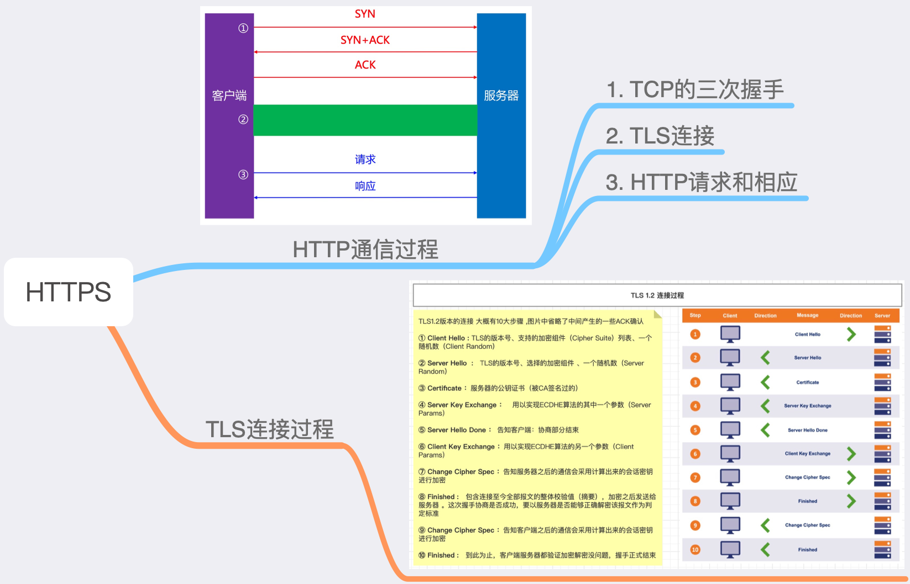

# 面试的思维导图
文章经常看了忘，忘了看，感觉没有必须要这么浪费，只要记得大概的结构就行了。所以做了个思维导图,只要看思维导图大概就知道知识点在什么位置。

文档也是看了很多遍了，一些特性主要是内存分配的问题，比如Block。需要经常通过Hopper软件分析一下写的代码转成汇编是什么样子，也是通过Xcode进行查看。

## Block

## 多线程

## 签名机制

## TCP

## HTTP

## HTTPS

