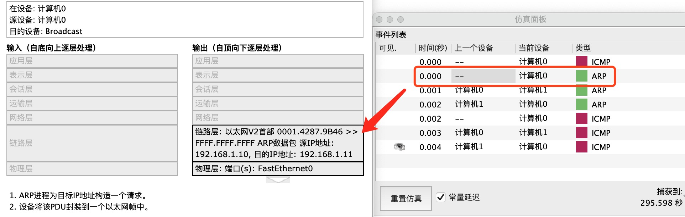
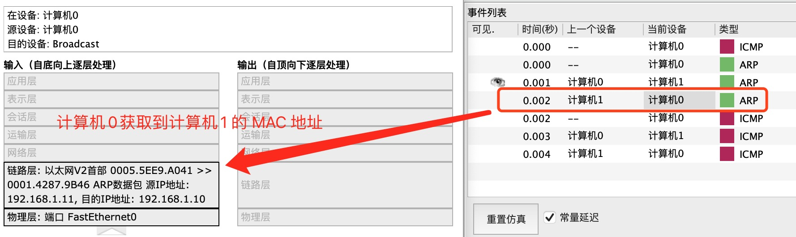
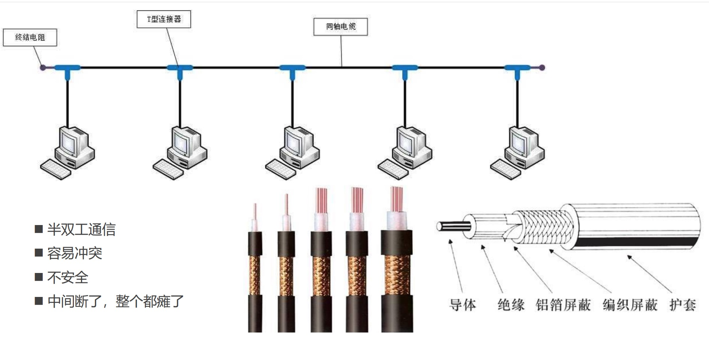
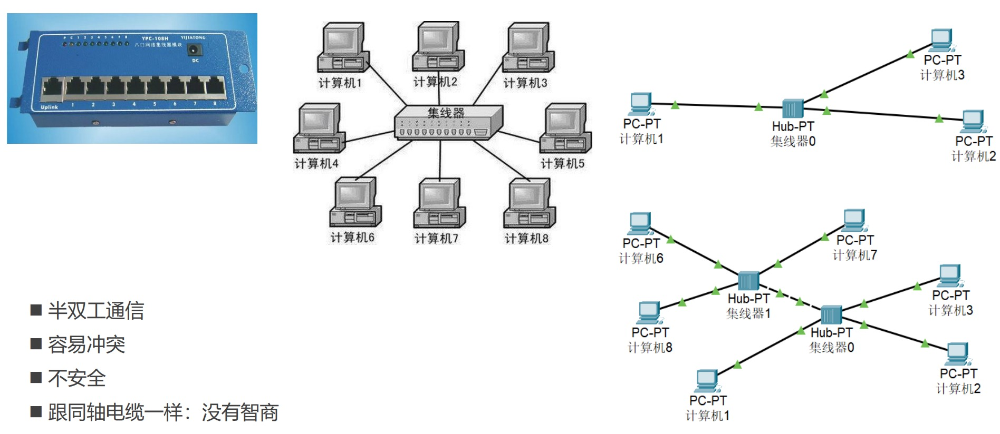
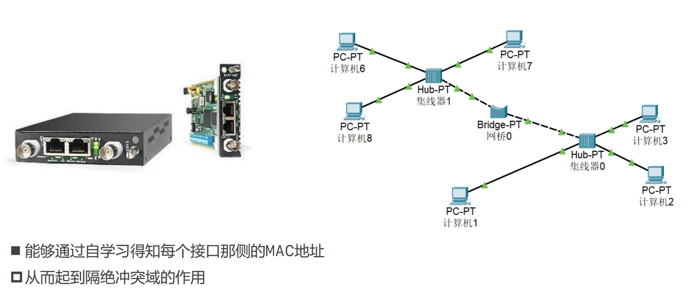
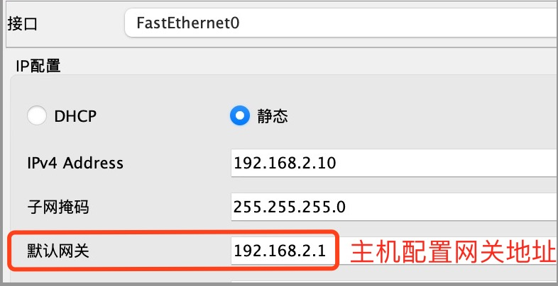
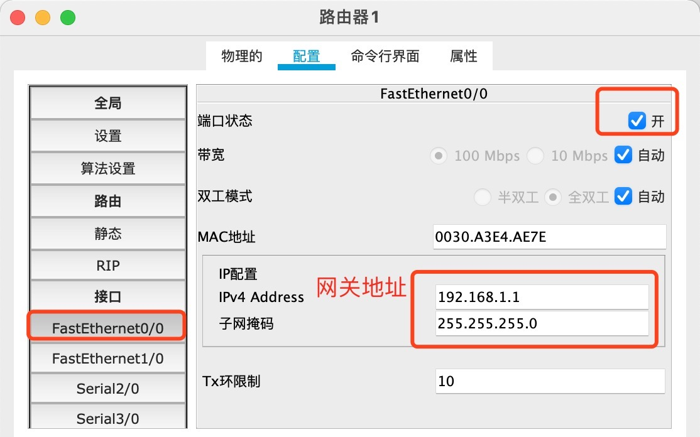

# 基础概念
本章节主要讲一些网络的基本概念:两台局域网内的计算机如何才能通信、MAC地址、同轴电缆、集线器、网桥、交换机、路由器

* 首先是局域网内两台电脑是如何通信的: `通过 arp协议获取到对方的MAC地址，根据MAC地址进行发送消息`
* 然后讲通讯设备的升级，`同轴电缆 -> 集线器 -> 网桥 -> 交换机 -> 路由器`,以及各种设备相对上一代设备的优势
* 互联网的最终解决方案是 路由器 + 交换机 
* 通过`Packet Tracker`进行通信测试，`Packet Tracker`是思科开发测试网络的一款工具
* 光猫:光调制解调器，将光信号转换成电信号

## 网络互连模型

## 请求过程
发送网络请求时，发送方的内容经过层层包装，接收方收到消息之后再层层解开封装获取到真正的内容

## 网络分层

## 两台电脑进行通信
两台局域网电脑如果要进行通信，最简单的方式是使用`交叉线`进行直连。

**两台电脑通信的基础**

1. 知道对方的IP地址
2. 知道对方的MAC地址
3. 根据 MAC地址（也就是网卡地址）, 传输数据到对方网卡。
   * 如果网卡发现数据的目标 MAC 地址是自己，就会将数据传递给上一层进行处理
   * 如果网卡发现数据的目标 MAC 地址不是自己，就会将数据丢弃，不会传递给上一层进行处理

**ARP 请求**
1. 两台计算机刚开始通信时，是不知道对方的 Mac 地址的,首先会发送一个 ARP 广播，广播中括 源MAC地址、目标MAC地址`（FFFF.FFFF.FFFF）`、源IP、目标IP。 **MAC地址为 `FFFF.FFFF.FFFF` 表示局域网内的电脑都可以接收到消息**
2. 收到广播的计算机，如果看到目标ip是自己的ip时，会返回 ARP协议包，将自己的 Mac地址发送过去。

1. 收到对方的 ARP 返回包后，知道了对方的 MAC地址，双方开始进行通信

**两台电脑 Ping 的过程**

当我们使用 电脑A `ping` 电脑B 时,例如:`ping 192.168.1.10`

1. A 首先会发送一个 ARP 请求获取 B 的MAC 地址
2. 获取到MAC地址之后，创建 ICMP 请求跟 B 进行通信。
3. ping 命令走的是 ICMP 协议

## 同轴电缆 （已淘汰）
半双工通信：A到B,B到A都行,但不能同时进行.如[对讲机]

全双工通信：A到B,B到A都行,可以同时进行.如[电话]

同轴电缆是很早之前的一种连接方式，缺点很多
* 只能半双工通信
* 容易冲突
* 安全问题，每个计算机都可以收到其他计算机的消息
* 中间断开会造成网络瘫痪

## 集线器 （已淘汰） 
集线器相对与同轴电缆的优势在于可以连接多个设备，单个计算机断开不会影响其他设备。缺点也同样明显：
* 只能半双工通信
* 容易冲突
* 安全问题，每个计算机都可以收到其他计算机的消息
* 集线器没有智商，只要跟它连接就会发送消息,设备越多，效率越低

## 网桥 （已淘汰）
网桥还是在同一个网段,网桥可以隔绝一定的冲突域。相比集线器来说,它的优势在于可以通过自学习得知每个接口侧的MAC地址,一个网桥有2个端口。
* 通过自学习得知接口侧的MAC地址
* 隔绝冲突域

## 交换机
交换机相当于集线器+网桥，拥有全双工通信。交换机拥有多个接口，可以连接多个计算机。交换机可以通过自学习记录每个端口的Mac地址。目前交换机是局域网的最终方案。如果要跨网段，就需要使用路由器了。
* 全双工通信
* 拥有多个接口
* 比集线器要安全

## 路由器
网线直连、同轴电缆、集线器、网桥、交换机都有一个共同的特点，必须在同一网段，处在同一个广播域，当设备首次链接时，每台设备都可以收到arp广播。

路由器的特点：
* 可以在不同网段之间转发数据
* 隔绝广播域

主机发送数据之前，首先会判断目标主机的 ip 地址跟它是否在同一网段：
1. 同一网段：ARP、通过交换机/集线器 传递数据
2. 不再同一网段： 将数据发送到网关(Gateway)，由网关进行转发和接收，路由器则提供网关功能

我们一直说跨网段传递数据需要使用到路由器，这是因为路由器提供多个网关接口，当主机发送数据到不同的网段时，会先将数据发送到网关，由网关进行转发和接收。

`Packet Tracker`中设置路由器网关时，为了方便查看，最好显示端口标签，以免配置错误。点击选项 -> 首选项 -> 勾选在逻辑工作区总是显示端口标签。

**主机设置网关地址**

**路由器设置网关地址**
