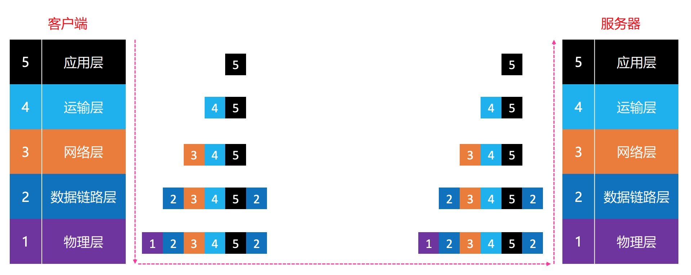
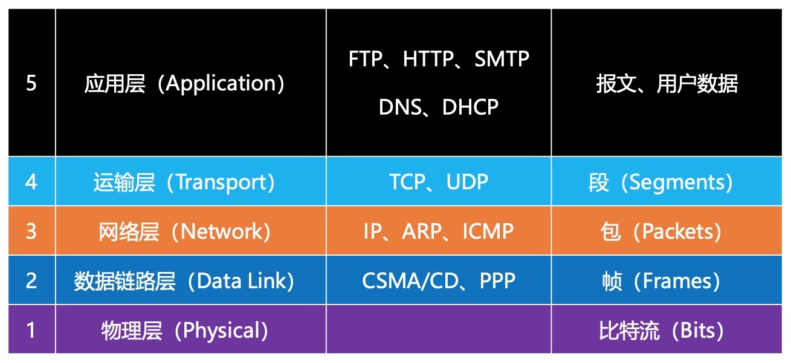

# 物理层
由于网络过于复杂，国际标准化组织提出对网络进行分层，也就是原始的OSI模型,每层的作用对应的作用不同。方便网络的维护和管理，当某一层出现问题，可以针对当前层进行更新而不影响其它层的功能。

在之后的实际开发中，表示层和会话层慢慢被发现可以被其他层的协议可替代，慢慢被废弃，我们可以只对 应用层、运输层、网络层、数据链路层、物理层 进行学习研究。

## 请求过程
发送网络请求时，发送方的内容经过层层包装，接收方收到消息之后再层层解开封装获取到真正的内容

## 网络分层
