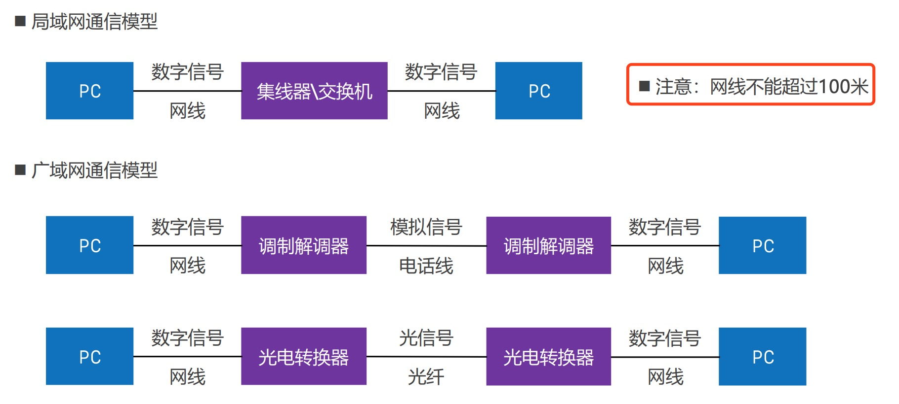

# 物理层
由于网络过于复杂，国际标准化组织提出对网络进行分层，也就是原始的OSI模型,每层的作用对应的作用不同。方便网络的维护和管理，当某一层出现问题，可以针对当前层进行更新而不影响其它层的功能。

在之后的实际开发中，表示层和会话层慢慢被发现可以被其他层的协议可替代，慢慢被废弃，我们可以只对 应用层、运输层、网络层、数据链路层、物理层 进行学习研究。

## 网络请求过程
发送网络请求时，发送方的内容经过层层包装，接收方收到消息之后再层层解开封装获取到真正的内容

## 网络分层
每层使用到的协议和对数据叫法都不同,在应用层我们说数据是报文，到了运输层说数据是段，到了网络层是包，数据链路层是帧，物理层是比特流。这也是对每层的数据做了更为形象的叫法，和方便以后的数据维护和问题查找。

## 物理层
物理层定义了接口标准、线缆标准、传输速率、传输方式等,比如水晶头用什么材质、路由器的接口要多大 等等这些都是物理层定义的。

## 数字信号、模拟信号
电话线使用的是模拟信号,网线使用的是数字信号，光纤使用的是光信号。**网线是不能超过100米的，超过100米之后可能会造成信号丢失。**

## 局域网的通信模型
很早之前发送数据时,先通过调制解调器将`数字信号`转换成`模拟信号`通过电话线进行传输，到达另一端后，通过调制解调器再转换成数字信号。

之后使用光纤，会先通过光电转换器将`数字信号`转换成`光信号`，通过光纤进行传输，到达另一端后，通过光电转换器转换成数字信号。

## 信道
* 信道: 信息传输的通道，一条传输介质上（比如网线）上可以有多条信道
* 单工通信: 信号只能往一个方向传输，任何时候都不能改变信号的传输方向,比如无线电广播、有线电视广播
* 半双工通信: 信号可以双向传输,但必须是交替进行，同一时间只能往一个方向传输, 比如对讲机
* 全双工通信: 信号可以同时双向传输,比如手机（打电话，听说同时进行）