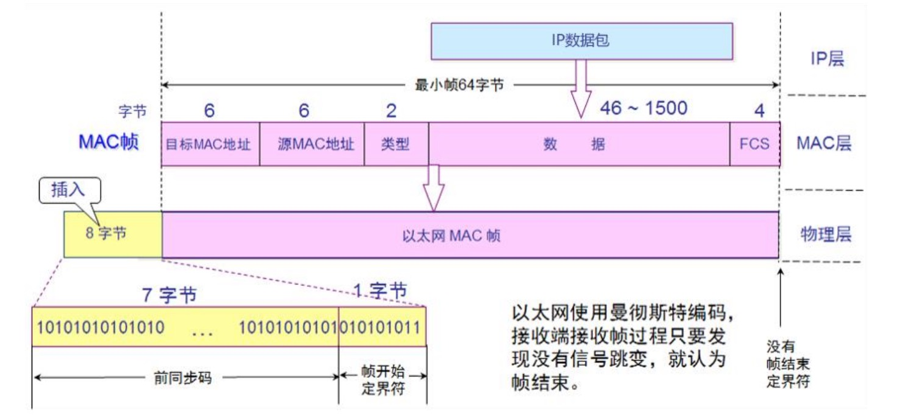
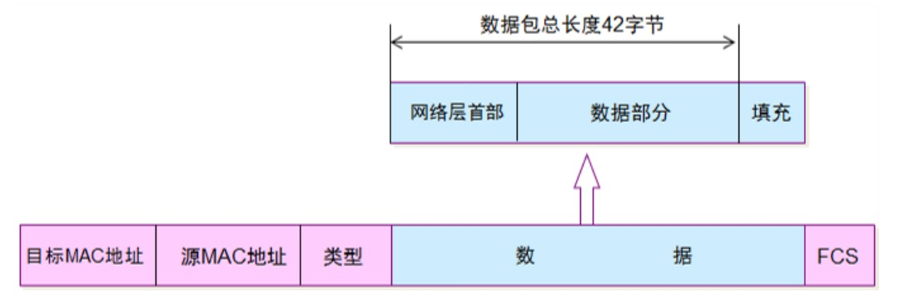
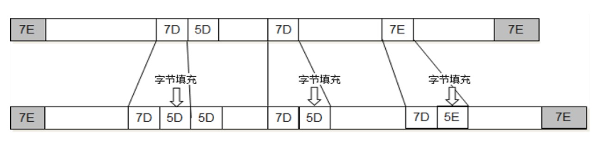

# 数据链路层
链路: 从1个节点到相邻节点的一段物理线路（有线或无线）,中间没有其他交换节点。

例如下面这张图:

* 计算机0 - 路由器0 是一条链路。   使用CSMA/CD协议
* 路由器0 - 路由器1 是一条链路， 路由器1 - 路由器2 是一条链路。 使用 PPP 协议
* 路由器2 - 交换机0 是一条链路。 使用 以太网帧的格式 进行传递数据
* 交换机0 - 计算机1 是一条链路。 **路由器到交换机 和 交换机到计算机之间虽然是不同的链路，但是传输的数据是一样的。**

在一条数据链路传输数据时，需要有对应的通信协议来控制数据的传输，**不同类型的数据链路，使用的通信协议可能是不同的**，比如路由器和路由器之间使用的是 PPP 协议, 计算机0 到 路由器0 之间使用的是CSMA/CD协议
* 广播信道：CSMA/CD协议（比如同轴电缆、集线器等组成的网络）
* 点对点信道：PPP协议（比如2个路由器之间的信道）

>数据链路层的3个问题: 封装成帧、透明传输、差错检验。不管是什么数据链路，只要在数据链路层，都会有这三个问题。

## 封装成帧
数据链路层将网络层传过来的IP数据包作为自己的数据部分，在数据部分前后增加帧的首部和帧的尾部。这样就封装成一个完整的帧。

帧的首部和帧的尾部有帧开始符和帧结束符，在 以太网帧V2的版本，使用曼彻斯特编码，不再需要帧开始符和结束符，只要发现没有信号跳变，就认为帧结束。

> 最大传输单元MTU（Maximum Transfer Unit）,每一种数据链路层协议都规定了所能够传送的帧的数据长度上限,以太网的MTU为1500个字节.也就是说IP数据包不能超过1500字节

## 透明传输
透明传输:不管传的是什么，所采用的设备只是起一个通道作用，把要传输的内容完好的传到对方。

在链路上传输数据时肯定是一连串的帧，怎么才能知道每个帧的具体长度呢，这个时候就要有帧开始符和帧结束符。`SOH（Start Of Header）`表示帧开始符,`EOT （End Of Transmission）` 表示帧结束符

但是在实际数据传递中，传输数据里很可能就包含帧开始符 和 帧结束符对应的字节，为了防止在这种情况不能识别，只要在数据中发现 帧开始符 和 帧结束符 就在其前面使用ESC进行填充。如下图:

网卡接收到数据之后，会对数据进行过滤，去掉填充的数据，还原成原来的数据，这个过程就是透明传输。
>以太网帧V2的版本，如果使用曼彻斯特编码，只要发现没有信号跳变，就认为帧结束

## 差错检验
为什么要有差错检验？在信道传输的过程中，如果受到干扰很可能会造成失真，差错检验主要为确定数据是准确的。

差错检验的方法: 使用帧的数据部分和数据链路层首部计算出 `FCS`，网卡拿到数据之后，会再对数据进行计算，如果`FCS`一致，网卡会继续往上传，如果不一致，网卡会将这个数据丢弃。

## CSMA/CD 协议
`CSMA（英语：Carrier Sense Multiple Access）载波侦听多路访问/冲突检测`是一种介质访问控制（MAC）的协议。
* `载波侦听（英语：Carrier Sense）`指任何连接到介质的设备在欲发送帧前，必须对介质进行侦听，当确认其空闲时，才可以发送。
* `多路访问（英语：Multiple Access）`指多个设备可以同时访问介质，一个设备发送的帧也可以被多个设备接收。
* `碰撞检测` 比如多个设备同时发送信号，碰撞之后发生回弹，计算机要有能力检测信号是碰撞返回的数据还是正常的数据。 

>使用了CSMA/CD的网络可以称为是以太网（Ethernet），它传输的是以太网帧。以太网帧的格式有：`Ethernet V2标准`、`IEEE的802.3标准`, 使用最多的是：`Ethernet V2标准`。为了能够检测正在发送的帧是否产生了冲突，**以太网的帧至少要64字节**。 用交换机组建的网络，已经支持全双工通信，不需要再使用CSMA/CD，但它传输的帧依然是以太网帧，所以，用交换机组建的网络，依然可以叫做以太网。

## 以太网帧格式 
`Ethernet V2标准` 的以太网帧使用曼彻斯特编码，只要发现没有信号跳变，就认为帧结束。帧的首部和尾部不再需要帧开始符和帧结束符。但是在物理层会插入8个字节，包含前同步码和帧开始界定符。

Ethernet V2标准下的以太网帧:
* 帧首部: `目标MAC + 源MAC + 网络类型(IPv4还是IPv6)`
* 以太网帧: `首部 + 数据 + FCS`
* 数据的长度至少是 `64 - 6 - 6 - 2 - 4 = 46字节`。IP数据包的大小为`46 ~ 1500字节`。

>当数据部分的长度小于46字节时,数据链路层会在数据的后面加入一些字节填充。接收端接收到数据后会将添加的字节去掉。

总结: 以太网帧的数据长度是`46~1500字节`,以太网帧的长度是 `64~1518字节（目标MAC +源MAC + 网络类型 + 数据 + FCS）`。

## PPP 协议
点对点协议（Point-to-Point Protocol,缩写PPP）工作在数据链路层。它通常用在两节点间创建直接的连接，意思是这条线路一定是从A到B，**点对点数据链路不需要源MAC地址和目标MAC地址**。并可以提供连接认证、传输加密以及压缩。被用在许多类型的物理网络中，包括串口线、电话线、中继链接、移动电话、特殊无线电链路以及光纤链路（如SONET）

在下面这张图中,两个路由器之间使用的就是点对点协议。数据在不同的链路中传输时，网络层的数据是不变的。根据不同的数据链路类型，帧的首部和尾部会发生变化。

PPP协议的格式: 
* Address字段：图中的值是0xFF，形同虚设，点到点信道不需要源MAC、目标MAC地址
* Control字段：图中的值是0x03，目前没有什么作用
* Protocol字段：PPP协议内部用到的协议类型
* 帧开始符、帧结束符：0x7E

在 PPP协议中, 帧开始符和帧结束符是`0X7E`，如果数据中含有`0x7E`替换成`0x7D5E`,如果有`0X7D`替换成`0X7D5D`。

## 网卡
网卡工作在数据链层和物理层。当网卡接收到一个帧，首先会进行差错校验，如果校验通过则往上传，否则丢弃。
* `Wireshark`抓到的帧没有`FCS` ，因为它抓到的是差错校验通过的帧（帧尾的FCS会被硬件去掉）
* `Wireshark`抓不到差错校验失败的帧, 校验失败的帧已经被网卡丢弃了

也推荐观看[CPU：网卡老哥，你到底怎么工作的？](https://mp.weixin.qq.com/s/60e2VLFLydKtrt_j2FJN-w),写的挺不错的。