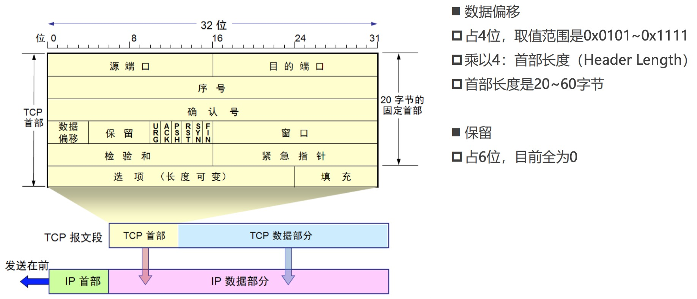
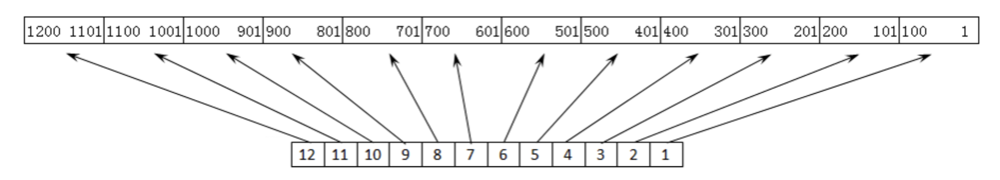
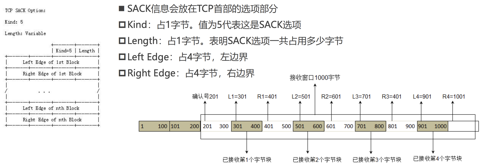

# 传输层
* TCP（Transmission Control Protocol）,传输控制协议,是一种面向连接的、可靠的、基于字节流的传输层通信协议
* UDP（User Datagram Protocol）,用户数据报协议,是一个简单的面向数据报的通信协议

传输层最常用的两个协议`TCP`和`UDP`，它们不管是在设计还是使用场景上都有很大区别，可以根据下图进行对比：

## UDP 协议
UDP是一个简单的面向数据报的通信协议,不需要跟服务端建立连接，减少了建立连接和释放连接的开销，同时UDP只尽最大能力交付，不保证可靠交付，因此不需要维护一些复杂的参数，它的首部只有8个字节，而 TCP 的首部至少20个字节。

**UDP首部包含：源端口号、目的端口号、UDP长度、UDP检验和。UDP 长度指的是  `UDP的首部长度 + UDP的数据部分`。**

>UDP首部中占16位的长度字段是冗余的，纯粹是为了保证首部是32bit对齐,TCP\UDP的数据长度，完全可以由IP数据包的首部推测出来。`传输层的数据长度 = 网络层的总长度 – 网络层的首部长度 – 传输层的首部长度`

**UDP检验和内容 ：`伪首部(12个字节) + 首部(8个字节) + 数据部分`，伪首部仅在计算检验和时起作用，并不会传递给网络层。`伪首部中的 17 表示使用的是UDP协议`**

我们可以通过 Wireshark 抓一个 UDP 的数据查看：

### 端口Port

一台服务器上可能有多个应用，我们怎么知道要跟哪个应用进行通信的呢？这个时候就要用到端口，一些我们常用的服务，比如 HTTP ，默认端口是80。

协议  | 默认端口号
------- | -------
HTTP | TCP + 80
HTTPS | TCP + 443
FTP | TCP + 21
MySQL | TCP + 3306
DNS | UDP/TCP + 53
SMTP | TCP + 25
POP3 | TCP + 110

* 客户端的源端口是临时开启的随机端口.
* 防火墙可以设置开启/关闭某些端口来提高安全性.

UDP首部中端口占用2个字节，也就是16个二进制位，可以计算出端口的取值范围是0~65535。

命令  | 含义
------- | -------
netstat -an | 查看被占用的端口
netstat -anb | 查看被占用的端口、占用端口的应用程序
telnet 主机 端口 | 查看是否可以访问主机的某个端口

## TCP 协议
TCP是一种面向连接的、可靠的、基于字节流的传输层通信协议，相对于 UDP 来说，为了保证连接之间的可靠传输、流量控制、拥塞控制，它的首部就相对复杂很多。

我们通过下面这张图来了解 TCP协议 的首部信息：

TCP 协议的首部由 固定部分(20个字节) 和 可变部分(最大40个字节) 组成。固定部分 包含 源端口(2个字节)、目的端口(2个字节)、序号(4个字节)、确认号(4个字节)、数据偏移（占4位）、保留位、URG、ACK、PSH、RST、SYN、FIN、窗口(2个字节)、检验和(2个字节)、紧急指针(2个字节)

> 这里有一个细节，有些资料中 TCP 首部的保留（Reserved）字段占3位，标志（Flags）字段占9位，比如 Wireshark 中TCP数据显示保留位只有三位

### 序号(seq)
序号占4个字节。**在传输过程的每一个字节都会有一个编号**，在建立连接后，序号代表这一次传给对方的TCP数据部分的第一个字节的编号

比如建立连接后，数据是从1-100，每次传5个数据，第一次传递的序号是1，第二次传递的序号是6。

### 确认号(ack)
确认号占4个字节，当ACK=1时，确认号字段才有效。在建立连接后，确认号代表：期望对方下一次传过来的TCP数据部分的第一个字节的编号。

那序号例子，比如客户端收到服务端传递过来的数据，从1-5，那么它给服务端返回的首部确认号就是6

### 数据偏移
数据偏移是用来算首部长度的，一共占4位，由于4个比特位表达的值有限，数据偏移最终的值计算方式是 `二进制的值 * 4`。

首部是由固定部分和可变部分组成，固定部分是20个字节，四个二进制位最大的值是`Ob1111` * 4 = 60,可变部分的长度最大值是60 - 20 = 40。
* 0b0101：5 * 4 = 20（首部长度最小值）
* 0b1111：15 * 4 = 60（首部长度最大值）

### 标志位 (Flags)
标志位很多时候是配合信息的，一个标志位占一个二进制位，只有两个值 0 和 1。

标志 | 含义
------- | -------
URG(Urgent) | 当URG=1时，紧急指针字段才有效。表明当前报文段中有紧急数据，应优先尽快传送
ACK(Acknowledgment) | 当ACK=1时，确认号字段才有效
PSH(Push) | 当PSH=1时，指示接收方应该尽快将这个报文段交给应用层而不用等待缓冲区装满。
RST(Reset) | 当RST=1时，表明连接中出现严重差错，必须释放连接，然后再重新建立连接
SYN(Synchronization) | 当SYN=1、ACK=0时，表明这是一个建立连接的请求,若对方同意建立连接，则回复SYN=1、ACK=1
FIN(Finish) | 当FIN=1时，表明数据已经发送完毕，要求释放连接

### 窗口(Window)
窗口占2个字节，有流量控制功能，用以告知对放下一次发送的数据大小(以字节为单位),窗口大小在连接过程中大小是可变的。

### 检验和 (Checksum)
跟UDP一样，TCP 检验和的计算内容：`伪首部(12个字节) + 首部(8个字节) + 数据`。伪首部仅在计算检验和时起作用，并不会传递给网络层

### 紧急指针
当标志位 URG 为1时，紧急指针中的数据才有效，紧急指针保存的是字节长度，表示的是TCP协议的数据部分有多少字节是紧急数据。比如紧急指针是8时，表示数据部分前8个字节属于紧急数据。

## TCP - 可靠传输
我们知道TCP的主要作用是 `可靠传输、流量控制、拥塞控制`。那它是怎么做到可靠传输的呢？如果让我们来去设计一个可靠传输，我们应该如何设计呢？我们可以从TCP协议的做法中去做参考。

### 停止等待协议 ARQ（Automatic Repeat–reQuest） 自动重传请求
最简单的可靠传输做法: A向B发送数据，B收到数据之后给A一个回复，A收到B的回复之后才发送下一个数据。在完美的情况下这是最简单的办法，但是网络环境往往是复杂多变的，这样做可能存在下面几个问题使我们重复发送数据浪费资源。
1. 超时重传： A 发送数据时候数据被丢失,这个时候要设置 A 在一定的时间内收不到回复进行重传数据(参考图b)
2. 确认丢失： B 接收到 A 发送的数据之后，回复确认时消息丢失。A 进行重传之后，B 丢弃收到的重复数据，重新确认 (参考蓝色图a)
3. 确认迟到： A 发送数据时，没有收到 B 的确认，A 进行重传，在过一段时间之后，A 收到了之前的迟到确认，这个时候什么也不做(参考蓝色图b)

从上图我们可以看到，虽然这样做可以保证可靠传输，但是在效率和资源利用上有些浪费。所以对此协议进行了升级`连续ARQ协议 + 滑动窗口协议`

>若有个包重传了N次还是失败，会一直持续重传到成功为止么？
这个取决于系统的设置，比如有些系统，重传5次还未成功就会发送reset报文（RST）断开TCP连接

### 连续ARQ协议 + 滑动窗口协议
我们通过下面这张图来了解一下什么是连续ARQ协议:

当数据过大时，传输层会对其进行拆分，图中的 M1/M2/M3/M4... 可以看做被拆分的包，ARQ协议是发送方发送数据，接收到对方回复之后才会发送下一个包，连续ARQ则是一次发送多个包给接收方,接收方收到之后，回复给发送方最后一个数据序号 + 1，如右图

在建立连接时，接收方会告诉发送方自己的接收窗口大小，发送方的发送窗口 发送数据时会根据接收方的接收窗口进行调整。

我们用一个简单的例子来阐述一下发送过程，假设有1200个字节，分成12组，每一组数据是100个字节，代表一个数据段的数据，如下图:

当发送方A和接收方B进行通信时，过程可以用下图进行表示：

* 在 t1 这一步，双方建立 TCP 连接，B 告诉 A 它的接收窗口是400个字节，A 就设置发送窗口为400字节
* 到t2这一步时，B 接收到 A 的400个字节数据，序号(seq)表示一段数据的第一个字节编号，回复A `ACK=1 确认号(ack)=401`，确认号代表期望对方下一次传过来的TCP数据部分的第一个字节的编号。因为这里已接收400个字节，希望下次对方发送第一个字节的序号(seq)为401的数据
* 到t3这一步时，A 收到了B 的确认，发送窗口向右移动，继续发送 5、6、7、8 组数据，`注意:窗口并不是固定的，大小是可以变化的`
* 到t4这一步时，B 在接收数据时发现 第7组 数据丢失，将接收窗口移动至丢失的分组，向 A 发送确认，由于接收到5、6、8组数据，回复 A `ACK=1 确认号(ack)=601`,希望下次对方发送数据序号(seq)为601的数据。**并且在TCP首部的可变部分通过选择性确认技术告诉 A 你都收到了哪些数据**。
* 到t5这一步时，A 收到了 B 的回复，知道丢失了第7组数据， 发送 7、9、10 组数据给B （这里为什么8不会被重复发送，是因为**选择性确认**可以让A知道第8组数据已经被接收了）

#### SACK 选择性确认
在TCP通信过程中，如果发送序列中间某个数据包丢失（比如1、2、3、4、5中的3丢失了）, TCP会通过重传最后确认分组 后面的分组数据（最后确认的是2，会重传3、4、5），这样原来已经正确传输的分组也可能重复发送（比如4、5），降低了TCP性能。

为改善上述情况，发展出了`SACK（Selective acknowledgment，选择性确认）`技术,告诉发送方哪些数据丢失，哪些数据已经收到,使TCP只重新发送丢失的包（比如3），不用发送后续所有的分组（比如4、5）。

SACK 的数据放在 TCP 首部的可选部分，Kind 值为5表示这是一个 SACK 选项,使用左右边界(Left Edge、Right Edge)告诉发送方有哪些数据时收到的，如下图:

* Kind:占1个字节，值为5表示这是 SACK 选项
* Length: 占1个字节，表明 SACK 选项共占用多少字节
* Left Edge: 占4个字节，左边界
* Right Edge: 占4个字节，右边界

> 一对边界信息需要占用8字节，由于TCP首部的选项部分最多40字节，所以 SACK选项 最多携带4组边界信息,SACK选项的最大占用字节数 = 4 * 8 + 2 = 34

#### 通过抓包进行分析
我们通过抓包进行分析一下,抓http网站的数据,例如`http://testerhome.com/`,https的网站会增加证书校验步骤.

## TCP - 流量控制

如果接收方的缓存区满了，发送方还在疯狂着发送数据
接收方只能把收到的数据包丢掉，大量的丢包会极大着浪费网络资源
所以要进行流量控制
◼ 什么是流量控制？
让发送方的发送速率不要太快，让接收方来得及接收处理
◼ 原理
通过确认报文中窗口字段来控制发送方的发送速率
发送方的发送窗口大小不能超过接收方给出窗口大小
当发送方收到接收窗口的大小为0时，发送方就会停止发送数据

特殊情况下的流量控制
◼ 有一种特殊情况
一开始，接收方给发送方发送了0窗口的报文段
后面，接收方又有了一些存储空间，给发送方发送的非0窗口的报文段丢失了
发送方的发送窗口一直为零，双方陷入僵局
◼ 解决方案
当发送方收到0窗口通知时，这时发送方停止发送报文
并且同时开启一个定时器，隔一段时间就发个测试报文去询问接收方最新的窗口大小
如果接收的窗口大小还是为0，则发送方再次刷新启动定时器

拥塞控制

拥塞控制
防止过多的数据注入到网络中
避免网络中的路由器或链路过载
◼ 拥塞控制是一个全局性的过程
涉及到所有的主机、路由器
以及与降低网络传输性能有关的所有因素
是大家共同努力的结果
◼ 相比而言，流量控制是点对点通信的控制