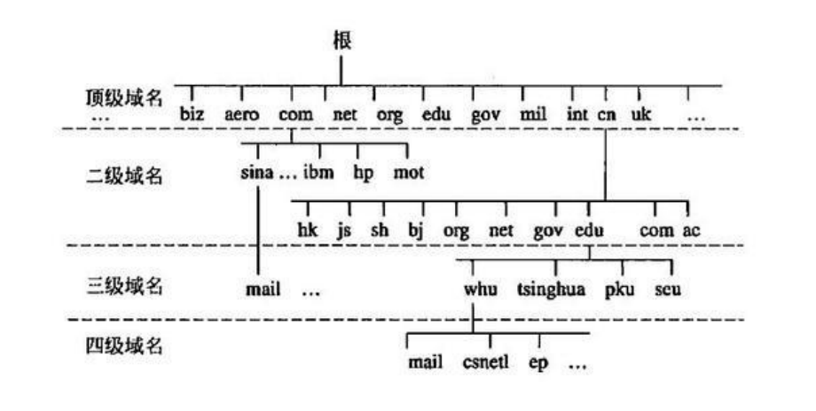
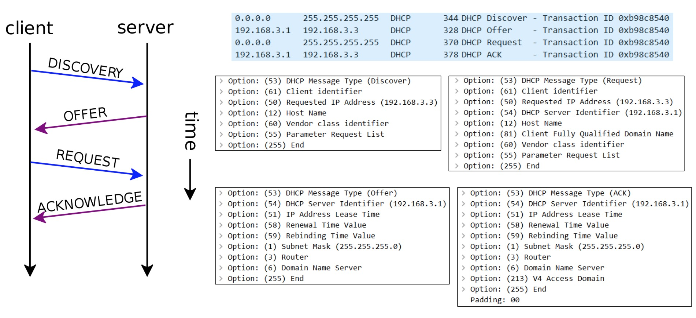

# 应用层 - 域名、DNS、DHCP
关于应用层的协议有很多:
* 超文本传输：HTTP、HTTPS
* 文件传输：FTP
* 电子邮件：SMTP、POP3、IMAP
* 动态主机配置：DHCP
* 域名系统：DNS

每个协议都是针对不同的应用场景，我们先来了解域名、DNS和DHCP。

## 域名（Domain Name）
由于IP地址不方便记忆，并且不能表达组织的名称和性质，人们设计出了域名(比如google.com)。**但实际上，为了能够访问到具体的主机，最终还是得知道目标主机的IP地址**。

### 域名的分类
根据级别不同，域名可以分为 `顶级域名（Top-level Domain，简称TLD）`、`二级域名`、`三级域名` ...等等

* 通用顶级域名（General Top-level Domain，简称gTLD）
    * `.com（公司）`、`.net（网络机构）`、`.org（组织机构）`、`.edu（教育）`、`.gov（政府部门）`、`.int（国际组织）`等
* 国家及地区顶级域名（Country Code Top-level Domain，简称ccTLD）
    * `.cn（中国）`、`.jp（日本）`、`.uk（英国）`
* 新通用顶级域名（New Generic Top-level Domain，简称：New gTLD）
   * .vip、.xyz、.top、.club、.shop等

### 二级域名
二级域名是指顶级域名之下的域名,有两种情况:
* 在通用顶级域名下，它一般指域名注册人的名称，比如`google.com`、`baidu.com`、`sign.com`中的goole/baidu/sign就是二级域名
* 在国家及地区顶级域名下，它一般指注册类别的，例如com、edu、gov、net等,比如`xxx.gov.cn`/`xxx.com.cn`

三级域名是指二级域名之下的域名，比如`mail.sign.com`中的mail就是三级域名。通过一张图来了解一下:


## 域名系统 DNS (Domain Name System)
域名只是方便我们记忆，但是为了能够访问到具体的主机，最终还是得知道目标主机的IP地址，这时就需要使用DNS昔日以。利用DNS协议，可以将域名（比如baidu.com）解析成对应的IP地址（比如220.181.38.148）。**DNS可以基于UDP协议，也可以基于TCP协议，服务器占用53端口**

### DNS服务器的访问流程
在我们搞清楚域名解析之前，我们需要知道的是:
```
1. 客户端首先会访问最近的一台DNS服务器（也就是客户端自己配置的DNS服务器）
2. 所有的DNS服务器都记录了DNS根域名服务器的IP地址
3. 上级DNS服务器记录了下一级DNS服务器的IP地址
4. 全球一共13台IPv4的DNS根域名服务器、25台IPv6的DNS根域名服务器
```
知道了这些之后，我们再来看下面这张图：


DNS是有缓存的,当我们访问一下网址时，如果主机里面已经有DNS缓存了，则直接返回给你对应的IP地址，如果没有找到对应的缓存，则会走图中的请求流程，比如访问`example.microsoft.com`。
1. 用户首先会请求当前主机 `Q1`
2. 主机不知道域名对应的IP地址，会访问根域名服务器`Q2`，根域名服务器返回 com域名服务器的地址`A1`
3. 主机访问 com域名服务器`Q2`，得到 microsoft.com服务器的地址`A2`
4. 主机访问 microsoft.com服务器`Q3`,返回example.microsoft.com服务器地址`A3`
5. 主机访问 example.microsoft.com服务器`Q4`,得到返回数据`A4`
6. 主机将数据返回给DNS用户`A5`

### DNS 相关命令
命令 | 含义
------- | -------
ipconfig /displaydns | 查看DNS缓存记录
ipconfig /flushdns | 清空DNS缓存记录
nslookup 域名 | 查看域名解析对应的服务器 （`MAC`电脑也能用这个命令）

## 动态主机配置协议 DHCP
在了解DHCP之前我们需要先知道IP的分类,IP地址按照分配方式，可以分为：静态IP地址、动态IP地址。
* 静态IP地址, 需要手动设置 , 适用场景：不怎么挪动的台式机（比如学校机房中的台式机）、服务器等
* 动态IP地址, 从DHCP服务器自动获取IP地址, 适用场景：移动设备、无线设备等

DHCP `（Dynamic Host Configuration Protocol）` 动态主机配置协议,DHCP协议基于UDP协议，客户端是68端口，服务器是67端口。

>DHCP服务器会从IP地址池中，挑选一个IP地址“出租“给客户端一段时间，时间到期就回收它们。平时家里上网的路由器就可以充当DHCP服务器。

### DHCP 分配IP的过程
DHCP 分配IP可以分为四个阶段,DISCOVER、OFFER、REQUEST、ACKNOWLEDGE：
```
1. DISCOVER：发现服务器 , 主机发广播包（源IP是0.0.0.0，目标IP是255.255.255.255，目标MAC是FF:FF:FF:FF:FF:FF）
2. OFFER：提供租约 , 服务器返回可以租用的IP地址，以及租用期限、子网掩码、网关、DNS等信息 (注意：这里可能会有多个服务器提供租约)
3. REQUEST：选择IP地址 , 客户端选择一个OFFER，发送广播包进行回应
4. ACKNOWLEDGE：确认 , 被选中的服务器发送ACK数据包给客户端
```


### DHCP 细节
1. 当DHCP服务器、客户端不在同一个网段,可以借助DHCP中继代理`（DHCP Relay Agent）`实现跨网段分配IP地址
2. 客户端会在租期不足的时候，自动向DHCP服务器发送REQUEST信息申请续约

### DHCP 相关命令
命令 | 含义
------- | -------
ipconfig /all | 可以看到DHCP相关的详细信息，比如租约过期时间、DHCP服务器地址等
ipconfig /release | 释放租约
ipconfig /renew | 重新申请IP地址、申请续约（延长租期）