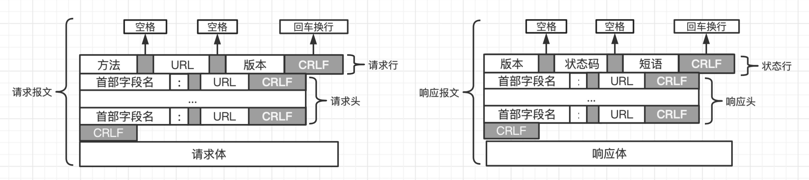
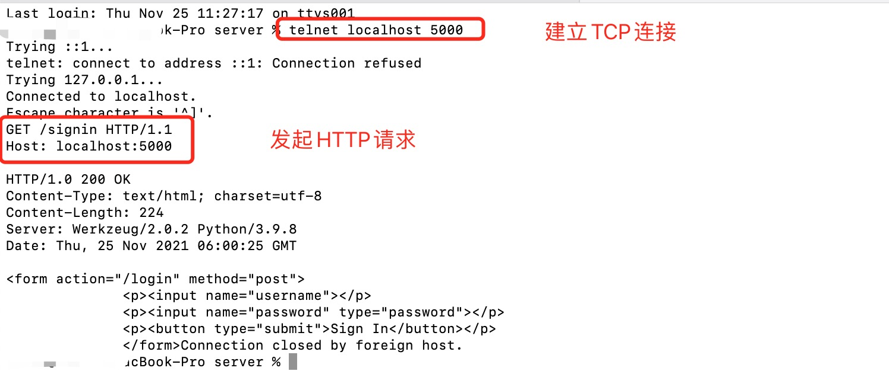
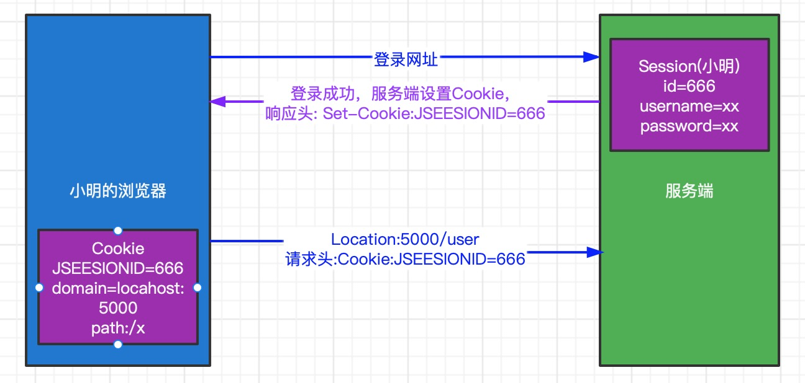

# HTTP协议
终于到了HTTP协议，在面试过程中最常问到的就是TCP和HTTP相关的协议。我们先来看看HTTP是什么？

HTTP`（Hyper Text Transfer Protocol）`，译为超文本传输协议,是互联网中应用最广泛的应用层协议之一,设计HTTP最初的目的是：提供一种发布和接收HTML页面的方法，由URI来标识具体的资源,后面用HTTP来传递的数据格式不仅仅是HTML，应用非常广泛。

从几个方面来将，HTTP的发展过程/HTTP的协议的格式，通过抓包进行验证/代理服务器/CDN/缓存几个当面来讲

>URI是 统一资源标志符,比如 `html/login.html`,URL是统一资源定位符,包含在URI中，它表示网络中具体的资源路径，比如`http://localhost:8080/hello/html/login.html`

## HTTP - 发展过程
1.  1991年，`HTTP/0.9`
    * 只支持GET请求方法获取文本数据（比如HTML文档），且不支持请求头、响应头等，无法向服务器传递太多信息
2. 1996年，`HTTP/1.0`
    * 支持POST、HEAD等请求方法，支持请求头、响应头等，支持更多种数据类型（不再局限于文本数据）
    * 浏览器的每次请求都需要与服务器建立一个TCP连接，请求处理完成后立即断开TCP连接
3. 1997年，`HTTP/1.1（最经典、使用最广泛的版本）`
    * 支持PUT、DELETE等请求方法
    * 采用持久连接（Connection: keep-alive），多个请求可以共用同一个TCP连接
4. 2015年，`HTTP/2.0`
5. 2018年，`HTTP/3.0`，处于草稿阶段

## HTTP - 报文格式
我们每次在浏览器打开一个URL地址，相当于向浏览器发送一个HTTP请求(含有请求报文),服务器返回给我们对应的数据（含有响应报文），它们的格式如下图:

 
>MAC系统使用回车符，即`CR`表示下一行`\r`,UNIX/Linux 采用换行符,即`LF`表示下一行`\n`。十六进制中回车键是`0x0D ` ,换行键是`0x0A` 

光这样干看很容易懵逼,我们通过 Wireshark 抓包对HTTP的报文进行分析。

首先使用Flask建立一个简单的web服务器,`pip3 install flask`安装Flask,下面是web服务器相关的代码,包含`signin GET请求`登录界面和`login POST`登录成功界面，Flask 默认打开 5000 端口:
```python
from flask import Flask
from flask import request

app = Flask(__name__)

@app.route('/', methods=['GET'])
@app.route('/signin', methods=['GET'])
def signin_form():
    return '''<form action="/login" method="post">
              <p><input name="username"></p>
              <p><input name="password" type="password"></p>
              <p><button type="submit">Sign In</button></p>
              </form>'''

@app.route('/login', methods=['POST'])
def login():
    # 需要从request对象读取表单内容：
    if request.form['username']=='123' and request.form['password']=='456':
        return '<h3>Hello, admin!</h3>'
    return '<h3>Bad username or password.</h3>'
if __name__ == '__main__':
    app.run()
```
`python3 xxx.py`运行web服务器,打开 Wireshark,选择监听本地5000端口`tcp.port==5000`,在网页中打开`http://127.0.0.1:5000/signin`,在 Wireshark 中我们可以看到与其相关的请求:


右键选中GET请求，选择追踪HTTP流，我们可以看到完整的请求报文和响应报文,跟图中的:


将数据跟之前的图片进行对比之后发格式基本是一致的，只是请求报文没有请求体，这是因为**GET请求本身就没有请求体，POST请求才有请求体。**在浏览器内输入用户名123，密码456，发送POST登录请求，通过Wireshark进行抓包，POST请求的报文如下图：


这下格式就完全对上了，哪有没有更严谨的方式呢？当然有啦！那就是ABNF

## HTTP - ABNF -> 最严谨的HTTP报文格式描述形式
ABNF（Augmented BNF）是BNF（Backus-Naur Form，译为：巴科斯-瑙尔范式）的修改、增强版。在[RFC 5234](https://datatracker.ietf.org/doc/html/rfc5234)中表明：**ABNF用作internet中通信协议的定义语言**。ABNF是最严谨的HTTP报文格式描述形式，脱离ABNF谈论HTTP报文格式，往往都是片面、不严谨的。关于HTTP报文格式的定义:
* 旧版 [RFC 2616 4.HTTP Message](https://datatracker.ietf.org/doc/html/rfc2616#section-4)
* 新版 [RFC 7230 3.Message Format](https://datatracker.ietf.org/doc/html/rfc7230#section-3)

### ABNF的核心规则

规则 | 形式定义 | 意义
------- | ------- | -------
ALPHA | %×41-5A / %x61-7A | 大写和小写ASCII字母 （A-Z, a-z)
DIGIT | %×30-39 | 数字 (0-9)
HEXDIG | DIGIT / "A" / "B" / "C"/  "D"/  "E"/  "F" | 十六进制数字 (0-9， A-F, a-f)
DQUOTE | %×22 | 双引号
SP | %×20 | 空格
HTAB | %X09 | 横向制表符
WSP | SP / HTAB | 空格或横向制表符
LWSP | *(WSP / CRLF WSP) | 直线空白（晚于换行）
VCHAR | %×21-7E | 可见（打印）字符
CHAR | %x01-7F | 任何7-位US-ASCII宁符，不包括NUL (%x00)
OCTET | %×00-FF | 8位数据
CTL | %×00-1F / %×7F | 控制字符
CR | %×0D  | 回车
LE | %X0A | 换行
CRLF | CR LF | 互联网标准换行 (%x0D%x0A)
BIT |  "0" / "1" | 二进制数字

### ABNF 关于 HTTP 格式的定义
在ABFN中关于报文整体格式如下:
```
HTTP-message = start-line
                *( header-field CRLF )
                CRLF
                [ message-body ]
```
解析 | 含义 | 定义
------- | ------- | -------
start-line | 请求行/响应行 | start-line = request-line / status-line
*( header-field CRLF ) | 请求头/响应头 | header-field = field-name":" OWS field-value OWS
CRLF | 回车换行
[ message-body ] | 请求体或者响应体 | message-body = *OCTET
/ | 任选一个    |   
`*` | 表示0个或多个<br>`2*`表示至少2个<br>`3*6`表示3到6个   |   
( ) | 组成一个整体  |   
[ ] | 可选（可有可无）  |   

我们知道请求报文和响应报文可以分为三部分:请求行、请求头、请求体 。响应行、响应头、响应体 。`CRLF`是回车换行,我们先看一下ABFN中关于它们的定义:
* 请求行 request-line =  method **`SP`** request-target **`SP`** HTTP-version **`CRLF`**
```
HTTP-version = HTTP-name "/" DIGIT "." DIGIT
HTTP-name = %x48.54.54.50  ;ASCII码表示 HTTP
举例:GET /hello/ HTTP/1.1
```
* 响应行 status-line = HTTP-version **`SP`** status-code **`SP`** reason-phrase **`CRLF`**
```
status-code = 3DIGIT
reason-phrase = *( HTAB / SP / VCHAR / obs-text )
举例:HTTP/1.1 200 、HTTP/1.1 200 OK
```
* 请求头/响应头 header-field = field-name ":" **`OWS`** field-value **`OWS`**
```
field-name = token
field-value = *( field-content / obs-fold )
OWS = *( SP / HTAB )
```
* 请求体/响应体 message-body = **`*OCTET`**

## HTTP - URL编码
URL中一旦出现了一些特殊字符（比如中文、空格），需要进行编码,我们在浏览器地址栏输入URL时，是采用UTF-8进行编码，比如使用搜索百度:
* 编码前：`https://www.baidu.com/s?wd=百度`
* 编码后：`https://www.baidu.com/s?wd=%E5%8D%8E%E4%B8%BA`

## HTTP - Xshell + telnet 测试请求
MAC系统自带终端可以直接使用,Window系统安装一个[`Xshell`](https://www.netsarang.com/zh/xshell/)（安全终端模拟软件），在Xshell中使用telnet:
* 可以直接面向HTTP报文与服务器交互
* 可以更清晰、直观地看到请求报文、响应报文的内容
* 可以检验请求报文格式的正确与否

比如我们直接在终端上连接之前的web服务器,直接使用HTTP的报文格式进行GET请求,结果如下图:



## HTTP - 请求方法
文档 [RFC 7231, section 4: Request methods](https://datatracker.ietf.org/doc/html/rfc7231#section-4) ：描述了8种请求方法: `GET、HEAD、POST、PUT、DELETE、CONNECT、OPTIONS、TRACE`,在 [RFC 5789, section 2: Patch method](https://datatracker.ietf.org/doc/html/rfc5789#section-2)：中描述了PATCH方法。

也就是一共9种请求方法，我们在项目中常用的只有 GET/POST 请求

方法 | 作用 | 场景
------- | ------- | -------
GET | 常用于读取的操作，请求参数直接拼接在URL的后面 **（浏览器对URL是有长度限制的）** | 
POST | 常用于添加、修改、删除的操作，请求参数可以放到请求体中（没有大小限制） | 
HEAD | 请求得到与GET请求相同的响应，但没有响应体 | 使用场景举例：在下载一个大文件前，先获取其大小，再决定是否要下载。以此可以节约带宽资源
OPTIONS | 用于获取目的资源所支持的通信选项，比如服务器支持的请求方法 | OPTIONS * HTTP/1.1
PUT | 用于对已存在的资源进行整体覆盖  |  由于不安全，一般服务器不开放该方法
PATCH | 用于对资源进行部分修改（资源不存在，会创建新的资源）  |  由于不安全，一般服务器不开放该方法
DELETE | 用于删除指定的资源  |  由于不安全，一般服务器不开放该方法
TRACE | 请求服务器回显其收到的请求信息，主要用于HTTP请求的测试或诊断
CONNECT | 可以开启一个客户端与所请求资源之间的双向沟通的通道，它可以用来创建隧道（tunnel） | 可以用来访问采用了 SSL (HTTPS) 协议的站点

## HTTP - 头部字段（请求头/响应头）
头部字段可以分为4种类型，简单一点可以只根据请求头字段和响应头字段进行区分:
* 请求头字段（Request Header Fields）:有关要获取的资源或客户端本身信息的消息头
* 响应头字段（Response Header Fields）:有关响应的补充信息，比如服务器本身（名称和版本等）的消息头
* 实体头字段（Entity Header Fields）:有关实体主体（也就是 请求体/响应体）的更多信息，比如主体长度（Content-Length）或其MIME类型
* 通用头字段（General Header Fields）:同时适用于请求和响应消息，但与消息主体无关的消息头

### 请求头字段
在请求头中，有一些值后面会有q, **q代表权重**,q值越大，表示优先级越高。 如果不指定q值，默认是1.0（1.0是最大值）

头字段名    |   说明    |   示例
------- | ------- | -------
User-Agent  |   浏览器的身份标识字符串  |   `User-Agent: Mozilla/5.0 (X11; Linux x86_64; rv:12.0) Gecko/20100101 Firefox/21.0`
Host    |   服务器的域名、端口号    |   `Host: localhost:80`
Date    |   发送该消息的日期和时间  |   `Date: Tue, 15 Nov 1994 08:12:31 GMT`
Referer |   表示浏览器所访问的上一个页面地址<br>有些网站使用它做防盗链，比如妹子图  |   `Referer: https://www.baidu.com`
Content-Type  |   请求体的类型    |   `Content-Type: multipart/form-data`
Content-Length |     请求体的长度（字节为单位）   |   `Content-Length: 348`
Accept  |   能够接受的响应内容类型(content-types)  |   `Accept: text/html,application/xhtml+xml,application/xml;q=0.9`
Accept-Charset  |   能够接受的字符集    |   `Accept-Charset: GB2312, utf-8 @=0.7, *=0.7`
Accept-Encoding |   能够接受的编码方式列表  |   `Accept-Encoding: gzip, deflate`
Accept-Language    |   能够接受的响应内容的自然语言列表    |   `Accept-Language: en-US`
Range   |   仅请求某个实体的一部分。字节偏移以0开始,**使用场景:多线程下载视频,每个线程下载视频的一部分**  |   `Range: byte$=500-999`
Origin  |   发起一个针对跨域资源共享的请求   |   `Origin: https //www.baidu.com`
Cookie  |   之前由服务器通过 Set- Cookie 发送的 Cookie  |   `Cookie: $Version=l: Skin=new`
Connection  |   该览器想要优先使用的连接类型    |   `Connection: keep-alive`
Cache-Contro   |   用来指定在这次的请求/响应链中的所有缓存机制都必须遵守的指令    |   `Cache-Control: no-cache`

### 响应头字段

头字段名    |   说明    |   示例
------- | ------- | -------
Date    |   发送该消息的日期和时间  |   `Date: Tue,15 Nov 1994 08:12:31 GMT`
Last-Modified   |   所请求的对象的最后修改日期  |   `Last-Modified: Tue, 15 Nov 1994 12:45:26 GMT`
Server  |   服务器的名字    |   `Server: Apache/2.4.1(Unix)`
Expires |   指定一个时间，超过该时间则认为此响应已经过期    |   `Expires: Thu, 01 Dec 1994 16:00:00 GMT`
Content-Type    |   响应体的类型    |   `Content-Type: text/html charset=utf-8`
Content-Encoding    |   容所使用的编码类型  |   `Content-Encoding: gzip`  
Content-Length  |   响应体的长度（字节为单位)   |    `Content-Length 348`
Content-Disposition |   一个可以让客户端下载文件并建议文件名的头部 |   `Content-Disposition: attachment; filename=fname.text `
Accept-Ranaes   |   服务器支持哪些种类的部分内容范围    |  `Accept-Ranges: bytes ` 
Content-Ranae   |   这条部分消息是属于完整消息的哪部分  |  ` Content-Range: bytes 21010-47021/47022`
Access-Control-Allow-Origin |   指定哪些网站可参与到跨来源资源共享过程中    |   `Access-ControーAllow-Origin: *`
Location    |   用来进行重定向，或者在创建了某个新资源时使用    |   `Location: http://www.w3.org`
Set-Cookie  |   返回一个 Cookie 让客户端去保存  |   `Set-Cookie: UserId=JohnDoe; Max-Age=3600;Verslon=1`
Connection  |   针对该连接所颋期的选项  |   `Connection: close`
Cache-Control   |   向从服务器直到客户端在内的所有绶存机制告知，它们是否可以缓存这个对象。单位为秒      |   `Cache-Control: max-age=3600`

## HTTP - 状态码
HTTP状态码由三个十进制数字组成，第一个十进制数字定义了状态码的类型，后两个数字确定具体的错误。HTTP状态码共分为5种类型：

分类 | 分类描述
------- | -------
1** |  信息响应，服务器收到请求，需要请求者继续执行操作
2** |  成功响应，操作被成功接收并处理
3** |  重定向，需要进一步的操作以完成请求
4** |  客户端错误，请求包含语法错误或无法完成请求
5** |  服务器错误，服务器在处理请求的过程中发生了错误

### 常见的状态码
状态码 | 描述 | 作用
------- | ------- | -------
100 | Continue | * 请求的初始部分已经被服务器收到，并且没有被服务器拒绝。客户端应该继续发送剩余的请求，如果请求已经完成，就忽略这个响应<br>* 允许客户端发送带请求体的请求前，判断服务器是否愿意接收请求（服务器通过请求头判断）<br>* 在某些情况下，如果服务器在不看请求体就拒绝请求时，客户端就发送请求体是不恰当的或低效的
200 | OK | 请求成功
302 | Found | 请求的资源被暂时的移动到了由Location头部指定的URL上
304 | Not Modified | 说明无需再次传输请求的内容，也就是说可以使用缓存的内容
400 | Bad Request | 由于语法无效，服务器无法理解该请求
401 | Unauthorized | 由于缺乏目标资源要求的身份验证凭证
403 | Forbidden | 服务器端有能力处理该请求，但是拒绝授权访问
404 | Not Found | 服务器端无法找到所请求的资源
405 | Method Not Allowed | 服务器禁止了使用当前HTTP方法的请求
406 | Not Acceptable | 服务器端无法提供与Accept-Charset以及Accept-Language指定的值相匹配的响应
408 | Request Timeout | 服务器想要将没有在使用的连接关闭,一些服务器会在空闲连接上发送此信息，即便是在客户端没有发送任何请求的情况下
500 | Internal Server Error | 所请求的服务器遇到意外的情况并阻止其执行请求
501 | Not Implemented | 请求的方法不被服务器支持，因此无法被处理。服务器必须支持的方法（即不会返回这个状态码的方法）只有 GET 和 HEAD
502 | Bad Gateway | 作为网关或代理角色的服务器，从上游服务器（如tomcat）中接收到的响应是无效的
503 | Service Unavailable | 服务器尚未处于可以接受请求的状态。通常造成这种情况的原因是由于服务器停机维护或者已超载

## HTTP - 表单提交
在网页中，如果我们想传递数据给服务端，需要使用表单提交的方式,将参数或者文件数据传递给服务端。我们创建一个简单的例子:
* 服务端代码

```python
from flask import Flask,redirect,render_template

app = Flask(__name__)

@app.route('/index', methods=['GET'])
def index():
    return app.send_static_file("index.html")

@app.route('/list', methods=['GET','POST'])
def list():
    data= {'nickname': request.form['username'],'password':request.form['password']}
    return render_template("list.html",user=data)  

if __name__ == '__main__':
    app.run()
```

* 客户端代码

```html
<!DOCTYPE html>
<html>
    <head>
        <meta charset="utf-8">
        <title>表单提交</title>
    </head>
    <body>
        <!-- action: 请求的URI -->
        <!-- method: 请求方法（GET、POST) -->
        <!-- enctype: POST请求时，请求体的编码方式 -->
        <form action="/list" method="post" enctype="multipart/form-data">
            <div>
                <span>姓名</span>
                <input type="text" name="username">
            </div>
            <div>
                <span>密码</span>
                <input type="text" name="password">
            </div>
            <div>
                <span>头像</span>
                <input type="file" name="potato">
            </div>
            <button type="submit">提交</button>
        </form>
        
    </body>
</html>
```
我们通过Flask搭建一个简单的服务端，点击`127.0.0.1:5000/index`显示对应网页。网页就是我们的客户端,显示两个输入框、一个选择文本框、一个提交按钮。

在我们点击提交按钮的时候，通过`from`标签内的`action`跳转到新的网页。`method`表示请求的方法`(GET/POST)`请求,`enctype`表示POST请求时，请求体的编码方式。编码方式可以分为下面几种:
* application/x-www-form-urlencoded : 默认编码类型,用&分隔参数，用=分隔键和值，字符用URL编码方式进行编码,比如`username=123&password=3343`
* multipart/form-data : 该类型用于**高效传输文件、非ASCII数据和二进制数据**,文件上传时必须使用这种编码方式
* text/plain : 普通文本
* application/json及其他MIME类型 : 已被W3C遗弃,默认使用 application/x-www-form-urlencoded

### 关于 multipart/from-data
在使用表单提交文件时，请求体必须是`enctype="multipart/form-data"`，这是因为它的格式不同,在[RFC1521](https://datatracker.ietf.org/doc/html/rfc1521)中有明确定义它的格式:
*  Content-type: multipart/form-data boundary=xxx
    ```
    multipart-body := preamble 1*encapsulation close-delimiter epilogue
    * encapsulation :=  delimiter body-part CRLF
    * delimiter := "--"boundary CRLF
    * close-delimiter := "--"boundary"--" CRLF
    * preamble 、 epilogue 可忽略不写
    ```
上面是官方给的格式，简单一点的就是:

    ```
    Content-Type: multipart/form-data; boundary=AaB03x   
    --AaB03x   
    Content-Disposition: form-data; name="submit-name"   
    Larry   
    --AaB03x   
    Content-Disposition: form-data; name="files"; filename="file1.txt"   
    Content-Type: text/plain   
    ... contents of file1.txt ...       
    --AaB03x--
    ```
使用Wireshark抓包，查看 multipart/from-data 的格式跟上面是一致的，如下图:


## HTTP - 跨域 `(Access-Control-Allow-Origin)`
浏览器有个同源策略`（Same-Origin Policy)`,它規定了：默认情况下，AJAX请求只能发送给同源的 URL。**同源指：协议、域名（IP）、端口 3个相同**

下表给出了与 URL `http://store.company.com/dir/page.html `的源进行对比的示例:

URL | 结果 | 原因
------- | ------- | -------
http://store.company.com/dir2/other.html | 同源 | 只有路径不同
http://store.company.com/dir/inner/another.html | 同源 | 只有路径不同
https://store.company.com/secure.html | 失败 | 协议不同
http://store.company.com:81/dir/etc.html | 失败 | 端口不同 ( http:// 默认端口是80)
http://news.company.com/dir/other.html | 失败 | 主机不同

>HTML标签中`img、script、1ink、iframe、video、audio` 等标签不受同源策的约束。

跨域资源共享需要客户端和服务端同时支持,IE至少是 IE10 版本,服务端需要返回相应的响应头(比如`Access-Control-Allow-Origin`)告诉浏览器这是一个允许跨域访问的请求。

## HTTP - Cookie、Session
HTTP协议是无状态的，在一次请求响应结束后，服务器不会留下关于客户端状态的信息。对于某些场景来说，客户端的信息有必要被记住，比如用户的登录状态，这样就可以根据用户的状态来返回不同的响应。为了解决这个问题就有了Cookie技术。通过在请求和响应报文中添加Cookie数据来保存客户端的状态信息。
* Cookie: 在客户端（浏览器）存储一些数据，存储到本地磁盘（硬盘），服务端可以返回Cookie交给客户端去存储
* Session: 在服务端存储一些数据，存储在内存中

Cookie 通常被用来进行用户的会话管理（登录状态），保存用户的个性化信息（比如语言设置，视频上次播放的位置，网站主题选项等）以及记录和手机用户浏览数据以来分析用户行为等。浏览器在一定时间内保存它，在下一次请求服务器时会附带这个Cookie数据。

使用Flask搭建一个简单的测试界面,有`signin`、`login`、`user`三个URL地址,开启服务后，打开`127.0.0.1:5000`默认是登录地址，登录成功之后会将用户的用户名和密码保存到Cookie，浏览器会在下一次的请求中会将Cookie带过去。如果有Cookie，打开`user`界面提示用户已经登录成功，并且保存了Cookie，如果没有Cookie，直接打开`user`则会被重定向到登录界面,代码如下:

```python
from flask import Flask,redirect,request
from flask import Flask,redirect,url_for
from flask.helpers import make_response

app = Flask(__name__)

@app.route('/', methods=['GET'])
@app.route('/signin', methods=['GET'])
def signin_form():
    return '''<form action="/login" method="post">
              <p><input name="username"></p>
              <p><input name="password" type="password"></p>
              <p><button type="submit">Sign In</button></p>
              </form>'''

@app.route('/login', methods=['POST'])
def login():
    # 需要从request对象读取表单内容：
    if request.form['username']=='123' and request.form['password']=='456':
        response = make_response('<h3>Hello, admin!</h3>')
        response.set_cookie('username',request.form['username'])
        response.set_cookie('password',request.form['password'])
        return response
    return '<h3>Bad username or password.</h3>'

@app.route('/user', methods=['GET'])
def user():
    # 如果有Cookie 并且保存的用户名是 123，密码是 456，跳转到新的网页
    if request.cookies.get('username')=='123' and request.cookies.get('password')=='456':
        return "<h3>用户已经登录成功，并且有cookie</h3>"
    return redirect('http://127.0.0.1:5000/signin')

if __name__ == '__main__':
    app.run()
```

可以使用下面这张图简单的描述：


>注意: 如果没有设置Cookie的过期时间，则当浏览器关闭时，Cookie就失效了，Session的有效期默认是30分钟。

## HTTP - 缓存Cache
通常会缓存的情况是：GET请求 + 静态资源（比如HTML、CSS、JS、图片等）, `Ctrl + F5`可以强制刷新缓存。

缓存对应的响应头有:
* Pragma：作用类似于Cache-Control，HTTP/1.0的产物
* Expires：缓存的过期时间（GMT格式时间），HTTP/1.0的产物
* Cache-Control：设置缓存策略
    * no-storage：不缓存数据到本地
    * public：允许用户、代理服务器缓存数据到本地
    * private：只允许用户缓存数据到本地
    * max-age：缓存的有效时间（多长时间不过期），单位秒
    * no-cache：每次需要发请求给服务器询问缓存是否有变化，再来决定如何使用缓存
* Last-Modified：资源的最后一次修改时间
* ETag：资源的唯一标识（根据文件内容计算出来的摘要值）

相关优先级：`Pragma > Cache-Control > Expires`、`ETag > Last-Modified`

缓存对应的请求头有:
* If-None-Match
    * 如果上一次的响应头中有ETag，就会将ETag的值作为请求头的值
    * 如果服务器发现资源的最新摘要值跟If-None-Match不匹配，就会返回新的资源（200 OK）,否则，就不会返回资源的具体数据（304 Not Modified）
* If-Modified-Since
    * 如果上一次的响应头中没有ETag，有Last-Modified，就会将Last-Modified的值作为请求头的值
    * 如果服务器发现资源的最后一次修改时间晚于If-Modified-Since，就会返回新的资源（200 OK）,否则，就不会返回资源的具体数据（304 Not Modified）

### Last-Modified  和  ETag 的区别
* Last-Modified的缺陷
    * 只能精确到秒级别，如果资源在1秒内被修改了，客户端将无法获取最新的资源数据
    * 如果某些资源被修改了（最后一次修改时间发生了变化）。但是内容并没有任何变化,会导致相同数据重复传输，没有使用到缓存
* ETag可以办到
    * 只要资源的内容没有变化，就不会重复传输资源数据
    * 只要资源的内容发生了变化，就会返回最新的资源数据给客户端

缓存的流程图如下:


## 推荐网址
* [HTTP教程](https://www.runoob.com/http/http-tutorial.html)
* [表单提交时编码类型enctype详解](https://segmentfault.com/a/1190000004955798)