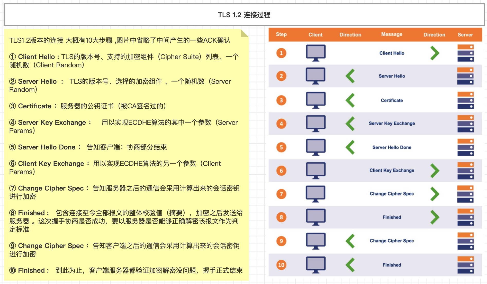

# HTTPS
超文本传输安全协议（英语：`HyperText Transfer Protocol Secure`，缩写：HTTPS；常称为HTTP over TLS、HTTP over SSL或HTTP Secure）是一种通过计算机网络进行安全通信的传输协议。HTTPS 经由 HTTP 进行通信，但利用`SSL/TLS`来加密数据包。

现在很多网站使用的是https协议，比如百度。我们在浏览器上输入`http://www.baidu.com`时，它会使用302重定向到https，如下图:


## 认识 SSL/TLS
TLS`（Transport Layer Security）`，译为：传输层安全性协议，它的前身是SSL（`Secure Sockets Layer）`，译为：安全套接层。

HTTPS 是在 HTTP 的基础上使用 SSL/TLS 来加密报文，对窃听和中间人攻击提供合理的防护。SSL/TLS 也可以用在其他协议上，比如、`FTP → FTPS`、`SMTP → SMTPS`。

它的历史版本信息:
```
SSL 1.0：因存在严重的安全漏洞，从未公开过
SSL 2.0：1995年，已于2011年弃用（RFC 6176）
SSL 3.0：1996年，已于2015年弃用（RFC 7568）
TLS 1.0：1999年（RFC 2246）
TLS 1.1：2006年（RFC 4346）
TLS 1.2：2008年（RFC 5246）
TLS 1.3：2018年（RFC 8446）
```
TLS/SSL 工作在运输层和应用层之间，如下图：


## OpenSSL
OpenSSL 是SSL/TLS协议的开源实现，始于1998年，支持Windows、Mac、Linux等平台。Linux、Mac一般自带OpenSSL,Windows平台的[OpenSSL下载地址](https://slproweb.com/products/Win32OpenSSL.html)

OpenSSL 常用命令有:
* 生成私钥：`openssl genrsa -out mj.key`
* 生成公钥：`openssl rsa -in mj.key -pubout -out mj.pem`

可以使用OpenSSL构建一套属于自己的CA，自己给自己颁发证书，称为“自签名证书”

## HTTPS的通信过程
HTTPS的通信过程可以分为3大阶段：① TCP的3次握手、② TLS的连接、③ HTTP请求和响应


## TLS 1.2的连接过程
TLS 1.2 版本的连接过程大约有10步，主要是客户端和服务端双方沟通TLS的版本号，沟通双方通信加密方式以及验证CA证书。如下图：


使用 Wireshark 进行抓包分析:


* ① Client Hello: TLS的版本号、支持的加密组件（Cipher Suite）列表（加密组件是指所使用的加密算法及密钥长度等）、一个随机数（Client Random）
    
* ② Server Hello: TLS的版本号、选择的加密组件`（是从接收到的客户端加密组件列表中挑选出来的）`、一个随机数（Server Random）
    
* ③ Certificate: 服务器的公钥证书（被CA签名过的）
    
* ④ Server Key Exchange: 用以实现ECDHE算法的其中一个参数（Server Params）。`ECDHE是一种密钥交换算法，为了防止伪造，Server Params经过了服务器私钥签名`
    
* ⑤ Server Hello Done: 告知客户端：协商部分结束
    
* ⑥ Client Key Exchange: 用以实现ECDHE算法的另一个参数（Client Params）
    
* ⑦ Change Cipher Spec: 告知服务器：之后的通信会采用计算出来的会话密钥进行加密
    
* ⑧ Finished: 包含连接至今全部报文的整体校验值（摘要），加密之后发送给服务器,这次握手协商是否成功，要以服务器是否能够正确解密该报文作为判定标准
    
* ⑨ Change Cipher Spec ⑩ Finished :到此为止，客户端服务器都验证加密解密没问题，握手正式结束


## 使用Flask搭建HTTPS服务

http://niusmallnan.com/_build/html/_templates/knowladge/python_https_server.html

生成证书：
```
# 生成rsa密钥
$ openssl genrsa -des3 -out server.key 1024
# 去除掉密钥文件保护密码
$ openssl rsa -in server.key -out server.key
# 生成ca对应的csr文件
$ openssl req -new -key server.key -out server.csr
# 自签名
$ openssl x509 -req -days 1024 -in server.csr -signkey server.key -out server.crt
$ cat server.crt server.key > server.pem
```

https://www.jianshu.com/p/b3cc1299e03e
https://segmentfault.com/a/1190000021142289
https://segmentfault.com/a/1190000023568902

## Wireshark 抓包HTTPS

## 推荐阅读
* [https如何使用python+flask来实现](https://bbs.huaweicloud.com/blogs/detail/259237)
* [TLS1.3 VS TLS1.2](https://zhuanlan.zhihu.com/p/44980381)
* [HTTP/3详解](https://www.kancloud.cn/kancloud/http3-explained/1395002)