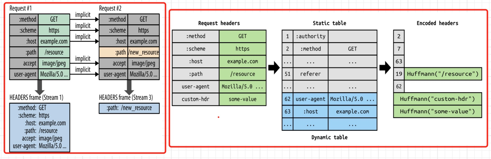
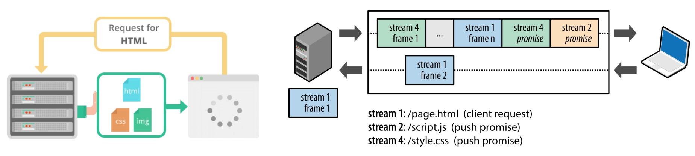

# HTTP/2 和 HTTP/3
在HTTP的使用过程中，人们逐渐发现它有以下的缺点:
```markdown
* 同一时间，一个连接只能对应一个请求。针对同一个域名，大多数浏览器允许同时最多6个并发连接
* 只允许客户端主动发起请求。 并且一个请求只能对应一个响应
* 同一个会话的多次请求中，头信息会被重复传输。通常会给每个传输增加500~800字节的开销，如果使用 Cookie，增加的开销有时会达到上千字节
```

为了解决这些问题，2009年11月，Google宣布将SPDY作为提高网络速度的内部项目，SPDY是HTTP/2的前身。

## SPDY
SPDY（`speedy`的缩写），基于TCP的应用层协议，它强制要求使用SSL/TLS。SPDY 并不用于取代HTTP，它只是修改了HTTP请求与响应的传输方式,只需增加一个SPDY层，现有的所有服务端应用均不用做任何修改。结构如下图:


✓ 2015年9月，Google宣布移除对SPDY的支持，拥抱HTTP/2。

## HTTP2
HTTP/2（超文本传输协议第2版，最初命名为HTTP 2.0），简称为h2。于2015年5月以[RFC 7540](https://datatracker.ietf.org/doc/html/rfc7540)正式发表。

HTTP/2 在底层传输做了很多的改进和优化，但在语意上完全与HTTP/1.1兼容。比如请求方法（如GET、POST）、Status Code、各种Headers等都没有改变。因此，要想升级到HTTP/2，开发者不需要修改任何代码，只需要升级服务器配置、升级浏览器。

HTTP/1.1 和 HTTP/2 速度对比可以参考这两个网站:[http2Demo](http://www.http2demo.io/)、[akamai](https://http2.akamai.com/demo),网站使用很多小图片拼成一张大图用来测试下载速度。

### HTTP/2 的一些基本概念
HTTP/2 将一个TCP连接分为若干个流`（Stream）`，每个流中可以传输若干消息`（Message）`，每个消息由若干最小的二进制帧`（Frame）`组成。这也是HTTP/1.1与HTTP/2最大的区别所在。

HTTP/2中，每个用户的操作行为被分配了一个流编号`（Stream ID）`，这意味着用户与服务端之间创建了一个TCP通道；协议将每个请求分割为二进制的控制帧与数据帧部分，以便解析。

* 数据流：已建立的连接内的双向字节流，可以承载一条或多条消息,所有通信都在一个TCP连接上完成，此连接可以承载任意数量的双向数据流
* 消息：与逻辑HTTP请求或响应消息对应，在HTTP/2中由一系列帧组成
* 帧：HTTP/2通信的最小单位，每个帧都包含帧头（会标识出当前帧所属的数据流,来自不同数据流的帧可以交错发送，然后再根据每个帧头的数据流标识符重新组装.如下图:
    

### HTTP/2 的新特性
HTTP/2使用了很多新的特性，比如采用了二进制而非明文来打包、传输客户端和服务器之间的数据、引入HPACK算法对头部做压缩、多路复用、优先级、服务器推送。

#### 传输格式使用二进制数据格式
在  HTTP/2 中采用二进制格式传输数据，而非HTTP/1.1的文本格式, 二进制格式在协议的解析和优化扩展上带来更多的优势。请求头是`HEADERS frame`，请求体是`DATA frame`。


#### 多路复用 （Multiplexing）
客户端和服务器可以将 HTTP消息分解为互不依赖的帧，然后交错发送，最后再在另一端把它们重新组装起来，它的优势有:
```markdown
1. 并行交错地发送多个请求，请求之间互不影响
2. 并行交错地发送多个响应，响应之间互不干扰
3. 使用一个连接并行发送多个请求和响应
4. 不必再为绕过 HTTP/1.1 限制而做很多工作 (比如image sprites、合并CSS\JS、内嵌CSS\JS\Base64图片、域名分片等)
```


对 [akamai](https://http2.akamai.com/demo)进行分析，对比 HTTP/1.1 和 HTTP/2 加载图片对应的链接个数，就能很明显看到 HTTP/2 多路复用的方式:


#### 优先级
HTTP/2 标准允许每个数据流都有一个关联的权重和依赖关系,可以向每个数据流分配一个介于1至256之间的整数,每个数据流与其他数据流之间可以存在显式依赖关系。

客户端可以构建和传递“优先级树”，表明它倾向于如何接收响应，服务器可以使用此信息通过控制CPU、内存和其他资源的分配设定数据流处理的优先级，在资源数据可用之后，确保将高优先级响应以最优方式传输至客户端。


#### 头部压缩
HTTP/2使用 HPACK 压缩请求头和响应头,可以极大减少头部开销，进而提高性能,它的原理是:
* 客户端与服务端根据[RFC 7541](https://datatracker.ietf.org/doc/html/rfc7541)的附录A，维护一份共同的静态字典（Static Table），其中包含了常见头部名及常见头部名称与值的组合的代码；
* 客户端和服务端根据先入先出的原则，维护一份可动态添加内容的共同动态字典（Dynamic Table）；
* 客户端和服务端根据[RFC 7541](https://datatracker.ietf.org/doc/html/rfc7541)的附录B，支持基于该静态哈夫曼码表的哈夫曼编码（Huffman Coding）。

如下图，如果在第二次请求中，只有请求路径发生变化，其他请求头没有发生变化时，HTTP/2 不会重复发送数据


#### 服务器推送
在 HTTP/1.1 的时候，一次HTTP请求对应一次HTTP响应，但是在 HTTP/2 时，服务器可以对一个客户端请求发送多个响应,除了对最初请求的响应外，服务器还可以向客户端推送额外资源，而无需客户端额外明确地请求。如下图:


## QUIC
虽然 HTTP/2 看起来已经很厉害了，但是依然存在着很多问题，比较明显的是队头阻塞和握手延迟问题，当然这并不是它自身问题导致的，而是由于它是基于TCP协议的，而 TCP 协议本身存在这种问题。

QUIC`（Quick UDP Internet Connections）`，译为：快速UDP网络连接，由Google开发，基于UDP协议进行实现，因为 UDP 协议不存在可靠传输，所以可靠传输部分由 QUIC 进行保证。同样因为基于UDP协议，所以也不存在对头阻塞和握手延迟的问题。


## HTTP/3
HTTP/3 是即将到来的第三个主要版本的HTTP协议，目前仍然是草案状态。

与其前任HTTP/1.1和HTTP/2不同，在HTTP/3中，将弃用TCP协议，改为使用基于UDP协议的QUIC协议实现。头部压缩使用`QPack`进行实现,结构如下图:


### HTTP/3 新特性 - 连接迁移
TCP基于4要素`（源IP、源端口、目标IP、目标端口）`,当切换网络时至少会有一个要素发生变化，导致连接发生变化。当连接发生变化时，如果还使用原来的TCP连接，则会导致连接失败，就得等原来的连接超时后重新建立连接。

所以我们有时候发现切换到一个新网络时，即使新网络状况良好，但内容还是需要加载很久,如果实现得好，当检测到网络变化时立刻建立新的TCP连接，即使这样，建立新的连接还是需要几百毫秒的时间。

QUIC的连接不受4要素的影响，当4要素发生变化时，原连接依然维持，它的原理是:
```markdown
* QUIC连接不以4要素作为标识，而是使用一组`Connection ID`（连接ID）来标识一个连接
* 即使IP或者端口发生变化，只要`Connection ID`没有变化，那么连接依然可以维持
```

比如: 当设备连接到Wi-Fi时，将进行中的下载从蜂窝网络连接转移到更快速的Wi-Fi连接
✓ 当Wi-Fi连接不再可用时，将连接转移到蜂窝网络连接 


## 推荐阅读
* [维基百科-HTTP/2](https://zh.wikipedia.org/wiki/HTTP/2#HTTP/2%E4%B8%8ESPDY%E7%9A%84%E6%AF%94%E8%BE%83)
* [QUIC协议原理分析](https://zhuanlan.zhihu.com/p/32553477)
