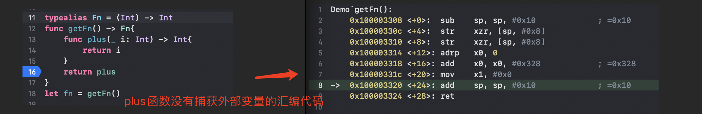
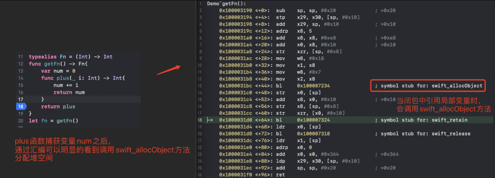

# 闭包表达式（Closure Expression）
在Swift中，可以通过func定义一个函数，也可以通过`闭包表达式`定义一个函数。闭包表达式的格式是：
```swift
{
    (参数列表) -> 返回值类型 in
    函数体代码
}
// 比如下面的闭包表达式
var fn = {
    (v1: Int, v2: Int) -> Int in
    return v1 + v2
}
```

## 闭包表达式的简写
```swift
// 定义一个闭包表达式
func exec(v1: Int, v2: Int, fn: (Int, Int) -> Int) {
    print(fn(v1, v2))
}
// 正常调用
exec(v1: 10, v2: 20, fn: { (v1: Int, v2: Int) -> Int in
    return v1 + v2
})
// 第一种简写方式，省去大括号、参数类型、返回值类型
exec(v1: 10, v2: 20, fn: { v1, v2 in return v1 + v2})
// 第二种简写方式，省去大括号、参数类型、返回值类型、return
exec(v1: 10, v2: 20, fn: { v1, v2 in v1 + v2 })
// 第三种简写方式，$0表示第一个参数 $1表示第二个参数
exec(v1: 10, v2: 20, fn: { $0 + $1 })
// 第四种简写方式，一般不用
exec(v1: 10, v2: 20, fn: + )
```

## 尾随闭包
如果将一个很长的闭包表达式作为函数的最后一个实参，使用尾随闭包可以增强函数的可读性。**尾随闭包是一个被书写在函数调用括号外面（后面）的闭包表达式**。比如:
```swift
//定义方法
func exec(v1: Int, v2: Int, fn: (Int, Int) -> Int) {
    print(fn(v1, v2))
}
// 调用时,大括号在方法外面
exec(v1: 10, v2: 20) {
    $0 + $1
}
```
如果闭包表达式是函数的唯一实参，而且使用了尾随闭包的语法，那就不需要在函数名后边写圆括号。比如:
```swift
// 闭包表达式是唯一的实参
func exec(fn: (Int, Int) -> Int) {
    print(fn(1, 2))
}
// 三种调用方式,()号可以省略
exec(fn: { $0 + $1 })
exec() { $0 + $1 }
exec { $0 + $1 }
```
比如Swift中的数组的排序方法`func sort(by areInIncreasingOrder: (Element, Element) -> Bool)`,只有一个闭包表达式参数。可以有多种写法:
```swift
var nums = [11, 2, 18, 6, 5, 68, 45]
// 定义一个方法
func cmp(i1: Int, i2: Int) -> Bool {
    return i1 > i2
}
nums.sort(by: cmp)
// 直接调用
nums.sort(by: {
    (i1: Int, i2: Int) -> Bool in
        return i1 < i2
})
// 一步步简化
nums.sort(by: { i1, i2 in return i1 < i2 })
nums.sort(by: { i1, i2 in i1 < i2 })
nums.sort(by: { $0 < $1 })
nums.sort(by: <)
nums.sort() { $0 < $1 }
nums.sort { $0 < $1 }
```

## 闭包（Closure）
一个函数和它所捕获的变量\常量环境组合起来，称为闭包。闭包有点类似OC中的block,一般指定义在函数内部的函数,一般它捕获的是外层函数的局部变量\常量。
```swift
// 函数起一个别名
typealias Fn = (Int) -> Int
func getFn() -> Fn {
    var num = 0
    func plus(_ i: Int) -> Int {
        num += i
        return num
    }
    return plus 
} //  返回的plus和num形成了闭包
var fn1 = getFn()
fn1(1) // 1
fn1(3) // 4
fn1(5) // 9
```
在上面的代码中,num是一个局部变量，如果是正常的函数,局部变量保存在栈空间，但是由于在闭包中捕获了局部变量num，所以在堆空间中也会保存一份数据。

>**可以把闭包想象成是一个类的实例对象,内存在堆空间,捕获的局部变量\常量就是对象的成员（存储属性）,组成闭包的函数就是类内部定义的方法。**

`getFn()`函数也可以简写为:
```swift
func getFn() -> Fn {
    var num = 0
     return {
        num += $0
        return num
    }
}
```

## 通过汇编对闭包进行分析
我们对下面两段代码进行汇编分析。第一段代码，只嵌套函数，不在嵌套函数内部捕获变量，我们可以根据汇编明显看到比较简单。

第二段代码，在嵌套函数内部捕获栈空间的局部变量,看汇编时明显看到`swift_allocObject`分配内存空间。


只有这些还是不够的，我们针对下面的代码做进一步的分析:
```swift
typealias Fn = (Int) -> Int
func getFn() -> Fn{
    var num = 0
    func plus(_ i: Int) -> Int{
        num += i
        return num
    }
    return plus 
}
var fn = getFn()
print(fn(1)) //1
print(fn(2)) //3
print(fn(4)) //7
```
断点下在`return plus`,查看汇编代码,在`getFn`汇编中`swift_allocObject`的下一行下断点,通常`%rax`、`x0`寄存器存储的是堆空间的返回地址，这里肯定是闭包的地址，我们通过`register read x0`读取寄存器中的地址，然后通过`x/4xg 0x0000000100513880`查看从当前内存开始的32字节内存地址，以16进制显示。再将断点下在`return num`处，这样每次`num += 1`的时候，我们都可以直接查看内存中的值变化。如下图:


如果我们想知道给堆分配了多少空间，可以猜测`swift_allocObject`方法中会有一个分配内存大小的参数，然后通过查看寄存器x1中的值就知道了
```
0x1000031ac <+28>: mov    w8, #0x18
0x1000031b0 <+32>: mov    x1, x8
```
传递的内存大小值是24字节，但是由于在64位中内存对齐是16的倍数，也就是系统会分配32个字节。实际占用只有24字节。

## 自动闭包  @autoclosure
自动闭包是一种语法糖,的作用是简化我们的代码，使代码看上去更好阅读。先说下自动闭包如何使用，比如下面的代码，根据前一个参数确定是否返回后面的参数
```swift
// 如果第1个数大于0，返回第一个数。否则返回第2个数
func getFirstPositive(_ v1: Int, _ v2: Int) -> Int {
    return v1 > 0 ? v1 : v2
}
getFirstPositive(10, 20) // 10
```
如果需要延时加载，则可以将v2修改成闭包，比如:
```swift
// 改成函数类型的参数，可以让v2延迟加载
func getFirstPositive(_ v1: Int, _ v2: () -> Int) -> Int? {
    return v1 > 0 ? v1 : v2()
}
getFirstPositive((-4) { 20 }) // 可以这样写
getFirstPositive(-4) { 20 } // 也可以这样写
```
在调用的时候，代码不好阅读，这时可以使用`@autoclosure`告诉编译器这是一个闭包:
```swift
// @autoclosure 会自动将 20 封装成闭包 { 20 }
// @autoclosure 只支持 () -> T 格式的参数
// @autoclosure 并非只支持最后1个参数
// 空合并运算符 ?? 使用了 @autoclosure 技术
// 有@autoclosure、无@autoclosure，构成了函数重载
func getFirstPositive(_ v1: Int, _ v2: @autoclosure () -> Int) -> Int? {
    return v1 > 0 ? v1 : v2()
}
getFirstPositive(-4, 20)
```
