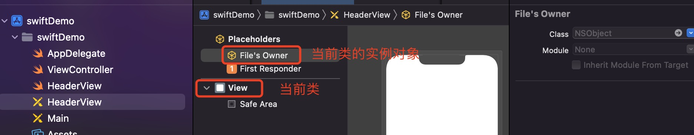

# Xib
本章主要记录可视化编程的一些问题，以及如何解决这些问题。附带可视化编程的一些技巧。比如在XIB添加自定义属性、设置按钮的选中状态、设置等比例控件等等

使用xib进行开发时，经常需要设置文字颜色、控制器背景色、主题颜色等，通过在`Assets`中添加自定义颜色可以让我们开发过程中快速选择，加快开发进度。

在xib中添加自定义颜色，选择`Background`最后的`Custom`自定义颜色，在第二个选项"颜色滑块"中选择`RGB Sliders`，在底部可以输入十六进制颜色，如下图:


```markdown
* iOS16 在XIB中使用 `DatePicker` 时,需要将 Preferred Style 设置为 Whells
* iOS15之后，系统对 UIButton 做了优化，添加`UIButton.Configuration`配置,如果还是想适配iOS15之前的系统需要把`style`设置成`Default`,不然按钮一直显示文字
```

## File's Owner
使用Xib自定义View的时候有两种方式，使用用`File's Owner`或者直接定义View。它们之间的区别在于:
* `File's Owner`: self 是自定义类型的一个实例, 要将 View 拉为约束添加在 self,  可以直接添加在 storyboard/xib 上使用, 在代码中使用时, 要使用对象方法, Bundle.main.loadNibNamed 方法中 owner 为 self。
* `View`: self 是自定义类型, 类型不能直接添加在 storyboard/xib 上, 代码中使用时要使用类型方法,  Bundle.main.loadNibNamed 方法中 owner 为 nil


#### File's Owner  加载方式
* 通过 init 方法加载
```swift
    @IBOutlet var contentView: UIView!//xib 中的 View 拉为约束 contentView
    
    //代码创建, 执行此方法, 不执行 init?(coder aDecoder: NSCoder)
    override init(frame: CGRect) {
        super.init(frame: frame)
        awakeFromNib()
    }
    
    //添加在 storyboard 上, 执行此方法
    required init?(coder aDecoder: NSCoder) {
        super.init(coder: aDecoder)
    }
    
    override func awakeFromNib() {
        super.awakeFromNib()
        setupContentView()
    }
    
    func setupContentView() {
    //owner 一定要为 self, 不能为 nil
        let contentView = Bundle.main.loadNibNamed("CustomView_Fileowner", owner: self, options: nil)?.first as! UIView
        contentView.frame = self.bounds
        contentView.autoresizingMask = [.flexibleWidth, .flexibleHeight]
        addSubview(contentView)
    }
```
* 通过协议的方式加载
```swift
    protocol NibLoadableProtocol { }
    extension NibLoadableProtocol where Self : UIView {
        //设置 File's Owner 的 CustomClass
        //实例方法
        func loadNibFileOwner(_ nibNmae: String? = nil) -> UIView {
            //获取实例的类型
            let object: AnyObject = object_getClass(self)!
            //"\(object)": AntennaParameters.XXXXXX
            //获取真正的类型名
            let className = type(of: object).description().components(separatedBy: ".").last
            
            let contentView = Bundle.main.loadNibNamed(nibNmae ?? className!, owner: self, options: nil)?.first as! UIView
            contentView.frame = self.bounds
            contentView.autoresizingMask = [.flexibleWidth, .flexibleHeight]
            addSubview(contentView)
            return contentView
        }
    }
 
    //让 CustomView_Fileowner 服从协议
    class: CustomView_Fileowner, NibLoadableProtocol
        @IBOutlet var contentView: UIView!
        
        //代码创建, 执行此方法, 不执行 init?(coder aDecoder: NSCoder)
        override init(frame: CGRect) {
            super.init(frame: frame)
            awakeFromNib()
        }
        
        //添加在 storyboard 上, 执行此方法
        required init?(coder aDecoder: NSCoder) {
            super.init(coder: aDecoder)
        }
    
        override func awakeFromNib() {
            super.awakeFromNib()
            //协议方法
            contentView = loadNibFileOwner()
        }
    }
```

#### View 加载方式
* 自定义协议,自定义类遵守协议
```swift
    protocol NibLoadableProtocol { }
    extension NibLoadableProtocol where Self : UIView {
        //类型方法
        static func loadNib(_ nibNmae: String? = nil) -> Self {
            return Bundle.main.loadNibNamed(nibNmae ?? "\(self)", owner: nil, options: nil)?.first as! Self
        }
    }
    
    extension CustomView: NibLoadableProtocol { } // 自定义类遵守协议
```
* 或者定义类方法直接加载
```swift
    //View 中, 类方法
    class func newInstance() -> CustomView {
        //owner 为 nil
        return Bundle.main.loadNibNamed("CustomView", owner: nil, options: nil)?.first as! CustomView
    }

    //使用类型方法创建
    let viewView = CustomView.newInstance()
    viewView.frame = CGRect(x: 50, y: 400, width: 200, height: 100)
    view.addSubview(viewView)
```

>Swift可使用第三方`pod 'Reusable', '~> 4.1.2'`,只要继承相关协议就可以直接调用。


## @IBInspectable 添加自定义属性
`@IBDesignable`和`@IBInspectable`是iOS8的新特性，可以实时渲染在`interface builder`上，直接对值进行修改视能实时发生变化。[参考文档](https://nshipster.cn/ibinspectable-ibdesignable/)

比如`layer.borderWidth、borderColor、cornerRadius`这些属性在xib上是不能直接设置的。`@IBInspectable`利用运行时机制,可以把这些属性映射到xib上，同时还可以映射自定义的属性。举例说明:
```swift
@@IBDesignable  //@IBDesignable关键字用来声明一个类是可以被设计的，可以实时渲染在interface builder 上
class SpaceButton: UIButton{
    //@IBInspectable关键字用来声明一个属性，可以在interface builder上修改该属性，就可以实时渲染border的变化
    @IBInspectable var space: CGFloat = 10.0

    override var intrinsicContentSize: CGSize{
        let size = super.intrinsicContentSize
        return CGSize(width: size.width + space, height: size.height)
    }
}
```

> 使用`@IBInspectable`添加属性时，需要给类型显式加上类型标识，不然XIB里面不显示。

## 获取View真实宽度
使用xib编程，在`viewDidLoad`或者`awakeFromNib`方法中给 View 设置圆角时，遇到只有左边是圆角，右边不显示圆角的情况。

原因是在设置圆角时，**View的宽度还是你在xib中使用模拟器的宽度，并不是它真实屏幕的宽度。**，解决方案是在`layoutSubViews`或者`viewDidLayoutSubviews`方法里设置圆角。或者是通过`@IBInspectable`在xib上添加View属性，进行直接赋值。

UITbaleView的 HeaderView 使用 xib 开发时，在`tableView.tableHeaderView = headerView`这句话之前我们需要对 headerView 的 frame 进行重新设置，不然`headView`的高度就是xib模拟器中的高度

UITableViewCell 在xib中获取到的宽度，一直是320。在一种分区圆角的界面中，需要在 代理方法`tableview: willDisplay: forRowAt:`方法中获取到cell内部控件的真实宽度。 可以使用约束，在`layoutSubViews`里面对内部控件的 frame 进行重新赋值。

## 修改约束值
* 修改比例约束值
```objc
// aspect 是比例约束  修改图片宽度比
NSLayoutConstraint.deactivate([aspect])
aspect = NSLayoutConstraint(item: logoView, attribute: .width, relatedBy: .equal, toItem: logoView, attribute: .height, multiplier: 1.5, constant: 0)
NSLayoutConstraint.activate([aspect])
```

* 修改固定宽高约束值
```objc
_heightConstraint.constant = 12;
```

## iOS 15 系统遇到过的适配问题
1. Must translate autoresizing mask into constraints to have _setHostsLayoutEngine:YES Xcode 13

仅在 iOS 15 上的 Xcode 13.0 也发生了同样的事情，需要将cell视图设置为Layout: `Autoresizing Mask `，如下图：


仅在 iOS 15 上的 Xcode 13.0 ，使用stacke时，需要注意它默认是有背景的。


## UIScrollView
在Xib中使用UIScrollView的时候，需要注意在iOS11之后，UIScrollView增加了`framelayoutGuide`和`contentLayoutGuide`。

```markdown
* `framelayoutGuide:` 框架布局指南，就是指框架本身，这里的框架就是UIScrollView
* `contentLayoutGuide:` 内容布局指南，滚动视图内容的布局指南，指的UIScrollView里面的布局
```
iOS11以上以下步骤进行添加：
```markdown
1. xib中添加scrollview，添加对父控件约束
2. ScrollView内部添加UIView，设置四周边距跟`contentLayoutGuide`相等，设置完成后，修改比例为1
3. 设置UIView的宽或者高跟`framelayoutGuide`相等，设置好之后会报错，先给View对应的宽或者高一个固定值，防止报错
4. 如果是宽相等，纵向滑动，如果是高相等，横向滑动。 
```

如果是 iOS11 以下在XIB中使用UIScrollView按照以下的步骤:

```markdown
1. xib中添加scrollview，添加对父控件约束
2. scrollview取消 Content Layout Guides 按钮，取消后，不再使用 framelayoutGuide 和 contentLayoutGuide
3. scrollview内部添加UIView，设置四周边距，如果上下滑动设置跟scrollview等宽，这个时候还会报错，不管它
4. 在UIview上 设置 我们想要添加的控件，注意要设置顶部跟底部跟UIview的约束
5. 注意CongtentView的宽度，设置跟ScrollView的宽度一致，
6. 删除ContentView约束上的固定宽高约束
```

在利用xib绘制UIScrollerView时，全屏时页面总是出现偏移一个状态栏高度。设置`Content Insets`为`Never`或者代码中设置:
```objc
if (@available(iOS 11.0, *)){
    [[UIScrollView appearance] setContentInsetAdjustmentBehavior:UIScrollViewContentInsetAdjustmentNever];
    [UITableView appearance].estimatedRowHeight = 0;
    [UITableView appearance].estimatedSectionHeaderHeight = 0;
    [UITableView appearance].estimatedSectionFooterHeight = 0;
}
```

>⚠️注意这里有个坑: 在iOS16的系统中，也就是iPhone14的设备。在拥有系统导航栏的时候，UIViewController的高度是整体屏幕的高度，在iOS16之前的设备上，UIViewController的高度是 `屏幕高度 - 导航栏高度 - 状态栏高度`。

* [Xcode11 在Xib中进行UIScrollView布局](https://juejin.cn/post/6844904042452238344)


## UITableView
#### 注册xib创建的UITableViewCell
* OC版本注册cell
```objc
[_tableView registerNib:[UINib nibWithNibName:@"PersonMessageCell" bundle:nil] forCellReuseIdentifier:@"PersonMessageCell"];
```
* Swift版本注册cell
```swift
tableView.register(UINib(nibName: "TableViewCell", bundle: Bundle.main), forCellReuseIdentifier: "TableViewCell")
``` 

#### tableHeaderView 自适应高度
需要完成一个需求: tableview的headView中有一个可换行的label, 需要headview写入数据时, tableview的headView的高度自适应. 不手动计算字符串的高度;

1. 在headview的操作:
    *  headview 的 xib,所有的控件约束要保证是正确的,从上到下的约束要确保有,并且是正确的.
    * 在headview的.m文件中,要设置高度变化label允许显示的最大宽度:`contentL.preferredMaxLayoutWidth = UIScreen.main.bounds.size.width - 100`,设置`numberofline = 0`,这个label就可以自动计算出自身的高度了
2. 在 controller 中对 headview 进行赋值,赋值之后需要重置 headView 的 frame:
    ```swift
    //使表视图的高度自适应
    func layoutHeadView(){
        //利用systemLayoutSizeFittingSize:计算出真实高度，当前方法计算的时间开销是十分大的
        let height = tableView.tableHeaderView?.systemLayoutSizeFitting(UIView.layoutFittingCompressedSize).height ?? 0.0
        guard var rect = tableView.tableHeaderView?.frame else {return}
        rect.size.height = height
        //修改tableHeaderView的frame
        self.tableView.tableHeaderView?.frame = rect
    }
    ```
这样 headView 作为 tableview 的头部视图就可以根据内容自适应高度了。**在每一次headView的数据更改之后, 都记得要调用layoutHeadView方法**


## UIButton 
UIButton的默认布局左边是图片，右边是文字。我们经常会遇到右边是图片，左边是文字的情况，可以通过给分类添加方法的方式解决，也可以在Xib右侧面板选中`Semantic`属性选择`Right-To-Left`的方式来解决，这样就文字在左边，图片在右边
```markdown
* Unspecified: 视图的默认值，当从左到右和从右到左的布局进行切换时，视图被翻转。
* Playback: 表示播放控制的视图，如播放，倒带或快进按钮或播放头清洗器。在从左到右和从右到左的布局之间切换时，这些视图不会翻转。
* Force Left-To_Right: 始终使用从左到右布局显示的视图。
* Force Right-To-Left: 始终使用从右到左的布局显示的视图。
```

**设置UIButton 文字 和 图片 的间隔技巧**，有时候我们需要一些选中按钮，图片和文字之间是有间隔的，我们又希望 Button 的宽度自适应。可以通过自定义按钮，重写`intrinsicContentSize`属性设置图标和文字的间距。
````markdown
1. 设置UIButton居中和侧边约束，不设置按钮宽度，使宽度自适应，可以设置高度扩大按钮的点击范围
2. 在Xib中设置按钮的`Image Insets`右侧的间距，比如我们设置距离文字的间距是`10`
3. 自定义`SpaceButton`,XIB中使用此按钮,设置`space`间距
    ```swift
    class SpaceButton: UIButton{
        // 图标和文字的间距
        @IBInspectable var space: CGFloat = 10.0

        override var intrinsicContentSize: CGSize{
            let size = super.intrinsicContentSize
            return CGSize(width: size.width + space, height: size.height)
        }
    }
    ```
````

> 在一种左右是半圆，中间是文字的Label标签中，也可以自定义UILabel的方式扩大UILabel的真实宽度

> iOS15之后，UIButton多了`UIButton.Configuration`配置，不需要再搞这样的技巧了，iOS15可以直接在xib上配置按钮图片和文字的间距、图片的位置、按钮的边框、前置颜色、圆角等等

## UILabel内容显示优先级
`intrinsicContentSize`:固有大小。意思就是如果没有指定大小，控件就按照这个大小来。 像`UILabel`、`UIImageView`、`UIButton`等这些组件都有 `Intrinsic Content Size` 属性。

> 当我们设置UILabel时，只要给它位置就可以，它自己会计算大小

当一行有两个UILable的时候，如果不给他们设置优先级，就会造成`Intrinsic冲突`。因为当两个label显示的内容超过一行时，它们不知道要优先显示谁。需要用到下面的属性:
* `Content Hugging Priority`:内容拥抱优先级,默认是251。**优先级越大，当前控件大小保持不变，另一个控件进行拉伸或压缩**
    ```swift
    open func contentHuggingPriority(for axis: NSLayoutConstraint.Axis) -> UILayoutPriority
    open func setContentHuggingPriority(_ priority: UILayoutPriority, for axis: NSLayoutConstraint.Axis)
    ```
* `Content Compression Resistance Priority`: 内容压缩阻力优先级。**优先级越大,视图中的内容越难被压缩**
    ```swift
    open func contentCompressionResistancePriority(for axis: NSLayoutConstraint.Axis) -> UILayoutPriority
    open func setContentCompressionResistancePriority(_ priority: UILayoutPriority, for axis: NSLayoutConstraint.Axis)
    ```

>如果只是两个UILabel冲突的时候，只要将不想被压缩内容的控件`Content Compression Resistance Priority`优先级调大即可

## 相关文档
* [Xib文件使用（二）——关联变量](https://blog.csdn.net/xunyn/article/details/8521194)
* [Xib的使用：设置File‘s Owner的Class和view的Class的区别](https://blog.csdn.net/az44yao/article/details/110836006?spm=1001.2101.3001.6661.1&utm_medium=distribute.pc_relevant_t0.none-task-blog-2%7Edefault%7EBlogCommendFromBaidu%7ERate-1.pc_relevant_default&depth_1-utm_source=distribute.pc_relevant_t0.none-task-blog-2%7Edefault%7EBlogCommendFromBaidu%7ERate-1.pc_relevant_default&utm_relevant_index=1)
* [Swift 4 Xib 关联 File's Owner 和 View 的区别](https://blog.csdn.net/LeeCSDN77/article/details/82501005)