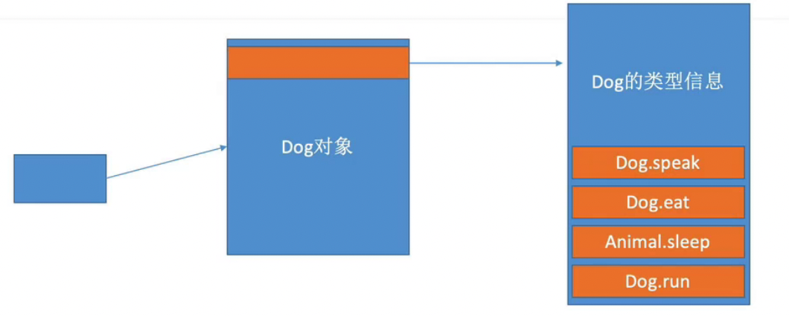

# 继承（Inheritance）
值类型（枚举、结构体）不支持继承，只有类支持继承。

没有父类的类，称为：基类。Swift并没有像OC、Java那样的规定：任何类最终都要继承自某个基类, 子类可以重写父类的下标、方法、属性，重写必须加上`override`关键字。

## 继承的内存结构
在这之前我们知道系统对类的最小分配内存是16个字节,内存对齐也是按照16个字节。继承相当于在子类中加上父类的成员变量和方法。
```swift
class Animal {  //内存分配 32字节
    var age = 0
}
class Dog : Animal { //内存分配 32字节
    var weight = 0
}
class ErHa : Dog { //内存分配 48字节
    var iq = 0
}
// Dog继承Animal，等价于
class Dog{
    var age = 0
    var weight = 0
} 
```

## 重写实例方法/类型方法/属性
子类可以重写父类的方法,重写必须加上`override`关键字。


>⚠️ `static`修饰的类型方法，不允许被子类重写,`class`修饰的类型方法，允许被子类重写。

在子类重写父类的属性时需要注意的是:
```markdown
1. 子类可以将父类的`属性（存储、计算）`重写为`计算属性`。并且只能重写var属性，不能重写let属性
2. 子类不可以将父类属性重写为存储属性
3. 重写时，属性名、类型要一致
4. 子类重写后的属性权限 不能 小于 父类属性的权限
    * 如果父类属性是只读的，那么子类重写后的属性可以是只读的、也可以是可读写的
    * 如果父类属性是可读写的，那么子类重写后的属性也必须是可读写的
```
举一个列子，SubCircle 继承自 Circle 并且重写了Circle属性,在调用过程中我们需要注意的是，如果是子类的实例对象调用属性，最终都会调用子类重写的计算属性。代码如下:
```swift
class Circle {
    var radius: Int = 0
    var diameter: Int {
        set {
            print("Circle setDiameter")
            radius = newValue / 2
        }
        get {
            print("Circle getDiameter")
            return radius * 2
        }
    }
}

// 子类
class SubCircle : Circle {
    override var radius: Int {
        set {
            print("SubCircle setRadius")
            super.radius = newValue > 0 ? newValue : 0
        }
        get {
            print("SubCircle getRadius")
            return super.radius
        }
    }
    override var diameter: Int {
        set {
            print("SubCircle setDiameter")
            super.diameter = newValue > 0 ? newValue : 0
        }
        get {
            print("SubCircle getDiameter")
            return super.diameter
        }
    }
}
// 调用过程
circle = SubCircle()
// SubCircle setRadius
circle.radius = 6
// SubCircle getDiameter
// Circle getDiameter
// SubCircle getRadius
// 12
print(circle.diameter)
// SubCircle setDiameter
// Circle setDiameter
// SubCircle setRadius
circle.diameter = 20
// SubCircle getRadius
// 10
print(circle.radius)
```

>⚠️ 被`class`修饰的计算类型属性，可以被子类重写。被`static`修饰的类型属性（存储、计算），不可以被子类重写。

另外需要注意的是：被`final`修饰的方法、下标、属性，禁止被重写,被`final`修饰的类，禁止被继承。

## 多态原理
多态的原理其实是获取到对象的前8个字节，前8个字节指向类型信息，根据偏移量找到对应的方法地址进行调用。
```swift
class Animal {
    func speak() {
        print("Animal speak")
    }
    func eat() {
        print("Animal eat")
    }
    func sleep() {
        print("Animal sleep")
    }
}

class Dog : Animal {
    override func speak() {
        print("Dog speak")
    }
    override func eat() {
        print("Dog eat")
    }
    func run() {
        print("Dog run")
    }
}

var anim: Animal
anim = Animal()
anim.speak()

anim = Dog()
anim.speak()
```

