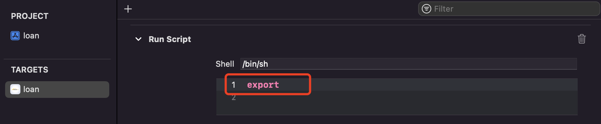

# Xcode
Xcode是iOS开发必备的开发工具，在项目中，经常会遇到各种配置和路径问题，这里主要说一下Xcode的一些常见配置

## Xcode内置变量
在编写Xcode脚本的时候，我们通常需要一些内置变量，比如说编译路径，当前项目名称等等。 我们可以通过 `export` 指令打印出Xcode内置变量。首先需要新增 Run Script

通过`commond + B`编译一下，项目编译完成之后会自动运行脚本，在刚才的编译任务 log 中可以看到内置的环境变量


* 常用到的内置变量

内置变量  |  含义  |  示例
------- | ------- | -----
`${SRCROOT}`  | 根目录 | `/Users/mlive/Desktop/wecash`
`${PROJECT_DIR}`  |  项目目录 | `/Users/mlive/Desktop/wecash`
`${PROJECT_NAME}`  |  项目名字 | `loan`
`${PROJECT_FILE_PATH}` | 项目文件路径,相当于`$(PROJECT_DIR)/$(PROJECT_NAME).xcodeproj` | `/Users/mlive/Desktop/wecash/loan.xcodeproj`
`${EXECUTABLE_NAME}`  |  可执行文件名称 | `loan`
`${PRODUCT_NAME}`  |  产品名称 | `loan`
`$(PRODUCT_BUNDLE_IDENTIFIER)`  |  Bundle ID | `com.xxx.xxx`
`$(inherited)`  |  允许继承来自更高一级的配置 | 
`$(PUBLIC_HEADERS_FOLDER_PATH)`  |  共有头文件路径 | `loan.app/Headers`
`$(SCRIPTS_FOLDER_PATH)`  |  脚本路径 | `loan.app/Scripts`
`$(FRAMEWORKS_FOLDER_PATH)`  |  frameworks文件夹路径 | `loan.app/Frameworks`
`$(PLUGINS_FOLDER_PATH)`  |  插件文件夹路径 | `loan.app/PlugIns`
`$(ARCHS)`  |  当前项目架构 | `arm64`
`$(USER_LIBRARY_DIR)`  |  用户库路径  | 默认为：`~/Library`
`$(COMPRESS_PNG_FILES)`  |   是否压缩PNG文件  | 默认为YES
`${INFOPLIST_KEY_CFBundleDisplayName}` | App的名称，需要在info.plist中加入`CFBundleDisplayName` | 对应`Xcode -> TARGETS -> General -> Identity -> Display Name`，必须填写才有值
`${TARGET_DEVICE_PLATFORM_NAME}` | 目标设备名称,如果选择构建,这个值为空 | 真机是`iphoneos`,模拟器是`iphonesimulator`
`${MARKETING_VERSION}` | APP发布版本 | 1.0.0


* Xcode证书相关变量 `build setting` 中的配置 

内置变量  |  含义  |  示例
------- | ------- | -----
`CODE_SIGN_ENTITLEMENTS`  | `entitlements`文件 | `xxxLive/xx.entitlements`
`CODE_SIGN_IDENTITY`  | 身份 | `iPhone Developer`
`CODE_SIGN_IDENTITY[sdk=iphoneos*]`  |  描述文件`dev`还是`Release` | `iPhone Distribution`
`CODE_SIGN_STYLE`  | 签名方式 | `Manual` 或者 `Automatic`

* 编译相关的路径

内置变量  |  含义  |  示例
------- | ------- | -----
`${BUILD_DIR}`  | build文件的路径 | `/Users/mlive/Library/Developer/Xcode/DerivedData/loan-dmnqkzmjvvadlyamxlyhxztvlhsp/Build/Products`
`${BUILT_PRODUCTS_DIR}` | 构建产品路径 | `/Users/mlive/Library/Developer/Xcode/DerivedData/loan-dmnqkzmjvvadlyamxlyhxztvlhsp/Build/Products/Debug-iphonesimulator`
`${TARGET_BUILD_DIR}` | 目标构建目录 | `/Users/mlive/Library/Developer/Xcode/DerivedData/loan-dmnqkzmjvvadlyamxlyhxztvlhsp/Build/Products/Debug-iphonesimulator`
`$(CONFIGURATION)`  |  配置模式 | `Debug` 或者 `Release`
`$(CODESIGNING_FOLDER_PATH)`  |  编译`*.app`完整路径 | `/Users/mlive/Library/Developer/Xcode/DerivedData/loan-dmnqkzmjvvadlyamxlyhxztvlhsp/Build/Products/Debug-iphonesimulator/loan.app`
`${EFFECTIVE_PLATFORM_NAME}`  |  平台名称 | `-iphonesimulator`

* Pod相关变量,使用CocoaPods管理第三方，会增加下面几个变量

Pod变量  |  含义  |  示例
------- | ------- | -----
`${PODS_ROOT}`  | Pod文件的路径 | `${SRCROOT}/Pods`
`${PODS_PODFILE_DIR_PATH}`  | `Podfile`文件路径 | `${SRCROOT}/.`
`${PODS_BUILD_DIR}`  | Pod编译文件路径 | `${BUILD_DIR}`
`${PODS_CONFIGURATION_BUILD_DIR}`  | 项目构建路径 | `${PODS_BUILD_DIR}/$(CONFIGURATION)$(EFFECTIVE_PLATFORM_NAME)`

##  Build Setting
设置 | 含义
------- | -------
`Framework Search Paths` | 附加到项目中的framework 的搜索路径。
`Library Search Paths` | 附加到项目中的第三方Library的搜索路径。
`Header Search Path` | 头文件的搜索路径。
`User Header Search Paths` | 只有在Always Search User Paths为Yes时才会被搜索。

* Xcode多个架构设置


```markdown
* `$(ARCHS_STANDARD)`: Xcode内置的环境变量，默认是`armv7` 和`arm64`
* `Excluded Architetures`:  如果项目不需要哪种架构就写上去
```

## 查看汇编代码
* 进入断点查看汇编的方式 `Debug -> Debug Workflow -> Always show Disassembly`，进入断点时会显示汇编代码
* 通过将.m文件转成汇编文件的方式 `Product -> Perform Action -> Assemble 文件名.m`,会将对应的文件转成汇编文件。如果想看具体的行号，搜索`m:行号`

## Instruments — Time Profiler使用 排查耗时代码
有时候程序在某个时间运行很慢，通过Time Profiler工具可以对耗时代码进行排查，比如我在做PK时，需要使用YY_Image加载webp动画，webp动画解码的时候特别耗时，通过`Time Profiler`工具可以直接定位到代码。
打开方式：`Instruments` -> `Time Profiler`


* `Separate by State :` 线程分离，状态分开显示 ，例如：Running状态，
* `Separate by Thread :` 线程分离, 每个线程分开显示，只有这样 才能在调用路径中能够清晰看到占用CPU耗时最大的线程.(默认勾选)
* `Invert Call Tree :` 堆栈信息显示顺序,默认是`FunA { FunB { FunC } }`,勾选后堆栈顺序是`C->B->A`
* `Hide System Libraries :` 隐藏系统调用,只关注自己代码的耗时(建议勾选，方便查看)
* `Flatten Recursion : `递归函数, 每个堆栈跟踪一个条目
* `Top Functions :` 显示某个函数的总时间，A函数内调用多个函数时，可以显示A函数的总耗时

## 设置环境变量
`Product` -> `Scheme` -> `Edit Scheme` -> `Run` -> `Environment Variables`

## 关闭ARC
选中`Build Settings`,选择 `ALL` 和 `Combined` ，搜索 `Automatic Reference Counting`，将值从YES 更改为 NO;

Xcode 提供了一个迁移工具，可以自动将MRC代码转换为ARC代码，选择 `Edit > Convert > To Objective-C ARC`

使用ARC作为默认方式的项目,可以使用`-fno-objc-arc`编译器标志为指定文件禁用ARC
使用MRC作为默认方式的项目,可以使用`-fobjc-arc`编译器标志为指定文件启用ARC

## 开启僵尸对象
`Product` -> `Scheme` -> `Edit Scheme` -> `Run` -> `Diagnostics` -> `Zombie Objects`

## 开启LinkMap
生成LinkMap条件，`Build Settings` 
 `Path to Link Map File`  LinkMap 文件保存地址
 `Write Link Map File`  开启LinkMap
可借助第三方工具解析LinkMap文件： https://github.com/huanxsd/LinkMap

## Xcode附加进程
除了用Reveal查看界面外，还可以使用Xcode附加进程的方式查看手机中的应用界面。
1. 首先需要手机打开对应的应用
2. 打开Xcode选中手机，选择`Debug -> Attach to Process -> 选择调试的应用`
3. 或者选择`Debug -> Attch to Process by PID or Name -> 输入应用的名字或者端口`,端口可以在Mac中的控制台进行查看


## M1芯片 Xcode 关闭 Rosetta
打开访达->应用->Xcode->右键点击Xcode->显示简介->勾选使用Rosetta 打开，关闭Xcode，重新打开。 现在可以正常打包了

## LLDB查看寄存器和汇编地址

含义 | 指令 
------- | ------- 
读取寄存器的值 |  `register read 寄存器名称`,例如`register read rax`
修改寄存器的值 |  `register write 寄存器名称 数值`,例如`register write rax 10`
读取内存中的值 |  `x/数量-格式-字节大小 内存地址`,例如 `x/3xw 0x0000010`
读取内存中的值 |  `memory read 数量格式字节数 内存地址`,例如 `memory read/3xg 0x100552c00`
修改内存中的值 |  `memory write 内存地址 数值`,例如`memory write 0x0000010 10`

在读取内存中的值对应的3xw含义：
```markdown
3: 代表打印的数量
x: 代表显示的格式 x->以16进制显示,   f->浮点数,  d->十进制
w: 代表字节数   b->byte 1个字节,  h ->half word 2字节,  w ->word 4字节, g ->giant word 8字节
```

## 编译器优化
Xcode中设置debug模式和release模式编译出来的汇编是不一样的，这是因为Release模式开启了编译器优化，选择`Target -> Build Settings`,搜索 `Optimization Level`。

## Xcode输出内容到命令行
Xcode想输出内容到命令行，可以创建`run Script`,在命令行中输入`tty`会显示软连接地址，比如`/dev/ttys003`，在`run Script`中 输入`echo "123" > /dev/ttys003`这样项目编译完成后就会显示在命令行了

比如在编译完成后输出 mach-o 文件的信息到 命令行
```swift
nm -pa "${CONFIGURATION_BUILD_DIR}/${PROJECT_NAME}" > /dev/ttys003
```
* `${CONFIGURATION_BUILD_DIR}` 项目编译的文件夹路径，一直到`build`文件的目录
* `${PROJECT_NAME}`项目的名字，生成的 mach-o 文件名字一般都是项目名字

做的项目正好可以用到，编译完成后直接复制 mach-o 文件到桌面的`Payload`文件，然后压缩成zip，修改名字为ipa即可
```shell
rm -rf ~/Desktop/Payload/*/ #删除Payload文件夹内的文件
rm -rf ~/Desktop/${INFOPLIST_KEY_CFBundleDisplayName}.ipa  #删除同名ipa
if [ -z ${TARGET_DEVICE_PLATFORM_NAME}];then  #如果没有证明在构建
    cp -R ${CODESIGNING_FOLDER_PATH} ~/Desktop/Payload #拷贝到桌面文件
    cd ~/Desktop
    zip -r "${INFOPLIST_KEY_CFBundleDisplayName}"_"${MARKETING_VERSION}".ipa  Payload #压缩成zip
fi
```

## 推荐文档
* [配置文件官方文档](https://developer.apple.com/documentation/xcode/adding-a-build-configuration-file-to-your-project?changes=_8)


## Xcode多项目配置 - Build Configuration
如果做多环境配置，除了多个 Target 之外还可以使用多个Scheme的方式，配置多个`Configuration Settings File` 文件。

Xcode编译默认有 Release 和 Debug 两种模式，可以自己添加一种编译模式，通过在Xcode中添加自定义配置达到多环境配置。比如配置不同的URL：
1. 添加 Beta  Configuration


2. 在 Xcode 中添加自定义配置


3. 在 info.plist 文件中使用变量


4. 通过切换编译模式可以获取不同的值


当我们使用 Cocoapods 导入第三方的时候，Cocoapods 会给我们创建2个配置文件。


对应的就是Xcode中的自定义宏。


也就是说`Xcode -> Target -> Build Settings`里的信息，我们可以直接通过文件进行配置。这样的话我们就可以通过自定义 Configuration 文件来达到我们刚才的目的
1. 首先创建两个 `Configuration Settings File` 文件，一个 Debug 模式，一个 Release 模式。文件内写入:
```
HTTP_URL = "www.debug.com"
```
2. 在对应的模式下使用对应的 Configuration 文件


3. 在 `info.plist` 文件中使用变量,通过切换编译模式可以获取不同的值

#### Configuration 文件

Configuration 文件中还可以配置其他的Xcode选项，比如常用的`Other Linker Flags`可以通过文件进行配置：
```xml
// key-value
OTHER_LDFLAGS = -framework "AFNetworking"
```

`OTHER_LDFLAGS` 是`Other Linker Flags`的缩写，通过[xcodebuildsettings](https://xcodebuildsettings.com/)这个网站可以找到Xcode配置中的缩写，比如`System Header Search Paths`：


> 注意有部分变量不能通过`xcconfig`配置到`Build Settings`中，例如`PRODUCT_BUNDLE_IDENTIFIER`,配置之后不起作用

#### 导入其他的 `Configuration`文件
如果有多个`Configuration`文件,在Xcode中配置时只能配置一个，可以选择在一个`Configuration`文件中导入其他的`Configuration`文件。比如
```
#include "pod/Target Support Files/Pods-SDemo/Pods-SDemo.debug.xcconfig"
```
如果两个文件中有同样的 key 比如`OTHER_LDFLAGS` ,后面导入的文件会重置之前文件的变量。如果防止这种现象，使用`$(inherited)`。它会将你导入的其他文件的 value 传递过来，类似继承
```xcconfig
#include "pod/Target Support Files/Pods-SDemo/Pods-SDemo.debug.xcconfig"

OTHER_LDFLAGS = $(inherited) -framework "AVFoundation"
```

`Configuration`文件还可以指定的模式，比如
```xml
OTHER_LDFLAGS[config=Debug][sdk=iphonesimulator*][arch=x86_64] = $(inherited) -framework "AVFoundation"
```
在Xcode11.4之后，可以使用`default`指定变量为空时的默认值
```xml
$(BUILD_SETTING_NAME:default=value)
```

## Xcode14打包出现问题
xx-frameworks.sh 所在位置为：`项目所在路径/Pods/Target Support Files/Pos-xxAPP/Pods-xxAPP-frameworks.sh`
```
找到...-frameworks.sh 文件，替换
    source="$(readlink "${source}")"
    为
    source="$(readlink -f "${source}")"
```