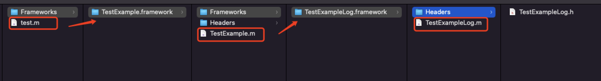
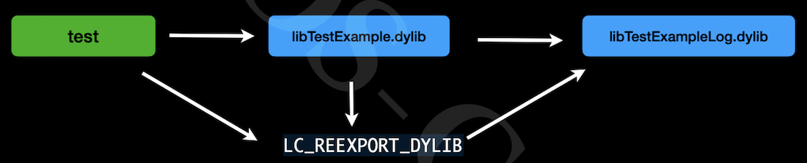

# 动态库
与静态库相反，动态库在编译时并不会被拷⻉到⽬标程序中，⽬标程序中只会存储指向动态库的引⽤。等到程序运⾏时，动态库才会被真正加载进来。格式有：.framework、.dylib、.tdb。

缺点： 会导致⼀些性能损失。但是可以优化，⽐如延迟绑定(Lazy Binding)技术

静态库是 .o 文件的合集，动态库是 .o 文件链接过后的产物。动态库不能合并。跟静态库一样，先使用一个例子展示一下怎么链接动态库。

一个 test.m 文件,文件中用到了静态库`AFNetworking`,我们使用clang编译器将下面的代码编译成可执行文件。
```objc
#import <Foundation/Foundation.h>
#import <AFNetworking.h>
int main(){
    AFHTTPSessionManager *manager = [AFHTTPSessionManager manager];
    NSLog(@"testApp----%@", manager);
    return 0;
}
```

1. 将test.m文件编译成 .o 文件
```
    clang -target x86_64-apple-macos11.1 \
    -fobjc-arc \
    -isysroot /Applications/Xcode.app/Contents/Developer/Platforms/MacOSX.platform/Developer/SDKs/MacOSX12.sdk \
    -I./AFNetworking \
    -c test.m -o test.o
```
2. 将.o文件编译成可执行文件
```
    clang -target x86_64-apple-macos11.1 \
    -fobjc-arc \
    -isysroot /Applications/Xcode.app/Contents/Developer/Platforms/MacOSX.platform/Developer/SDKs/MacOSX12.sdk \
    -L./AFNetworking \
    -lAFNetworking \
    test.o -o test
```
3. 使用`lldb`运行可执行文件,会报找不到动态库的错误，如下图:
   
    我们通过编译动态库看是什么导致了这个问题。

## 手动编译动态库
还是使用编译静态库的例子,不同的是我们这次需要将 TestExample.m 文件编译成动态库。
1. 将 test.m 编译成 .o 文件
```
    clang -target x86_64-apple-macos11.1 \
    -fobjc-arc \
    -isysroot /Applications/Xcode.app/Contents/Developer/Platforms/MacOSX.platform/Developer/SDKs/MacOSX12.sdk \
    -I./dylib \
    -c test.m -o test.o
```
2. 将 TestExample.m 编译成 .o 文件
```
    clang -target x86_64-apple-macos11.1 \
    -fobjc-arc \
    -isysroot /Applications/Xcode.app/Contents/Developer/Platforms/MacOSX.platform/Developer/SDKs/MacOSX12.sdk \
    -c TestExample.m -o TestExample.o
```
3. 编译静态库
```
    libtool -static -arch_only x86_64 TestExample.o -o libTestExample.a
```

4. 使用 `ld` 编译动态库
```
    ld -dylib -arch x86_64 \
    -macosx_version_min 11.1 \
    -syslibroot /Applications/Xcode.app/Contents/Developer/Platforms/MacOSX.platform/Developer/SDKs/MacOSX12.sdk \
    -lsystem -framework Foundation \
    -all_load \
    libTestExample.a -o libTestExample
```
>`-all_load`这里是必须要加的，因为默认是`-no_all_load`,会导致类被剥离，找不到类文件。**这里在编译动态库时没有编译动态库的路径,使用`-install_name`参数可以在编译动态库时写入路径**

5. 生成可执行文件
```
    clang -target x86_64-apple-macos11.1 \
    -fobjc-arc \
    -isysroot /Applications/Xcode.app/Contents/Developer/Platforms/MacOSX.platform/Developer/SDKs/MacOSX12.sdk \
    -L./dylib \
    -lTestExample \
    test.o -o test
```
6. 使用`lldb`运行可执行文件,会报找不到动态库的错误，如下图:
    
    当 `dyld` 加载一个可执行文件，下图中的 Mach-O 相当于test可执行文件。在可执行文件中的`LC_LOAD_DYLIB`中,保存着动态库的路径`@rpath/AFNetworking.framework/Versions/A/AFNetworking'`。

    **我们知道动态库是运行时加载的，就是dyld通过动态库的路径找到动态库进行加载的。**当dyld通过路径找不到动态库时就会报错。
    

7. 使用`otool -l test | grep 'DYLIB' -A 3`查看可执行文件中的动态库路径时发现路径不对。
   
   
   可执行文件是怎么知道动态库的路径呢?动态库在编译的时候，在动态库本身中的一个`LC_ID_DYLIB`是来保存路径。
   
   使用`otool -l libTestExample.dylib | grep "ID" -A 5`查看动态库的路径
    

8. 使用`install_name_tool id 动态库路径  动态库`修改动态库的路径,修改完成后再使用`otool -l libTestExample.dylib | grep "ID" -A 5`查看动态库的路径已经改变。
9. 重新编译 test 可执行文件，通过 lldb 进行加载测试，完全OK。

## 链接器 ld  @rpath  @executable_path
如果在编译动态库的时候，直接在编译时将路径写入到动态库就不需要后面那几个步骤。`-install_name`本来就是链接器的参数。

在之前我们修改动态库路径时使用的是绝对路径，但是在编译动态库时的路径，肯定要使用相对路径，如何解决这个问题，就需要用到`@rpath`

>谁使用动态库，`@rpath`保存的就是谁cmd `LC_RPATH`的值。`@rpath`可以保存⼀个或多个路径的变量

#### 使用 @rpath
1. 我们继续使用上面的例子，将`libTestExample.dylib`动态库的路径修改为相对路径,`libTestExample.dylib` 文件在可执行文件目录下的子目录`dylib`文件夹下。
```shell
    install_name_tool -id @rpath/dylib/libTestExample.dylib  libTestExample.dylib
```
2. `@rpath`的值是从哪里来的呢？**可执行文件中有一个cmd`LC_RPATH`保存着`@rpath`的值。** 当我们使用`otool -l test | grep "RPATH" -A 5`查看 test 可执行文件时，并没有发现 @rpath 的值。

3. 没有查询到说明现在 test 现在还没有`@rpath`的值，使用`install_name_tool -add_rpath  可执行文件当前路径  可执行文件`进行添加
```
    install_name_tool -add_rpath /Users/xxx/Desktop/aaaa  test
```
4. 再次查看 test , `@rpath`已经有值了，通过 lldb 进行加载可执行文件依然可以完美运行。但是可执行文件使用的就是绝对路径，依然没有达到我们的要求，我们需要另一个参数`@executable_path`

#### 使用 @executable_path
`@executable_path`：表示可执⾏程序所在的⽬录，解析为可执⾏⽂件的绝对路径。

我们通过下面的指令将可执行文件的`@rpath`修改为 `@executable_path`。
```
    install_name_tool -rpath /Users/xxx/Desktop/aaaa @executable_path  test
```
使用 lldb 测试依然可以运行。这样就解决了绝对路径的问题。

## 动态库嵌套  @loader_path
当可执行文件引用了动态库A，动态库A又引用了动态库B，这种情况我们改怎么做呢？

举一个例子，test.m -> TestExample.m -> TestExampleLog.m，如下图：

代码如下：
```objc
// test.m
#import <Foundation/Foundation.h>
#import "TestExample.h"
#import "TestExampleLog.h"
int main(){
    NSLog(@"testApp----");
    TestExample *manager = [TestExample new];
    [manager lg_test: nil];
    TestExampleLog *log = [TestExampleLog new];
    NSLog(@"testApp----%@",log);
    return 0;
}
// TestExample.m
#import "TestExample.h"
#import "TestExampleLog.h"
@implementation TestExample
- (void)lg_test:(_Nullable id)e {
    NSLog(@"TestExample----");
    TestExampleLog *log = [TestExampleLog new];
    [log test_example_log: self];
}
@end
// TestExampleLog.m
@implementation TestExampleLog
- (void)test_example_log:(_Nullable id)e {
    NSLog(@"TestExampleLog---%@", e);
}
@end
```
1. 首先需要将 `TestExampleLog.m` 编译成动态库
```shell
    # 先编译成.o
    clang -target x86_64-apple-macos11.1 \
    -fobjc-arc \
    -isysroot /Applications/Xcode.app/Contents/Developer/Platforms/MacOSX.platform/Developer/SDKs/MacOSX12.sdk \
    -I./Headers \
    -c TestExampleLog.m -o TestExampleLog.o
    
    # 再编译成动态库
    clang -dynamiclib  \
    -target x86_64-apple-macos11.1 \
    -fobjc-arc \
    -isysroot /Applications/Xcode.app/Contents/Developer/Platforms/MacOSX.platform/Developer/SDKs/MacOSX12.sdk \
    -Xlinker -install_name -Xlinker @rpath/TestExampleLog.framework/TestExampleLog \
    TestExampleLog.o -o TestExampleLog
```
2. 将 `TestExample.m` 编译成动态库
```shell
    # 先编译成.o
    clang -target x86_64-apple-macos11.1 \
    -fobjc-arc \
    -isysroot /Applications/Xcode.app/Contents/Developer/Platforms/MacOSX.platform/Developer/SDKs/MacOSX12.sdk \
    -I./Headers \
    -I./Frameworks/TestExampleLog.framework/Headers \
    -c TestExample.m -o TestExample.o
    
    # 再编译成动态库
    clang -dynamiclib  \
    -target x86_64-apple-macos11.1 \
    -fobjc-arc \
    -isysroot /Applications/Xcode.app/Contents/Developer/Platforms/MacOSX.platform/Developer/SDKs/MacOSX12.sdk \
    -Xlinker -install_name -Xlinker @rpath/TestExample.framework/TestExample \
    -Xlinker -rpath -Xlinker @loader_path/Frameworks \
    -Xlinker -reexport_framework -Xlinker TestExampleLog \
    -F./Frameworks \
    -framework TestExampleLog \
    TestExample.o -o TestExample
```
   * `@loader_path` 表示当前动态库所在的路径。
   * `-reexport_framework` 重新导出 TestExampleLog

   在将 `TestExample.m` 编译成动态库时，由于它内部也链接 TestExampleLog 动态库,在给 TestExampleLog 动态库设置路径时,可以使用 `@loader_path` 避免绝对路径。它表示当前动态库所在的路径。

   可执行文件中如果要使用 TestExampleLog 动态库内的方法, 通过 `-reexport_framework` 参数重新导出 TestExampleLog，会在com的`LC_REEXPORT_DYLIB` 显示导出的路径。使用`otool -l TestExample | grep "DYLIB" -A 3` 可以看到相关的路径信息

   

   它们之间的关系如下图：
   

3. 将 `test.m` 编译成可执行文件
```shell
    # 先编译成.o
    clang -target x86_64-apple-macos11.1 \
    -fobjc-arc \
    -isysroot /Applications/Xcode.app/Contents/Developer/Platforms/MacOSX.platform/Developer/SDKs/MacOSX12.sdk \
    -I./Frameworks/TestExample.framework/Headers \
    -I./Frameworks/TestExample.framework/Frameworks/TestExampleLog.framework/Headers \
    -c test.m -o test.o
    
    # 再编译成可执行文件
    clang   \
    -target x86_64-apple-macos11.1 \
    -fobjc-arc \
    -isysroot /Applications/Xcode.app/Contents/Developer/Platforms/MacOSX.platform/Developer/SDKs/MacOSX12.sdk \
    -Xlinker -rpath -Xlinker @executable_path/Frameworks \
    -F./Frameworks \
    -framework TestExample \
    test.o -o test
```
4. 通过 lldb 进行验证，可以完美运行。

我们创建一个动态库项目，在`Build Settings`中搜索 rpath，可以看到关于动态库相关的配置，跟我们刚才写的这些一模一样。


## tdb格式
tbd 全称是`text-based stub libraries`，本质上就是⼀个`YAML`描述的⽂本⽂
件。

他的作⽤是⽤于记录动态库的⼀些信息，包括导出的符号、动态库的架构信息、动
态库的依赖信息。

**⽤于避免在真机开发过程中直接使⽤传统的dylib**。

对于真机来说，由于动态库都是在设备上，在Xcode上使⽤基于tbd格式的伪framework可以⼤⼤减少Xcode的⼤⼩

## Framework
Mac OS/iOS 平台还可以使⽤ Framework。Framework 实际上是⼀种打包⽅式，将库的⼆进制⽂件，头⽂件和有关的资源⽂件打包到⼀起，⽅便管理和分发。

Framework 和系统的 `UIKit.Framework` 还是有很⼤区别。系统的 Framework 不需要拷⻉到⽬标程序中，我们⾃⼰做出来的 Framework 哪怕是动态的，最后也还是要拷⻉到 App 中 **（App 和 Extension 的 Bundle 是共享的）**，因此苹果⼜把这种 Framework 称为 `Embedded Framework`。

`Embedded Framework`:开发中使⽤的动态库会被放⼊到ipa下的framework⽬录下，基于沙盒运⾏。

不同的App使⽤相同的动态库，并不会只在系统中存在⼀份。⽽是会在多个App中各⾃打包、签名、加载⼀份。

## XCFramework
XCFramework：是苹果官⽅推荐的、⽀持的，可以更⽅便的表示⼀个多个平台和架构的分发⼆进制库的格式。需要Xcode11以上⽀持。是为更好的⽀持Mac Catalyst和ARM芯⽚的macOS。专⻔在2019年提出的framework的另⼀种先进格式。和传统的 framework 相⽐：
1. 可以⽤单个`.xcframework`⽂件提供多个平台的分发⼆进制⽂件；
2. 与`Fat Header`相⽐，可以按照平台划分，可以包含相同架构的不同平台的⽂件；
3. 在使⽤时，不需要再通过脚本去剥离不需要的架构体系。

苹果设备相关架构
```markdown
iOS/iPad：arm64
iOS/iPad Simulator：x86_64 arm64
Mac Catalyst: x86_64 arm64
Mac: x86_64 arm64
```

#### 为什么要使用 XCFramework 格式
为什么苹果会搞 XCFramework 格式呢？使用以前的方式合并不同平台的架构有什么弊端呢? 我们先通过 lipo 尝试合并不同平台的两个动态库试下。我们需要iOS真机和模拟器的动态库。

1. 首先创建一个动态库项目 Demoxxx ，使用`xcodebuild`指令导出模拟器和真机的动态库
   * 打包模拟器
    ```
        xcodebuild archive -project 'Demoxxx.xcodeproj' \
        -scheme 'Demoxxx' \
        -configuration Release \
        -destination 'generic/platform=iOS Simulator' \
        -archivePath '../archives/Demoxxx-iphonesimulator.xcarchive' \
        SKIP_INSTALL=NO
    ```
   * 打包真机
   ```
       xcodebuild archive -project 'Demoxxx.xcodeproj' \
       -scheme 'Demoxxx' \
       -configuration Release \
       -destination 'generic/platform=iOS' \
       -archivePath '../archives/Demoxxx-iphoneos.xcarchive' \
       SKIP_INSTALL=NO
   ```
   * xcodebuild 指令参数含义
   ```markdown
       `-project` : 指定project
       `-scheme`  :指定scheme
       `-configuration`  :Release 还是Debug
       `-destination`  :指定平台
       `-archivePath`  :输出路径
       `SKIP_INSTALL=NO` :指定为NO时会把编译出来的静态库拷贝到输出的目录
   ```
2. 作为一个SDK供应商，需要给用户提供真机和模拟器两种平台的动态库,使用 `lipo` 将不同平台的动态库进行合并
```
    lipo -output DemoxxxAll -create \
    ../archives/Demoxxx-iphoneos.xcarchive/Products/Library/Frameworks/Demoxxx.framework/Demoxxx  ../archives/Demoxxx-iphonesimulator.xcarchive/Products/Library/Frameworks/Demoxxx.framework/Demoxxx
```
    提示有相同的arm6架构不能在同一个二进制文件`have the same architectures (arm64) and can't be in the same fat output file`，一个胖二进制文件不能同时有多个相同的架构。如果我们还要将模拟器和真机平台的动态库合并在一起，就需要先提取模拟器的x86架构，再进行合并

3. 使用 lipo 提取模拟器的 x86 架构
```
    lipo -output Demoxxx-x86_64 -extract x86_64 ../archives/Demoxxx-iphonesimulator.xcarchive/Products/Library/Frameworks/Demoxxx.framework/Demoxxx
```

4. 将真机和模拟器的动态库合并成一个动态库
```
    lipo -output DemoxxxAll -create ../archives/Demoxxx-iphoneos.xcarchive/Products/Library/Frameworks/Demoxxx.framework/Demoxxx  Demoxxx-x86_64
```

将模拟器和真机两个平台的动态库合并之后，还要后续的头文件、签名等等。太麻烦了，如果使用 xcframework 格式，我们就不需要删除或者提取不同平台相同的架构了，可以直接把所有的平台导入到一个 xcframework 文件中，文件内包含多个平台的动态库，系统在哪个平台下就使用哪个平台的动态库就可以了。打包的时候也是一样。

使用`xcodebuild -create-xcframework`指令制作 xcframework 文件
```
xcodebuild -create-xcframework \
-framework '../archives/Demoxxx-iphoneos.xcarchive/Products/Library/Frameworks/Demoxxx.framework' \
-framework '../archives/Demoxxx-iphonesimulator.xcarchive/Products/Library/Frameworks/Demoxxx.framework' \
-output 'Demoxxx.xcframework'
```

作为SDK供应商，如果别人在使用时出现了崩溃，我们肯定是希望可以定位到代码的，所以需要提供`dSYM`文件，可以查看崩溃时的调用栈。**如果SDK项目有开启bitcode， BCSymbolMaps文件也需要提供。**

```
xcodebuild -create-xcframework \
-framework '../archives/Demoxxx-iphoneos.xcarchive/Products/Library/Frameworks/Demoxxx.framework' \
-debug-symbols '/Users/mlive/Desktop/aaaa/archives/Demoxxx-iphoneos.xcarchive/BCSymbolMaps/4EFF94E3-8844-38C2-957E-3AD99B43105A.bcsymbolmap' \
-debug-symbols '/Users/mlive/Desktop/aaaa/archives/Demoxxx-iphoneos.xcarchive/dSYMs/Demoxxx.framework.dSYM' \
-framework '../archives/Demoxxx-iphonesimulator.xcarchive/Products/Library/Frameworks/Demoxxx.framework' \
-debug-symbols '/Users/mlive/Desktop/aaaa/archives/Demoxxx-iphonesimulator.xcarchive/dSYMs/Demoxxx.framework.dSYM' \
-output 'Demoxxx.xcframework'
```
* `-debug-symbols`: 传入对应的调试文件


## 相关文档
* [XCFramework 是用来干什么的](https://juejin.cn/post/6914611376560275470)