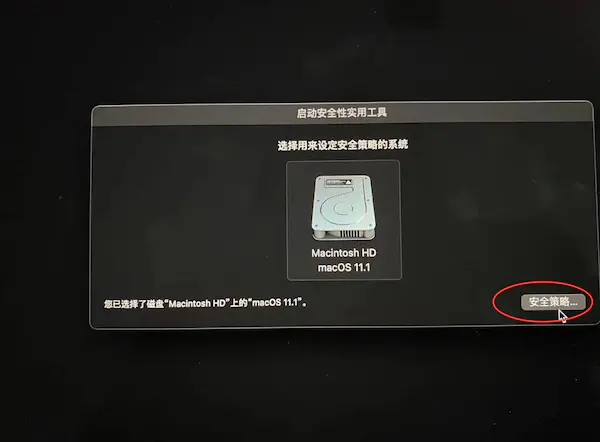
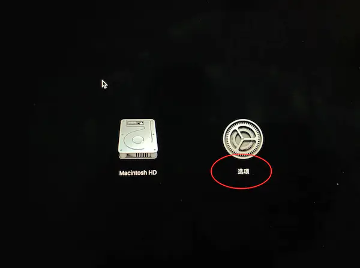
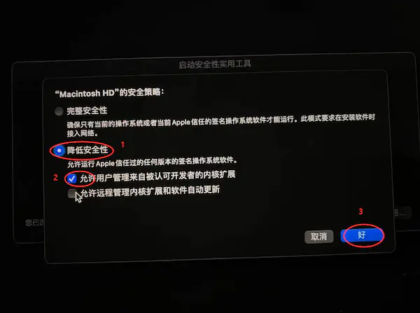
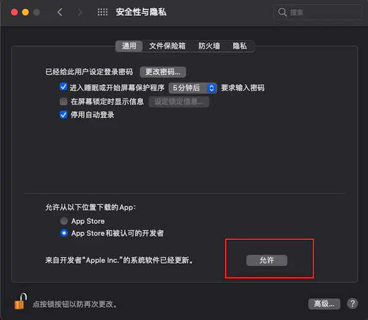
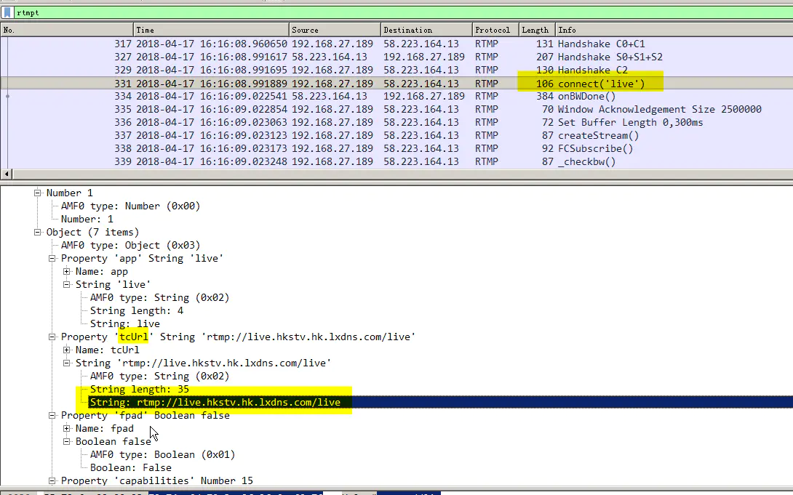
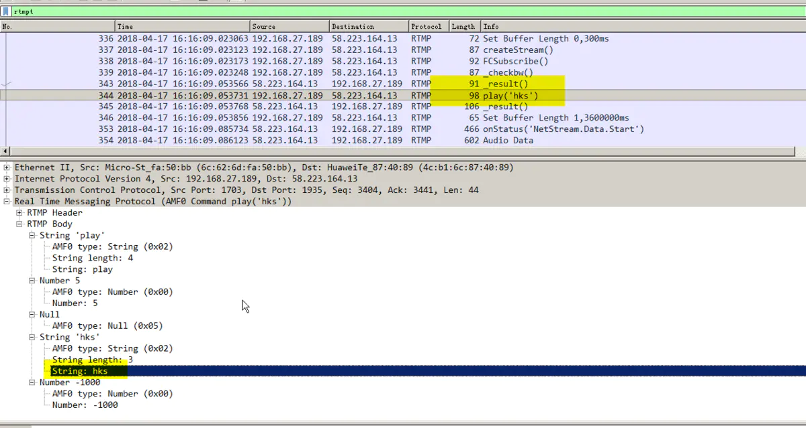

# 抓包工具
有时候会经常抓别人的APP接口分析他们的数据。主要介绍一些常用的抓包工具和软件功能。常用的抓包软件`Wireshark`、`Charles`。 

## Wireshark
Wireshark可以查看电脑网卡流量也可以获取手机的网卡流量，抓包手机网卡时需要先进行设置。由于`Wireshark`是直接查看网卡的流量。安装之后首先在命令行给它网卡的权限：`sudo chmod 777 /dev/bpf*`。

Wireshark查看的一些技巧:
```markdown
* `tcp.port==8080` 查看某个端口
* `ip.addr==192.168.1.1 ` 查看某个ip
* `tcp`  查看某个协议
*  Wireshark首页过滤器输入  `tcp port 443` 只查看tcp协议443端口的包
```

### Wireshark 抓取手机包
Wireshark使用手机抓包设置:
```markdown
1. 获取到手机的UDID,通过`Findler`进行查看，点击手机型号,右键复制`UDID`
2. 使用`rvictl -s UUID` 命令开启虚拟网络，默认是`rvi0`端口,使用`ifconfig -l`查看是否开启
3. 不使用时通过`rvictl -x UUID `关闭虚拟网络
```

----

Mac M1在终端使用rvictl命令后会出现`Starting device 00008020-0015091E0C68002E [FAILED]`开启失败，这是因为`rvictl`命令需要开启系统扩展才能使用，M1芯片的Mac不能直接打开系统扩展，需要手动进行启用。开启过程如下：
1. 在系统设置里，可以看到“系统扩展”是关闭的。

2. 选择`启用系统扩展`，弹窗之后选择`关机`。

3. 长按开机键，进入恢复模式，直到出现启动选项（连接多个显示器时，可能会出现黑屏情况，拔掉一个）
4. 选择安全策略,如果出现下面这张图,可直接跳到第5步。


    如果没有出现上图，而是出现下图的情况，则需要以下额外几个步骤：
    

    选择选项，继续，进入恢复模式（可能会要求输入用户密码），进入之后如图点开`『实用工具→启动安全工具』`,打开后等待出现硬盘图标

    

5. 选择降低安全性，允许用户管理被认可开发者的内核扩展

6. 重启后进入系统，打开偏好设置面板，此时面板里按钮变成了`允许`,点击允许重启电脑



### wireshark抓取rtmp的地址
抓取rtmp地址主要通过关注connect和play两个消息。 从connect中的`tcUrl`获取流的域名

从play消息获取到流地址,域名+流地址获取到完整的`rtmp`播放地址:`rtmp://live/hkstv.hk.1xdns.com/live/hks`



## 安卓手机抓包
因为有些软件只有安卓版本，不能在苹果商店进行下载，所有有时候我们需要抓安卓APP的包。小米手机通过 Charles 抓取接口，首先需要安装证书，`设置->WLAN->高级设置->添加证书`

有些APP禁止使用系统代理，我们可以通过VPN进行代理就绕过这个限制，安装手机软件`Drony`，设置手机语言为英文。如果APP没有网络请求，直接下载apk看一下是不是直接把json文件放到本地了。

### Drony 设置
1. 打开Drony看到LOG页，`右滑-> SETTING页`，选择`Networks 下：Wi-Fi`，点击当前在用的wifi名，进入`Network details`设置页
2. 点击`Hostname`，输入当前电脑的局域网IP，比如172.168.1.123
3. 点击`Port`，输入抓包软件的端口号，比如 8888   (这个时候，注意看 **Proxy type页面变成 Manual 手动模式**）
4. 点击`Filter default value`，选择`Direct all`（这步如果没加，log页面会看到黑压压的很多信息）
5. 点击`Rules`，进入`Rules`详情页，点击右上角的加号，进入`Add filter rule`，action选择`Local proxy chain`，Application选择需要抓包的应用，然后保存，返回主页
6. 左滑到`LOG`标签页，点击底部到`OFF`按钮，启用Drony，同时确保Drony进程在后台不会被杀掉。（这个时候英文版的就可以看到 很多log 数据了， 繁体版的看不到固不推荐。）**注意：**不要忘记第6点

## 推荐阅读
* [原来wireshark可以抓HTTPS明文包](https://segmentfault.com/a/1190000023568902)