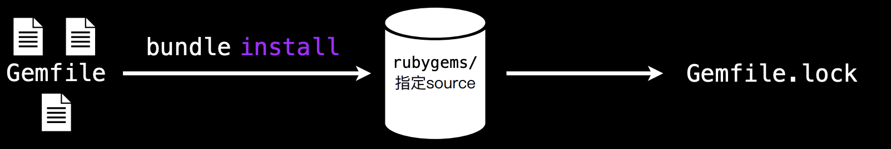
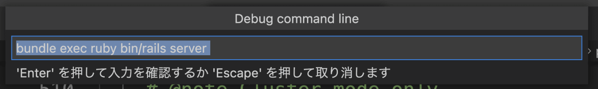

# Ruby
使用`brew install ruby ` 安装Ruby,`ruby -v`可以查看当前Ruby版本。
```
ruby 3.1.0p0 (2021-12-25 revision fb4df44d16) [arm64-darwin20]
```

与⼤多数的编程语⾔⼀样，Ruby 也受益于海量的第三⽅代码库。这些代码库⼤部分都以 Gem 形式发布。 RubyGems 是设计⽤来帮助创建，分享和安装 这些代码库的。
```markdown
* gem search -r/-f <gem>
* gem install <gem> --version <num>
* gem list
```

Bundler 能够跟踪并安装所需的特定版本的 gem，以此来为 Ruby 项⽬提供⼀
致的运⾏环境。

```
source 'https://rubygems.org'
gem 'rails', '4.1.0.rc2'
gem ‘debug'
gem 'nokogiri', '~> 1.6.1'
```

##  在 VSCode 中打开调试 Ruby 代码、Rails 代码
VSCode 需要安装的扩展:
* [Ruby](https://marketplace.visualstudio.com/items?itemName=rebornix.Ruby)
* [VSCode rdbg Ruby Debugger](https://marketplace.visualstudio.com/items?itemName=KoichiSasada.vscode-rdbg)
* [VSCode Ruby](https://marketplace.visualstudio.com/items?itemName=wingrunr21.vscode-ruby)

配置“开始调试”时行为的文件`.vscode/launch.json`. 如果该文件不存在，它将自动创建。`.vscode/launch.json` 如下：每个设置的含义在后面描述。

```json
.vscode/launch.json
{
  "version": "0.2.0",
  "configurations": [
    {
      "name": "Debug Rails",
      "type": "rdbg",
      "request": "launch",
      "cwd": "${workspaceRoot}",
      "script": "bin/rails server",
      "args": [],
      "askParameters": true,
      "useBundler": true,
    }
  ]
}
```

如果从 VSCode 菜单执行 `Run - Start Debugging` ，从现在开始要执行的命令将显示在对话框中，因此请选中并执行它。


实际执行的命令如下所示：
```
rdbg --command --open --stop-at-load --sock-path=/var/folders/tv/b9rpcj011w110tjd0kv0_8h80000gn/T/ruby-debug-sock-501/ruby-debug-igaiga-18173 -- bundle exec ruby bin/rails server
```

launch.json 中各项设置的含义如下。
```
"name": "Debug Rails"此配置的名称
"type": "rdbg"此配置的类型（要使用的扩展）
"request": "launch"“开始调试”中的设置
"cwd": "${workspaceRoot}"当前目录设置
"script": "bin/rails server"命令运行
"args": []传递给命令的选项
"askParameters": true执行前用对话框确认执行命令
"useBundler": true授予捆绑执行
```

## CocoaPods源码调试
1. [下载源码](https://github.com/CocoaPods/CocoaPods)
2. 创建一个新的iOS项目，创建一个Podfile文件
```
  platform :ios, '11.0'
  source 'https://github.com/CocoaPods/Specs.git'
  target "DemoX" do
    use_frameworks!
    pod 'AFNetworking'
  end
```
3. 将`CocoaPods`源码和iOS项目放到同一目录下，并在该目录下新建一个`Gemfile`文件,并运行`bundle install`。`Gemfile`文件内容
```
  source 'https://rubygems.org'
  # 指定本地CocoaPods路径
  gem 'cocoapods', path: './CocoaPods'
```
4. 创建 `launch.json` 文件，调试 rb 文件时可以选择是否创建 `launch.json`文件，修改部分内容
```json
  {
      // 悬停以查看现有属性的描述。欲了解更多信息，请访问: https://marketplace.visualstudio.com/items?itemName=KoichiSasada.vscode-rdbg
      "version": "0.2.0",
      "configurations": [
          {
              "type": "rdbg",
              "name": "Debug current file with rdbg",
              "request": "launch",
              // 指定使用的pod解释文件。
              "script": "${workspaceRoot}/CocoaPods/bin/pod",
              // pod 命令执行的路径。会在该路径下寻找Podfile文件。
              "cwd": "${workspaceFolder}/DemoX",
              // 执行的命令参数，在这里执行的是 pod install
              "args": ["install"],
              "askParameters": true
          },
          {
              "type": "rdbg",
              "name": "Attach with rdbg",
              "request": "attach"
          }
      ]
  }
```
5. 在`CocoaPods -> lib -> cocoapods -> command -> install.rb`文件中打断点,进行调试即可
   

## Symbol
Ruby 是⼀个强⼤的⾯向对象脚本语⾔，⼀切皆是对象。 在 Ruby 中 `Symbol` 表示“名字”，⽐如字符串的名字，标识符的名字。
* 创建⼀个 Symbol 对象的⽅法是在名字或者字符串前⾯加上冒号：
* 在 Ruby 中每⼀个对象都有唯⼀的对象标识符（Object Identifier）
* 对于 Symbol 对象，⼀个名字唯⼀确定⼀个 Symbol 对象
* Ruby 内部⼀直在使⽤ Symbol，Ruby内部也存在符号表
* Symbol 本质上是⼀个数字，这个数字和创建 Symbol 的名字形成⼀对⼀的映射；⽽String 对象是⼀个重量级的。(**⽤C结构体表示的家伙，因此使⽤ Symbol 和 String 的开销相差很⼤。**)
* 符号表是⼀个全局数据结构，它存放了所有 Symbol 的（数字ID，名字）。 
 
> Ruby 不会从中删除 `Symbol` ，因此当你创建⼀个 `Symbol` 对象后，它将⼀直存在，直到程序结束


# 参考文档
* [Ruby 基础文档](https://zenn.dev/igaiga/books/rails-practice-note/viewer/ruby_debug_gem)