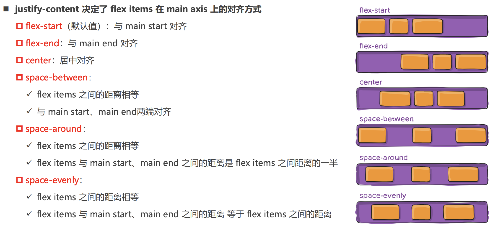
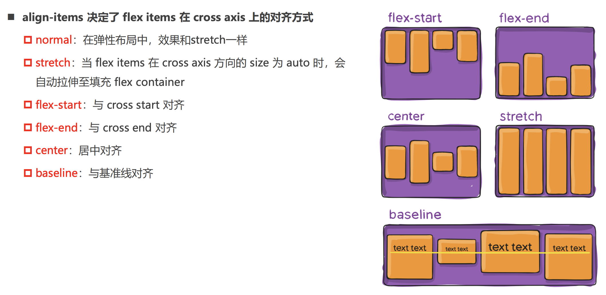

# CSS 布局
布局有三种方式： 常规流、浮动、绝对定位。常规流中包含 行级、块级、表格布局、Flexbox、Grid布局。

默认情况下，元素都是按照`normal flow`（标准流、常规流、正常流、文档流【document flow】）进行排布
```markdown
* 从左到右、从上到下按顺序摆放好
* 默认情况下，互相之间不存在层叠现象
```
>在标准流中，可以使用`margin`、`padding`对元素进行定位.

如果不想使用标准流，修改元素`position`的值。
```markdown
* `static`: 默认值，相当于取消定位属性，或者不设置定位属性
* `relative`: 相对定位，元素占据的文档流位置不变，可以通过left、right、top、bottom进行定位，定位参照对象是元素自己原来的位置。
* `absolute`: 绝对定位，元素脱离文档流，不占据文档流的位置，相对与显示屏幕的宽高进行定位
* `fixed`: 固定定位，元素脱离文档流，不占据文档流位置，相对与窗口进行定位
* `sticky`: 粘性定位
* `inherit`: 从父元素集成position属性的值
```

## relative 相对定位
使用相对定位之后，元素设置此属性之后仍然处在文档流中，不影响其他元素的布局。可以通过left、right、top、bottom进行定位，元素相对于原来位置进行偏移，宽高不变。

通过将一个大图片居中的方式进行举例,图片大小是`1920 x 489`。div是浏览器宽度，图片超出div部分需要进行裁剪`overflow: hidden;`。先将img向左移动图片大小一半的距离`left: -960px;`,然后设置左间距是div的一半`margin-left: 50%`就会居中。
```html
<style>
    body{
        margin: 0;
    }
    .box{
        height: 489px;
        background-color: red;
        overflow: hidden; /*因为图片过大，超出父元素部分进行隐藏*/
    }
    .box img{
        position: relative;
        margin-left: 50%; /* 设置左侧间距为div宽度的一半 */
        left: -960px; /* 让图片向左移动自身一半的像素 */
        /* transform: translate(-50%);  设置translate也可以， translate的百分比是相对于自身大小的 */
    }
</style>
<body>
    <div class="box">
        
    </div>
</body>
```

## fixed 固定定位
元素脱离标准流,可以通过left、right、top、bottom 进行定位,定位参照对象是视口（viewport）。**当画布滚动时，固定不动**。
```html
<style>
    .box{
        width: 120px;
        height: 5000px;
        background-color: red;
    }
    .box1{
        width: 100px;
        height: 100px;
        right: 50px;
        bottom: 50px;
        background-color: gold;
        position: fixed;
    }
</style>    
<body>
    <div class="box"> </div>
    <div class="box1"> </div>
</body>
```

## absolute 绝对定位
绝对定位是脱离文档流位置的.不区分行内元素/块级元素/行内块级元素,可以通过left、right、top、bottom进行定位。定位参照对象是最邻近的**定位祖先元素**。如果找不到这样的祖先元素，参照对象是**视口**。

在绝大数情况下，子元素的绝对定位都是相对于父元素进行定位，如果希望子元素相对于父元素进行定位，又不希望父元素脱标，常用解决方案是：
```markdown
* 父元素设置`position: relative`（让父元素成为定位元素，而且父元素不脱离标准流）
* 子元素设置`position: absolute`
```

绝对定位的一些特点：
```markdown
1. 元素会脱离文档流。脱离文档流后原来的位置相当于是空的，下面的元素会来占据它的位置。
2. 元素在没有定义宽度的情况下，宽度由元素里面的内容决定，效果和用float方法一样。
3. 设置left或者top时，如果父元素没有相对或者决定定位的情况下，元素相对于根元素定位
4. 如果父元素设置了相对定位或绝对定位，元素会根据离自己最近的父元素进行定位
```

对于普通元素来说，`父元素的宽度 = 子元素的际占用宽度 + left + right`。对于绝对定位元素来说，`定位参照对象的宽度 = 绝对定位元素的实际占用宽度 + left + right + margin-left + margin-right`,举一个例子

```html
<style>
    .box{
        width:800px
        height: 200px;
        background-color: red;
        position: relative;
    }
    .continer{
        width: 200px;
        height: 100px;
        background-color: gold;
        position: absolute;
    }
</style>
<div class="box">
    <div class="continer"> </div>
</div>
```
我们只给 continer 设置了宽高，没有设置left、right、margin-left、margin-right，计算方式 `800 = 200 + 0 + 0 + 0 + 0;`。如果想让 continer 水平居中。可以设置以下代码
```html
<style>
    .continer{
        width: 200px;
        height: 100px;
        left: 0px;
        right: 0px;
        margin: 0 auto;
        background-color: gold;
        position: absolute;
    }
</style>
```
计算方式 `800 = 200 + 0 + 0 + auto + auto;`，auto的意思就是交给浏览器处理。

* [相对定位和绝对定位的区别](https://www.runoob.com/w3cnote/css-position-static-relative-absolute-fixed.html)


## sticky  粘性定位
sticky 是一个大家期待已久的属性,可以看做是相对定位和固定(绝对)定位的结合体,**它允许被定位的元素表现得像相对定位一样，直到它滚动到某个阈值点,当达到这个阈值点时, 就会变成固定(绝对)定位**。


## z-index 层叠关系
z-index 属性用来设置`定位元素`的层叠顺序**仅对定位元素有效**，默认值是0,可以设置正整数、负整数。

* 如果是兄弟关系: `z-index`越大，层叠在越上面，`z-index`相等，写在后面的那个元素层叠在上面
* 如果不是兄弟关系: 各自从元素自己以及祖先元素中，找出最邻近的2个定位元素进行比较,而且这2个定位元素必须有设置`z-index`的具体数值

```html
<style>
    .item{
        width: 100px;
        height: 100px;
        position: fixed;
    }
    .box1{
        background-color: aqua;
    }
    .box2{
        left: 20px;
        top: 20px;
        background-color: red;
        z-index: 1; /* 层叠关系 */
    }
    .box3{
        left: 40px;
        top: 40px;
        background-color: yellow;
    }
</style>
<body>
    <div class="item box1">1</div>
    <div class="continer">
        <div class="item box2">2</div>
    </div>
    <div class="item box3">3</div>
</body>
```

## 弹性盒子布局 Flexbox 
Flexbox翻译为弹性盒子:是一种用于按行或按列布局元素的一维布局方法。元素可以膨胀以填充额外的空间, 收缩以适应更小的空间。通常我们使用Flexbox来进行布局的方案称之为flex布局`(flex layout)`。

**flex布局的重要概念:**
1. 开启了 flex 布局的元素叫 `flex container`,`flex container` 里面的直接子元素叫做 `flex item`。
2. 设置 `display` 属性为 `flex` 或者 `inline-flex` 可以成为 `flex container`
    ```css
    display: flex ; /* 生成一个块级的Flex容器 */
    display: inline-flex; /* 生成一个行级的Flex容器 */
    ```

* `flex container` 的相关属性，控制盒子的 摆放流向、摆放顺序、盒子的宽度和高度、水平和垂直方向的对齐、是否允许折行
```css
flex-direction:row; /* 控制摆放方向 */
flex-wrap:wrap; /* 是否允许换行 */
flex-flow: row wrap; /* flex-flow 属性是 flex-direction 和 flex-wrap 的简写。 */
justify-content: flex-start; /* 决定了 flex items 在 主轴 上的对齐方式 */
align-items: center; /*  决定了 flex items 在 侧轴 上的对齐方式 */
align-content: center; /* 决定了多行 flex items 在 cross axis 上的对齐方式，用法与 justify-content 类似 */
```




* `flex item` 的相关属性
```css
flex-grow: 0; /* 决定 flex items 如何扩展(拉伸/成长),默认值是 0 */  
flex-shrink: 0; /* 决定 flex items 如何收缩(缩小)，默认是 1 */
flex-basis: 100px; /* 设置 flex items 在 main axis 方向上的 基础大小，默认auto */
align-self: flex-end; /* 针对单个元素的对齐方式, 默认值auto */
order: 1; /* 单个元素使用，决定了 flex items 的排布顺序 */
flex: 0 0 100px; /* flex-grow || flex-shrink || flex-basis 的简写 */
```
* flex布局中最后一行item的处理，**添加 i 的个数需要是 行数-2**
```html
<!DOCTYPE html>
<html lang="en">
<head>
    <meta charset="UTF-8">
    <meta http-equiv="X-UA-Compatible" content="IE=edge">
    <meta name="viewport" content="width=device-width, initial-scale=1.0">
    <style>
       .container{
        width: 500px;
        background-color: orange;
        display: flex;
        flex-wrap: wrap;
        justify-content: space-between;
       }
       .item{
        width: 110px;
        height: 140px;
       }
       .container > i{ /* 因为i没有设置高度，所以不会显示 */
        width: 110px;
       }
    </style>
</head>
<body>
    <div class="container">
        <div class="item item1"></div>
        <div class="item item2"></div>
        <div class="item item3"></div>
        <div class="item item4"></div>
        <div class="item item5"></div>
        <div class="item item6"></div>
        <div class="item item7"></div>
        <!-- 添加 i 的个数需要是行数-2，这里一行4个item，需要添加2个i标签 -->
        <i></i>
        <i></i>
    </div>

    <script>
        function getRandomColor() {
            return `rgb(${Math.random()*255}, ${Math.random()*255}, ${Math.random()*255})`
        }
        const itemEls = document.querySelectorAll(".item")
        for (const item of itemEls) {
            item.style.backgroundColor = getRandomColor()
        }
    </script>
</body>
</html>
```


### Grid布局
```css
/* 生成一个块级的Grid容器 */
display: grid ;
/* 
grid-template-columns 有几个值，代表有几列
grid-template-rows: 有几个值，代表有几行
有三种表示形式

 */
grid-template-columns: 100px 200px 300px 400px;
grid-template-rows: 100px 50px;

grid-template-columns: 30% 20% auto;
grid-template-rows: 100px auto;

grid-template-columns: 100px 1fr 1fr;
grid-template-rows: 100px 1fr;

/* 修改单个网格布局大小 ,以分割线做区分，分割线以 1 开始*/
.a{
    grid-column-start: 1;
    grid-row-start: 1;
    grid-row-end: 3;
    grid-column-end: 3;
}
/* 等价于 */
.a{
    grid-area:1/1/3/3;
}

/* 设置行和列之间的间距 ,gap 同时设置行和列的间距*/
row-gap: 10px;
column-gap: 10px;
gap: 10px 10px;

/* 行方向是否填满整个块级元素, 默认填满 */
align-items: stretch;
/* 列方向是否填满整个块级元素，默认填满 */
justify-items: stretch;

/* 单独设置某个item 在列方向的位置 */
align-self: center;
/* 单独设置某个item 在行方向的位置 */
justify-self: center;

/* 当元素不会占满整个容器的时候，使用align-content  和 justify-content */

```
#### 网格线命名

第一种方式，给网格线起一个别名，修改单个单元格的时候可以直接使用别名


第二种方式,命名一个区域，可以直接使用区域进行赋值


## 浮动

```markdown
1. 浮动都会让元素脱离标准流,可以通过`float`属性让元素产生浮动效果,取值有`none、left、right`
2. 浮动元素碰到父元素边界、浮动元素、未浮动的元素才停下来
3. 相邻浮动的块元素可以并在一行，超出父级宽度换行
4. 浮动让行内元素或块元素自动转化为行内块元素
5. 浮动元素后面没有浮动的元素会占据它的位置，没有浮动的元素内的文字会避开浮动的元素，形成文字饶图的效果
6. 父元素没有高度时，浮动的元素无法撑开父元素，需要清除浮动
7. 浮动元素之间没有垂直margin的合并
```

* 浮动高度塌陷问题
由于浮动元素脱离了标准流，变成了脱标元素，所以不再向父元素汇报高度。**父元素计算总高度时，就不会计算浮动子元素的高度，导致了高度坍塌的问题。**解决父元素高度坍塌问题的过程，一般叫做清浮动（清理浮动、清除浮动），清浮动的目的是 **让父元素计算总高度的时候，把浮动子元素的高度算进去**

清除浮动的几种方式
```css
/* 1、父级上增加属性 overflow:hidden */
.box{
    overflow:"hidden";
}
/* 2、最后一个子元素的后面加一个空的div，样式属性clear:both <不推荐使用> */
<div style="clear:both"></div>

/* 3、使用成熟的清浮动样式类 clearfix */
.clearfix:after,.clearfix:before{ content: "";display: table;}
.clearfix:after{ clear:both;}
.clearfix{zoom:1;}

/* 第二种 clearfix 清除方式 */
.con2{... overflow:hidden}
或者
<div class="con2 clearfix">
```