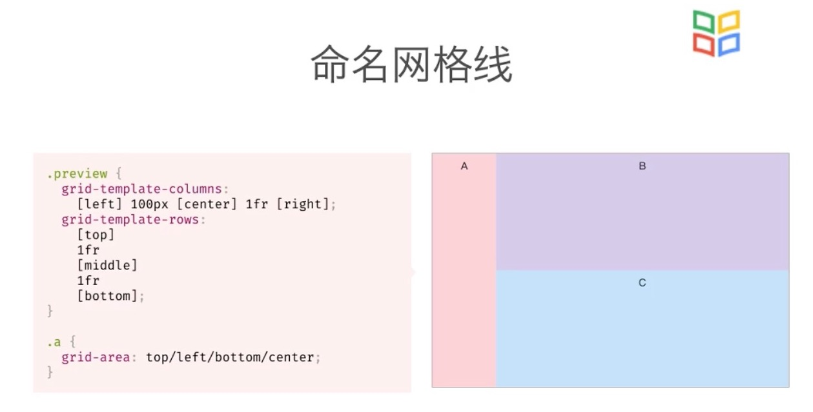
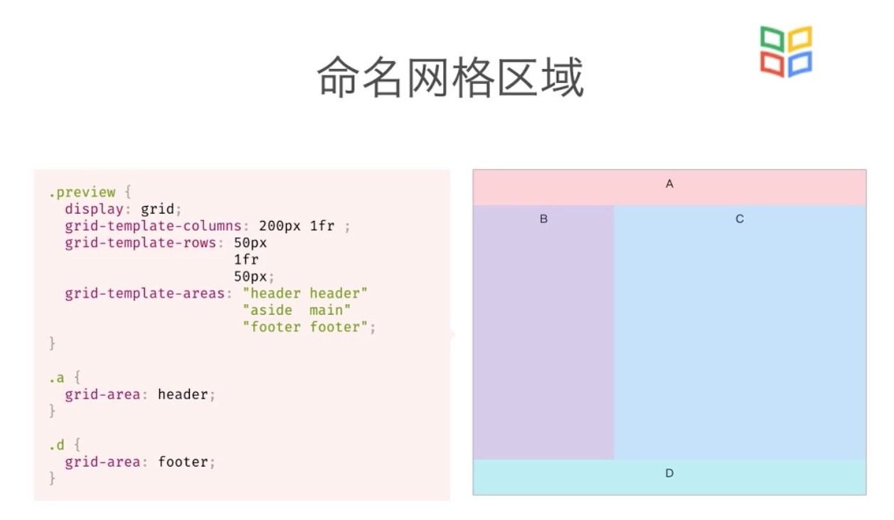

# CSS 布局
布局有三种方式： 常规流、浮动、绝对定位

## 常规流
常规流中包含 行级、块级、表格布局、Flexbox、Grid布局

### 行级元素
质保函行级盒子的容器会创建一个IFC
IFC内的排版规则
* 盒子在一行内水平摆放
* 一行放不下时，换行显示
* text-align 决定一行内盒子的水平对齐
* vertical-align 决定一个盒子在行内的垂直对齐
* 避开浮动(float)元素

### Flexible Box
控制盒子的 摆放流向、摆放顺序、盒子的宽度和高度、水平和垂直方向的对齐、是否允许折行
```css
/* 生成一个块级的Flex容器 */
display: flex ;
/* 生成一个行级的Flex容器 */
display: inline-flex;
/* 控制摆放方向 */
flex-direction:row;
/* 允许换行 */
flex-wrap:wrap;

/* 剩余空间时的伸展能力 */
flex-grow:
/* 剩余空间不足时的收缩能力 */
flex-shrink:
/* 没有伸展或者收缩时的基础长度 */
flex-basis:

/* 主轴方向的排序，主轴：空间排列方向 */
justify-content: start;

/* 侧轴方向 */
align-items: center;

/* 针对单个元素的对齐方式 */
align-self: flex-end;

/* 设置行的内容 */
align-content: center;

/* 单个元素使用，第几个元素 */
order:1;
```

### Grid布局
```css
/* 生成一个块级的Grid容器 */
display: grid ;
/* 
grid-template-columns 有几个值，代表有几列
grid-template-rows: 有几个值，代表有几行
有三种表示形式

 */
grid-template-columns: 100px 200px 300px 400px;
grid-template-rows: 100px 50px;

grid-template-columns: 30% 20% auto;
grid-template-rows: 100px auto;

grid-template-columns: 100px 1fr 1fr;
grid-template-rows: 100px 1fr;

/* 修改单个网格布局大小 ,以分割线做区分，分割线以 1 开始*/
.a{
    grid-column-start: 1;
    grid-row-start: 1;
    grid-row-end: 3;
    grid-column-end: 3;
}
/* 等价于 */
.a{
    grid-area:1/1/3/3;
}

/* 设置行和列之间的间距 ,gap 同时设置行和列的间距*/
row-gap: 10px;
column-gap: 10px;
gap: 10px 10px;

/* 行方向是否填满整个块级元素, 默认填满 */
align-items: stretch;
/* 列方向是否填满整个块级元素，默认填满 */
justify-items: stretch;

/* 单独设置某个item 在列方向的位置 */
align-self: center;
/* 单独设置某个item 在行方向的位置 */
justify-self: center;

/* 当元素不会占满整个容器的时候，使用align-content  和 justify-content */

```
#### 网格线命名

第一种方式，给网格线起一个别名，修改单个单元格的时候可以直接使用别名


第二种方式,命名一个区域，可以直接使用区域进行赋值


## 浮动
1. 浮动有左浮动和右浮动两种
2、浮动的元素会向左或向右浮动，碰到父元素边界、浮动元素、未浮动的元素才停下来
3、相邻浮动的块元素可以并在一行，超出父级宽度换行
4、浮动让行内元素或块元素自动转化为行内块元素
5、浮动元素后面没有浮动的元素会占据它的位置，没有浮动的元素内的文字会避开浮动的元素，形成文字饶图的效果
6、父元素没有高度时，浮动的元素无法撑开父元素，需要清除浮动
7、浮动元素之间没有垂直margin的合并

### 清除浮动
```css
/* 1、父级上增加属性 overflow:hidden */
.box{
    overflow:"hidden";
}
/* 2、最后一个子元素的后面加一个空的div，样式属性clear:both <不推荐使用> */
<div style="clear:both"></div>


/* 3、使用成熟的清浮动样式类 clearfix */

.clearfix:after,.clearfix:before{ content: "";display: table;}
.clearfix:after{ clear:both;}
.clearfix{zoom:1;}

/* 第二种 clearfix 清除方式 */
.con2{... overflow:hidden}
或者
<div class="con2 clearfix">

```

## 绝对定位
relative、 生成相对定位元素，元素占据的文档流位置不变，元素本身相对文档流进行偏移
absolute、绝对定位，元素脱离文档流，不占据文档流的位置，相对与body元素进行定位
fixed、固定的定位元素，脱离文档流，不占据文档流位置，相对与窗口进行定位
static、默认值，相当于取消定位属性，或者不设置定位属性
inherit、从父元素集成position属性的值

典型的定位布局

1、固定在顶部的菜单
2、水平垂直居中的弹框
3、固定的侧边工具栏
4、固定在底部的按钮