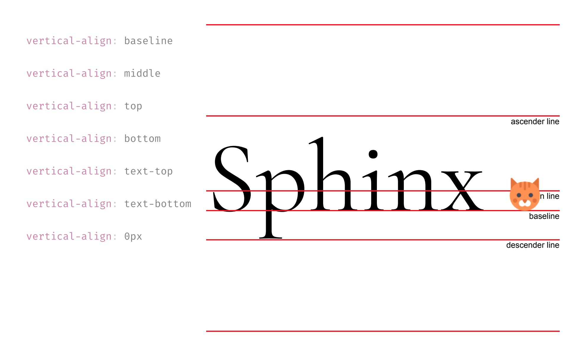

# CSS 基础


## 基础选择器

[点击查看所有的选择器](https://www.w3school.com.cn/cssref/css_selectors.asp)

选择器优先级
!important > 内联样式 > ID选择器 > 类选择器、属性选择器、伪类选择器 > 标签选择器、关系选择器、伪元素选择器 > 通配符选择器 
column0 | column1
------- | -------
!important | 最高
内联样式 | 1000
ID选择器 | 100
类选择器 | 10
伪类选择器 | 10
属性选择器 | 10
标签选择器 | 1
关系选择器 | 1
伪元素选择器 | 1
通配符选择器 | 0


选择元素的方式
* 按照标签名、类名或者id
* 按照属性
* 按照 DOM 数中的位置
 
通配选择器 

```html
<style>
    *{
        color: red;
    }
</style>
```
标签选择器
```html
<h1>This is heading</h1>
<p>this is some paragraph.</p>

<style>
    h1{
        color: orange;
    }
    p{
        color: gray;
        font-size: 20px;
    }
</style>
```

id选择器 （id是唯一的）
```html
<head>
    <h1 id="logo">
        
        HTML5文档
    </h1>
</head>

<style>
    #logo{
        font-size: 60px;
        font-weight: 200;
    }
</style>
```

类选择器 (类可以是多个)
```html
<ul>
    <li class="done">Learn HTML</li>
    <li class="done">Learn Css</li>
    <li>Learn JavaScript</li>
</ul>

<style>
    .done{
        color: gray;
        text-decoration: line-through;
    }
</style>
```

属性选择器 （标签中的属性）
```html
<p>
    <label>用户名:</label>
    <input value="zhao" disabled>
</p>

<style>
    input[disabled]{
        background: #eee;
        color: #999;
    }
</style>

<!-- 使用更具体的属性值做判断 -->
<p>
    <label>密码:</label>
    <input type="password" required>
</p>

<style>
    input[type="password"]{
        border-color: red;
        color: red;
    }
</style>

<!-- 使用正则的方式判断属性以 某个值开头或者结尾 -->
<p><a href="#top">回到顶部</a></p>
<p><a href="a.jpg">查看图片</a></p>

<style>
    a[href^="#"]{
        color: #f54767;
        background: 0 content/lem url(top.svg) no-repeat;
        padding-left: 1.1em;
    }

    a[hred$=".jpg"]{
        color: deepskyblue;
        background: 0 center/lem url(img.svg) no-repeat;
        padding-left: 1.1em;
    }
</style>
```

伪类选择器 （动态伪类和结构特性伪类）

动态伪类，比如`a`标签，可以通过不同的状态类来显示
```html
<a>example.com</a>

<style>
    a:link{
        color: black; 
    }

    a:visited{
        color: gray;
    }
    
    a:hover{
        color: orange;
    }
</style>
```

结构特性伪类
```html
<ol>
    <li>阿凡达</li>
    <li>泰坦尼克号</li>
    <li>星球大战</li>
    <li>复仇者联盟</li>
</ol>

<style>
    li{
        list-style-position: inside;
        border-bottom: 1px solid;
        padding: 0.5em;
    }
    
    /* 第一个元素 */
    li:first-child{
        color: coral;
    }
    /* 最后一个元素 */
    li:last-child{
        border-bottom: none;
    }
</style>
```

### 组合器

名称 | 语法 | 说明 | 示例
------- | ------- | ------- | -------
直接组合 | AB | 满足 A 同时满足 B | input:focus
后代组合 | A B | 选中B，如果它是A的子孙 | nav a
亲子组合 | A > B | B必须是A的子元素才会被选中 | section > p

```html
<label>
    用户名：
    <input class="error" value="aa">
</label>
<span class="error">最少三个字符</span>

<style>
    .error{
        color: red;
    }

    /* 同时满足这两个条件才会被选中 */
    input.error{
        border-color: yellow;
    }
</style>

<!-- 后代组合 和 亲子组合 -->
<article>
    <h1>拉森国家公园</h1>
    <p>位于.....</p>
    <section>
        <h2>气候</h2>
        <p>天气特别的好</p>
    </section>
</article>

<style>
    article p{
        color: coral;
    }
    article > p{
        color: limegreen;
    }
    article section h2{
        border-bottom: 1px dashed #999;
    }
</style>
```

选择器组
```html
<style>
    body,h1,h2,h3,ul,ol{
        margin: 0;
        padding: 0;
    }

    [type="checkbox"],[type="radio"]{
        box-sizing: border-box;
        padding: 0;
    }
</style>
```

## 盒子模型

* 盒子宽度 = width + padding左右 + border左右
* 盒子高度 = height + padding上下 + border上下
* box-sizing: border-box;  盒子包含border在内的宽度
* overflow:  内容溢出的时候行为

盒子模型图解 


边框 border

```css
border-top:10px solid red;
设置边框
border-top-color:red;    /* 设置顶部边框颜色为红色 */  
border-top-width:10px;   /* 设置顶部边框粗细为10px */   
border-top-style:solid;  /* 设置顶部边框的线性为实线，
常用的有：solid(实线)  
  dashed(虚线)  dotted(点线); */
```

内间距 padding

padding是根据父控件的宽度

```css
padding-top：20px;     /* 设置顶部内间距20px */ 
padding-left:30px;     /* 设置左边内间距30px */ 
padding-right:40px;    /* 设置右边内间距40px */ 
padding-bottom:50px;   /* 设置底部内间距50px */

简写，按照 上 左 下 右的规则进行排序
padding：20px 40px 50px 30px; /* 四个值按照顺时针方向，分别设置的是 上 右 下 左  
四个方向的内边距值。 */

设置不同值表示的意义不同

padding：20px 40px 50px; /* 设置顶部内边距为20px，左右内边距为40px，底部内边距为50px */ 
padding：20px 40px; /* 设置上下内边距为20px，左右内边距为40px*/ 
padding：20px; /* 设置四边内边距为20px */
```

### 盒子使用技巧
#### margin相关技巧
1、设置元素水平居中： margin:x auto;
2、margin负值让元素位移及边框合并

#### 外边距合并

外边距合并指的是，当两个垂直外边距相遇时，它们将形成一个外边距。合并后的外边距的高度等于两个发生合并的外边距的高度中的较大者。解决方法如下：

1、使用这种特性
2、设置一边的外边距，一般设置margin-top
3、将元素浮动或者定位

#### margin-top 塌陷

在两个盒子嵌套时候，内部的盒子设置的margin-top会加到外边的盒子上，导致内部的盒子margin-top设置失败，解决方法如下：

1、外部盒子设置一个边框
2、外部盒子设置 overflow:hidden
3、使用伪元素类：

```css
.clearfix:before{
    content: '';
    display:table;
}
```

### 盒子中的 块级元素 和 行级元素
顾名思义

块级元素就是一块整体，不能和其他元素摆在一起

行级元素是只占一行的位置，盒模型中的`width`、`height`不适用与行级元素

使用display修改元素类型
```css
/* 行级元素 */
display: inline; 
/* 块级元素 */
display: block;
/* 本身是行级，可以放在行盒中，可以设置宽高，作为一个整体不会被拆散成多行 */
display: inline-block;
/* 排版时完全被忽略 */
display: none;
```

### 盒子的背景颜色 background
background-image    背景图片
background-origin   指定了背景图像的位置区域。
background-clip 背景剪裁属性是从指定位置开始绘制	
background-origin   规定背景图片的定位区域。	
background-size 规定背景图片的尺寸。
background-repeat   背景图是否重复
background-position 背景图的位置

### 阴影 box-shadow
```css
box-shadow: 1px 2px 3px 0 gray
1px: 水平上的偏移量
2px: 垂直上的偏移量
3px: 阴影模糊的程度
0: 阴影扩张的大小
```

### 行高和垂直对齐 vertical-align


### 值和单位
关键字： initial/inherit
字符串： “string”
URL： url(/logo.png)
长度：100px、5em
百分比： 50%
整数： z-index:5
浮点数： line-height:1.8
颜色： #ff0000
时间： 300ms

长度的表示方法
px： 像素点
in  英寸
cm  厘米
mm  毫米
pt  磅 1/72 英寸
pc  1/6 英寸
em  元素字体大小
rem html字体大小
vh  1%窗口高
vw  1%窗口宽
vmax    vwvh 较大者
vmin    vwvh 较小者

